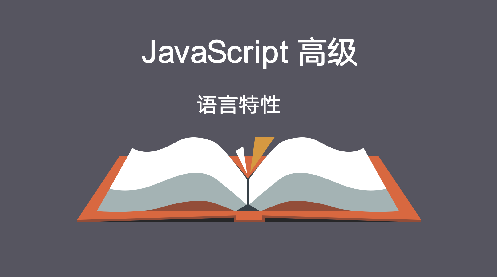

----

## 第0章 先谈ES5继承

继承：多个子类对象可以共用父类对象的成员属性和成员方法（代码重用--重复使用）；

### 0.1 原型链继承


核心原理：B.prototype = new A();

能够继承A构造函数以及原型链上的所有成员。

```javascript
	//定义父类构造函数
	function A(){
		this.age = 10;
	}
	A.prototype.say = function(){
		console.log(100);
	}
	//定义子类构造函数
	function B(){

	}
	//设置子类构造函数的原型对象 = 父类构造函数的实例对象
	B.prototype = new A();
	
	var b = new B();
	console.log(b.age);
	b.say();
```

缺点：子对象自身的constructor属性丢失了， 变成了父类构造函数

### 0.2 冒充继承

实现方式：在子类构造函数中，调用父类构造函数的（call, apply, bind）方法，使用子类构造函数的this去冒充父类构造函数的this。

**父类**.call(子类的对象, 其他参数);  //意思是让子类的对象，去代替父类中的this。

```javascript
	//父类构造函数
	function A(){
		this.age = 10;
		this.say = function(){
			console.log(100);
		}
	}
	//子类构造函数
	function B(){
      	//将B中的this,传给A，使A中的this指向B的this。
		A.call(this);
	}

	var b = new B();
	console.log(b.age);
	b.say();
```

缺点：这种实现继承的方式，是不能继承父类原型对象上的成员

```javascript
	function A(){
		this.age = 10;
	}
	A.prototype.say = function(){
		console.log(100);
	}
	function B(){
		A.call(this);
	}
	var b = new B();
	console.log(b.age);
	b.say();//报错
```

### 0.3 Object.create()继承

Object.create()是IE9才开始支持的。

var 新对象 = Object.create(原型对象); 该方法就是用于创建新对象并指定原型对象的。所以就可以直接使用create方法实现继承。

特点：父类构造函数以及其原型链上的成员都能继承。

适合场景：新的对象 没有直接对应的一个自定义构造函数

不指定原型对象（不继承），参数可以为null。  即  var obj = Object.create(null);

```javascript
	function A(){
		this.age = 10;
	}
	A.prototype.say = function(){
		console.log(100);
	}

	var obj = Object.create(new A());

	console.log(obj.age);
	obj.say();

	//或者
/*
	var obj = Object.create({
		age:10,
		say:function(){
			console.log(100);
		}
	});
	console.log(obj.age);
	obj.say();
*/

```


## 第1章 常量

### 

ES5没有定义声明常量的方式，ES6标准中引入了新的关键字const来定义常量。

```javascript
<script>
	const PI = 3.14;
	console.log(PI);
</script>
```

常量必须给初始值； 常量不能在同一作用域内重新定义或赋值；

```javascript
<script>
  	//常量不能在同一作用域中重新定义
	const PI = 3.14;
	const PI = 3.1415; //报错
</script>
<script>
  	//常量不能在同一作用域中重新赋值
	const PI = 3.14;
	PI = 3.1415; //报错
</script>
<script>
  	//不同作用域中可以声明同名常量
	const PI = 3.14;
	console.log(PI);//3.14
	function fn(){
      	const PI = 3.1415;
      	console.log(PI);
	}
	fn();//3.1415
</script>
```


## 第2章 块级作用域

### 2.1 块级作用域

JS中作用域有：全局作用域、函数作用域。

ES6中新增了块级作用域。
块作用域由 { } 包括，if语句和for语句里面的{ }就属于块作用域。(不包括函数)

```javascript
//注意 块级作用域中，使用var声明的变量是全局变量
{
	var a = 1;
	console.log(a);//1
}
console.log(a);//1

if(true){
	var b = 2;
	console.log(b);//2
}
console.log(b);//2
```

### 2.2、let关键字声明块级变量

ES6中增加了let关键字声明变量，声明的变量只在当前代码块中生效（块级作用域）。

```javascript
<script>
    if(true){
        let i=0;
        console.log(i);
    }
  console.log(i);//报错
</script>
<script>
    for(let i=0; i<=6; ++i){
        console.log(i);
    }
    console.log(i);//报错
</script>

```

使用`let`声明的变量可以重新赋值,但是不能在同一作用域内重新声明

```javascript
<script>
  	// let声明的变量可以重新赋值
    {
        let a = 1;
      	console.log(a);
      	a = 2;
     	console.log(a);;
    }
</script>

<script>
  // let声明的变量不能在同一作用域重新声明，直接报错 预解析错误
  {
  	let a = 1;
  	console.log(a);
  	let a = 2;
  	console.log(a);
}
</script>
```

### 2.3、let变量没有变量提升

```javascript
{
 	console.log(i);//报错
	let i = 8;
}
```

### 2.4、应用：let块级变量解决i丢失的问题

```javascript
var arr = [3,4,5,6,7];

for(let i=0; i<arr.length; i++){
	// (function(i){
		setTimeout(function(){
			console.log(i);
			//console.log(arr[i]);
		}, 1000);
	// })(i);
}
```


## 第3章 字符串模板(模板字面量)

js中单双引号字符串，均不解析变量，需要使用+号将变量拼接在字符串中。

ES6中提供了字符串模板语法，允许使用反引号（倒引号） `` 来创建字符串，里面可以包含${变量名}形式的变量占位符。 其中的变量会被解析。

反引号字符串还可以换行

```javascript
//生成一个随机数
var num=Math.random();

//将这个数字输出到console
console.log('your num is ' + num);
console.log(`your num is ${num}`);

var str = `hello
欢迎来到黑马大讲堂`;
console.log(str);
```

## 第4章 函数

### 4.1 参数默认值

ES5中定义函数时，不能指定参数的默认值。

ES6中定义函数时，可以指定参数的默认值。

```javascript
//ES5中，只能变相实现参数默认值（函数内部加判断处理）
function f1(username){
	//传统的指定默认参数的方式
	var username = username || 'zhangsan';
	console.log('Hello ' + username);
}
f1();//Hello zhangsan
f1('lisi');//Hello lisi


//ES6中，直接给形参设置默认值
function f2(username='zhangsan'){
	console.log(`Hello ${username}`);
	//console.log('Hello ' + username);
}

f2();//Hello zhangsan
f2('lisi');//Hello lisi
```

### 4.2 展开运算符（拆包）

ES6新增了**展开运算符**（用三个连续的点 (`...`) 表示），能够将数组和字符串字面量展开为多个元素

```javascript
//展开数组
var arr = [1, 2, 3];
console.log(arr); // [1, 2, 3]
console.log(...arr); // 1 2 3
//展开字符串
var str = "hello";
console.log(str);
console.log(...str);
```

应用：拓展参数

它允许传递数组或者类数组直接做为函数的参数。

```javascript
//函数本来接收三个单独的参数
function f3(x,y,z){
	console.log(x,y,z);
}

//ES6中，我们可以将一个数组以拓展参数的形式传递，它能很好地映射到每个单独的参数
var arr=[3,4,5];
f3(...arr);//输出：3 4 5 

//ES5中，如果需要传递数组当参数，我们需要使用函数的apply方法
f3.apply(null,arr);//输出：3 4 5 
```


### 4.3 不定参数(可变参数/剩余参数)

不定参数是指，在函数中使用 命名参数 同时接收 不定数量 的 未命名参数，需要使用三个连续的点 (`...`) 。

这是一种语法糖(在原语法上的简化用法)，ES5通过函数内部的arguments对象来达到类似效果。

不定参数的格式：

```javascript
//不定参数 将多个实参放在一个数组变量中
//  ...x  三个点是固定格式，x是形参变量名
function f1(...x){
	console.log(x);
}
f1(3,4,5); //[3,4,5]

function f2(m, n, ...x){
  	console.log(m, n, x);
}
f2(2,3,4,5,6); // m=2  n=3  x=[4,5,6]
```


## 第5章 解构（拆包）

在ES6中,可以使用**解构**从数组和对象提取值并赋值给独特的变量，即将数组或对象中的值，拆成一个一个变量。

解构：自动解析数组或对象中的值，并赋值给指定的变量。

### 5.1 数组解构

将数组中的值，取出并赋值给多个变量

```javascript
	var arr = [3,4,5];
	var [a, b, c] = arr;
	console.log(a, b, c);
	
	//还可以忽略值 需要使用,占位
	var arr = [3,4,5];
	var [a,, c] = arr;
	console.log(a, c);

	//函数返回值为数组，进行解构
	function f5(){
		return [1,2,3];
	}
	var [a, b, c] = f5();
	console.log(a, b, c);
```

### 5.2 对象解构

将对象中的成员值，取出并赋值给多个变量(变量名与对象成员名一致)

```javascript
var person = {
    "nickname": "老三",
    "age": 30,
    "sex": "男"
};
//解构时 {}中的变量名，不能加引号
var {nickname, age, sex} = person;
console.log(nickname, age, sex);
//可以忽略值  直接忽略 不需要占位
var {nickname, sex} = person;
console.log(nickname, sex);
```

### 5.3 函数参数默认值与解构

#### 5.3.1 函数参数与解构

函数参数使用解构数组或解构对象形式

```javascript
//1.函数形参，使用解构数组形式，调用函数时需要传递数组实参
function f1([x,y,z]){
  	console.log(x,y,z);
}
var arr = [1,2,3];
f1(arr);

//相当于
/*
function f1(a){
  	var [x,y,z] = a;
  	console.log(x,y,z);
}
var arr = [1,2,3];
f1(arr);
*/

//2.函数形参，使用解构对象形式，调用函数时需要传递对象实参
function f2({nickname,age,sex}){
  	//变量名与对象成员名一致
  	console.log(nickname,age,sex);
}
var obj = {"nickname":"zhangsan", "age":40, "sex":"男"};
f2(obj);

//相当于
/*
function f1(a){
  	var {nickname, age, sex} = a;
  	console.log(nickname,age,sex);
}
var obj = {"nickname":"zhangsan", "age":40, "sex":"男"};
f2(obj);
*/
```

#### 5.3.2 默认值与解构数组

函数参数使用解构数组 并设置默认值

```javascript
<script>
//1.函数参数使用解构数组，调用函数不传参数会报错
function fn([x, y, z]){
  	console.log(x, y, z);
}
fn(); //会报错
</script>

<script>
//2.函数参数使用解构数组，对整个数组设置默认值为空数组
function f1([x, y, z] = []){
  	console.log(x, y, z);
}
f1(); //不报错  x y z 都是 undefined

//3.函数参数使用解构数组，对整个数组设置默认值,数组中每个变量对应一个默认值
function f2([x, y, z] = [1,2,3]){
  	console.log(x, y, z);
}
f2(); //不报错  x=1 y=2 z=3
f2([4,5,6]); // x=4 y=5 z=6


//4.函数参数使用解构数组，对整个数组设置默认值为空数组, 在解构数组中对每个变量设置一个默认值
function f3([x=1, y=2, z=3]=[]){
  	console.log(x, y, z);
}
f3(); //不报错  x=1 y=2 z=3
f3([4,5,6]); // x=4 y=5 z=6
</script>
```


#### 5.3.3 默认值与解构对象

函数参数使用解构对象 并设置默认值

```javascript
<script>
//1.函数参数使用解构对象，调用函数不传参数会报错
function fn({x, y, z}){
  	console.log(x, y, z);
}
fn(); //会报错
</script>

<script>
//2.函数参数使用解构对象，对整个对象设置默认值为空对象
function f1({x, y, z} = {}){
  	console.log(x, y, z);
}
f1(); //不报错  x y z 都是 undefined

//3.函数参数使用解构对象，对整个对象设置默认值,对象中每个变量对应一个默认值
function f2({x, y, z} = {"x":1,"y":2,"z":3}){
  	console.log(x, y, z);
}
f2(); //不报错  x=1 y=2 z=3
f2({"x":4,"y":5,"z":6}); // x=4 y=5 z=6


//4.函数参数使用解构对象，对整个对象设置默认值为空对象, 在解构对象中对每个变量设置一个默认值
function f3({x=1, y=2, z=3}={}){
  	console.log(x, y, z);
}
f3(); //不报错  x=1 y=2 z=3
f3({"x":4,"y":5,"z":6}); // x=4 y=5 z=6
</script>
```


## 第6章 简化的（增强的）对象字面量

ES5中的对象字面量

```javascript
var person = {
    "nickname": "老三",
    "age": 30,
    "sex": "男",
    "say":function(){
          return "hello";
    }
};
```

### 6.1 成员属性

```javascript
//如果成员属性值，是放在变量中的值, 且属性名称与变量名称一致
var nickname = "老三";
var age = 30;
var sex = "男";
// 预期 {"nickname":"老三", "age":30, "sex":"男"}
//对象字面量可简写如下
var person = {
    nickname,
    age,
    sex
};
console.log(person);
```

### 6.2 成员方法

成员方法 可省略 function 关键字

```javascript
// 预期 {"nickname":"老三", "age":30, "sex":"男", "say":function(){return "hello";}}
var person = {
    "nickname":"老三",
    "age":30,
  	"sex":"男",
 	say(){
      return "hello";
 	}
};
console.log(person);
console.log(person.say());//hello
```

### 6.3 原型对象

可以在对象字面量里面定义原型 

```javascript
var person = {
 	say(){
      return "hello";
 	}
};
var coder = {
  	__proto__:person,
  	coding(){
      	return "I'm coding";
  	}
};
console.log( coder.say() );
console.log( coder.coding() );
```

## 第7章 for of值遍历

ES6新增了`for...of`循环语法。

```javascript
//遍历数组
var team = ["师父", "大师兄", "二师兄", "沙师弟", "小白龙"];
for(var v of team){
  	console.log(v);
}
//也可以遍历字符串
var str = "zhangsan";
for(var v of str){
  	console.log(v);
}
//for of不能遍历对象{} 
var person = {"nickname":"老三", "age":30, "sex":"男"};
for(var v of person){	//报错
  	console.log(v);
}
```


## 第8章 Symbol数据类型

ES5数据类型：6种： string  number boolean  null  undefined  object

ES6新增了一种数据类型：Symbol，表示独一无二的值，Symbol最大的用途是用来定义对象的唯一属性名。

 

Symbol值通过Symbol函数生成。

```javascript
var symbol1 = Symbol();

var symbol2 = Symbol("Alice");

console.log(symbol1, symbol2) // 输出：Symbol() Symbol(Alice)
```

typeof运算符用于Symbol类型值，返回symbol。

```javascript
console.log(typeof Symbol("Alice")) // 输出：symbol
```

 

Symbol类型的值是一个独一无二的值，Symbol函数的参数只是表示对当前Symbol值的描述，因此相同参数的Symbol函数的返回值是不相等的。

```javascript
console.log(Symbol() == Symbol()); // 输出：false

console.log(Symbol("Alice") == Symbol("Alice")); // 输出：false

```


应用：作为对象属性名的Symbol

```javascript
var attr_name = Symbol();
var obj = {
	[attr_name]: "Alice"
};
console.log(obj[attr_name]);

var obj = {
  	[Symbol()]:"Alice"
};
console.log(obj);
```


注：Symbol值作为对象属性名时，不能用点运算符。由于点运算符后面总是字符串，所以不会读取attr_name作为标识名所指代的那个值。

使用[]方括号，里面的attr_name不带引号，表示attr_name是一个变量.

 

## 第9章 类和对象

### 1、类的定义

ES6中添加了对类的支持，引入了class关键字

ES6中提供的类实际上只是JS原型模式的包装。现在提供class支持后，对象的创建、继承更加直观。

class类中，可以包含 构造方法、实例方法、静态方法。

```javascript
//类的定义
class A {
	//ES6中的构造方法（类的属性，定义在构造方法中）
    constructor(name) {
        this.name = name;
        this.age = 30;
    }
    //实例方法
    say() {
        console.log('我是A中的实例方法say，我的名字是 '+this.name);
    }
  	//静态方法(静态方法与实例方法 同名互不影响)
 	static say(){
      	console.log("我是A中的静态方法say");
 	}
}

//直接调用静态方法
A.say();

//实例化类 调用实例方法
var a = new A('Tom');
a.say();

//类也有原型对象
console.log(A.prototype);
console.log(a.__proto__)
```

**注意**：

1.class类中不能直接定义属性，只能定义方法，方法之间不需要也不能使用逗号隔开

2.类只能先定义，再使用，没有提升效果。

3.静态方法只能通过类名直接调用，实例方法只能将实例化成对象后调用。

### 2、类的继承

注：父类有构造函数，子类构造函数中，需要调用super() 实现父类的构造函数，否则报错。

```javascript
//类的继承
//父类A
class A {
	//ES6中的构造方法
    constructor(name) {
        this.name = name;
        this.age = 30;
    }
    //实例方法
    say() {
        console.log('我是A中的实例方法say，我的名字是 '+this.name);
    }
  	//静态方法
 	static say(){
      	console.log("我是A中的静态方法say");
 	}
}

//子类B
class B extends A {
  	//构造方法
    constructor(name) {
    	//使用函数形式的super(), 直接调用父类构造方法
      	//只要子类写了构造方法，就必须调用super()，且必须在使用this之前
        super(name);
    }
  	//实例方法
  	//子类方法 会覆盖父类同名方法
    say() {
      	//子类方法中，可以使用super.方法() 调用父类的非构造方法
      	//当前方法是实例方法，则调用父类的实例方法
      	//当前方法是静态方法，则调用父类的静态方法
      	//super.say(); 
        console.log('我是B中的实例方法say，我的名字是 '+this.name);
    }
  	
    static coding() {
        console.log('我是B中的静态方法coding');
    }
  	
}
//调用静态方法
B.say(); //A的静态方法
B.coding();//B自己的静态方法

//调用实例方法
var b = new B('Lucy');
b.say();//B中的实例方法say  //如果B中没有，才调用A的实例方法say
b.coding();//报错，B和A中都没有实例方法coding  （只有静态方法）
```


## 第10章 箭头函数

ES6可以使用“箭头”（=>）定义函数，注意是函数，不要使用这种方式定义类（构造器）。

### 10.1 语法

1.具有一个参数并直接返回的函数

```js
var f1 = a=>a;
//相当于  var f1 = function(a){ return a;};
console.log(f1('hello'));//'hello'
```

2.没有参数的需要用在箭头前加上小括号

```js
var f2 = () => '来了老弟';
console.log(f2());
```

3.多个参数需要用到小括号，参数间逗号间隔

```js
var f3 = (a, b) => a+b;
console.log(f3(3,4));//7
```


4.函数体多条语句需要用到大括号

```js
var f4 = (a, b) => {
  	console.log('来了老弟');
  	return a+b;
}
console.log(f4(5,6));//11
```


5.返回对象时需要用小括号包起来，因为大括号被占用解释为代码块

```js
var f5 = () => {
  	return ({"name":"老弟", "age":40});
}

//var f5 = () => ({"name":"老弟", "age":40});
console.log(f5());
```


6.直接作为事件处理函数

```js
<input type="button" value="点击" id="btn">
<script>
	document.getElementById('btn').onclick = evt=>{
      	console.log(evt);//evt 事件对象
	}
</script>
```


7.赋值为对象的方法

```js
var obj = {};
obj.say = ()=>{return "hello,我是obj的say方法";}
console.log(obj.say());
```

8.作为回调函数

```javascript
var f6 = (f)=>{
    console.log(f(100));
};
// f6(a=>a);
var f7 = a=>a;
f6(f7);
```

### 10.2 注意点

1. typeof 判断箭头函数 结果为function

```js
var f1 = a=>a;
console.log(typeof f1);//'function'
```


2. instanceof判断是否Function的实例，结果为true

```js
var f1 = a=>a;
console.log(f1 instanceof Function);//true
```


3. 箭头函数不绑定this, 内外this指向固定不变

这个很有用，再不用写me，self，_this了，或者bind。

```js
var obj = {
  	say:function(){
      	//非箭头函数
      	var _this = this;
      	var f1 = function(){
      		console.log(_this);//obj
			console.log(this);//window
        };
      	f1();
      	//箭头函数
        var f2 = ()=>{
			console.log(this);
        };
      	f2();
  	}
};
obj.say();
```


4. 箭头函数不能做构造函数，不能用new实例化，也没有prototype属性

```js
var Person = ()=>{};
console.log(Person.prototype);//undefined
var p = new Person();//报错
```


5. 不能使用arguments

```js
var f1 = ()=>{
	console.log(arguments);
};
f1(); //报错
```

6.箭头函数也支持默认参数、剩余参数、解构

```javascript
var f1 = (x=1,y)=>{
  	console.log(x, y); //3 4
};
f1(3,4);
var f2 = (...x)=>{
  	console.log(x); //[3,4]
};
f2(3,4);
var f3 = ([x,y]=[])=>{
  	console.log(x, y); //3 4
};
f3([3,4]);
```

