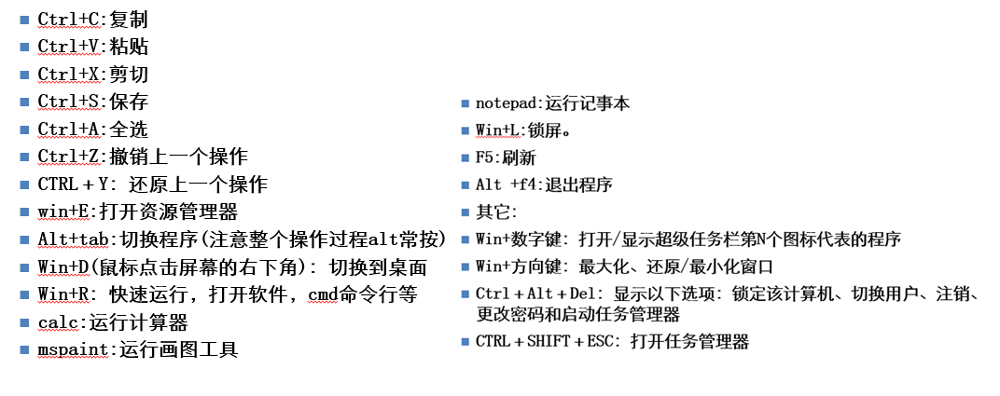
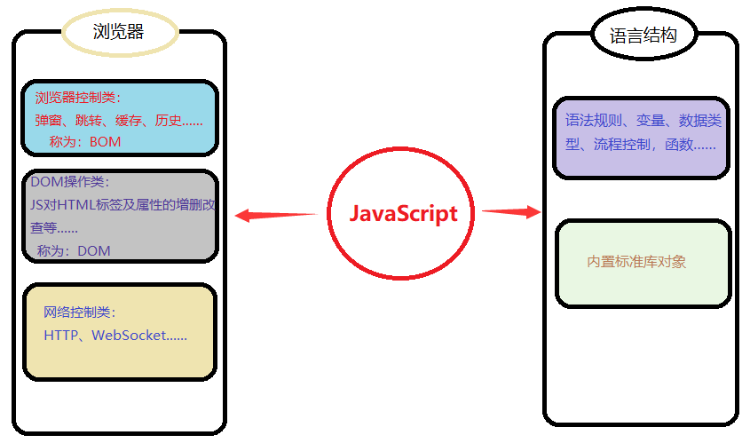
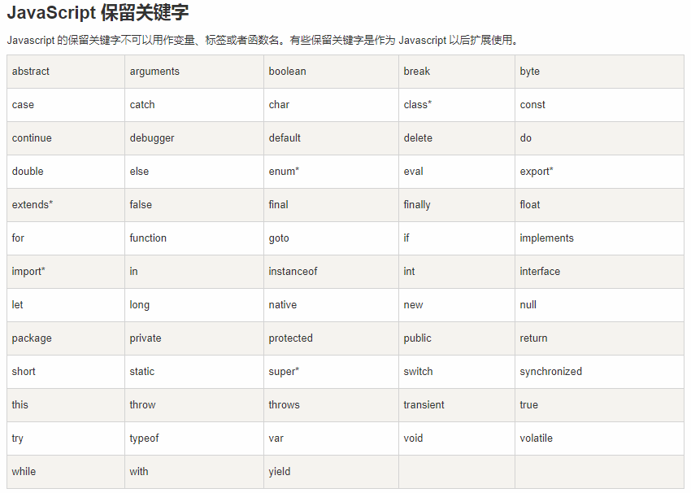
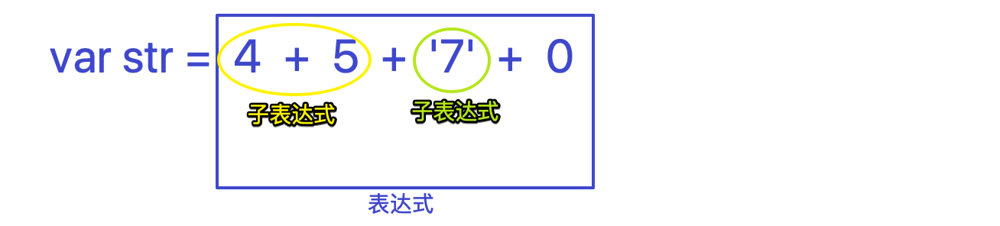
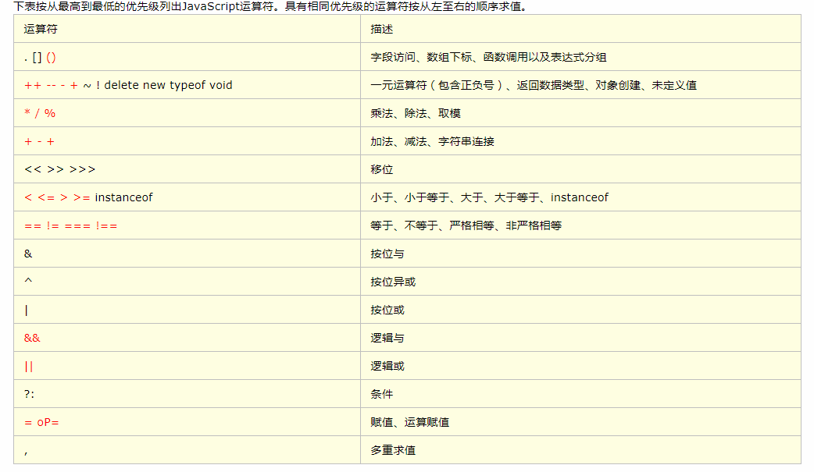
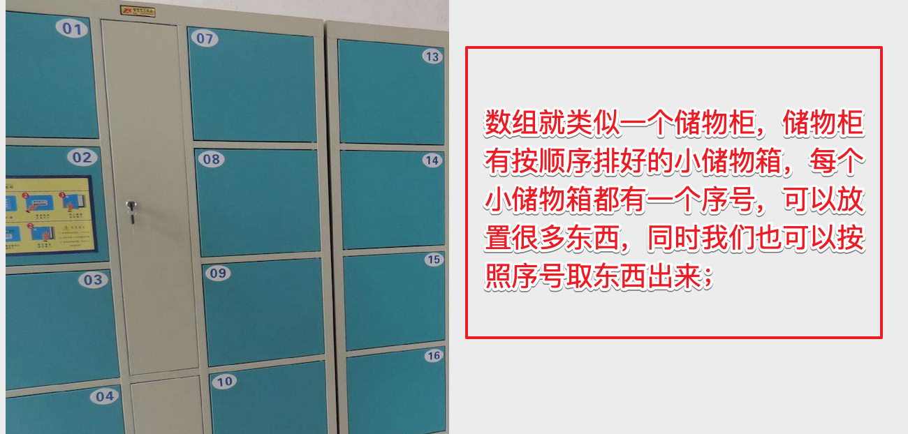
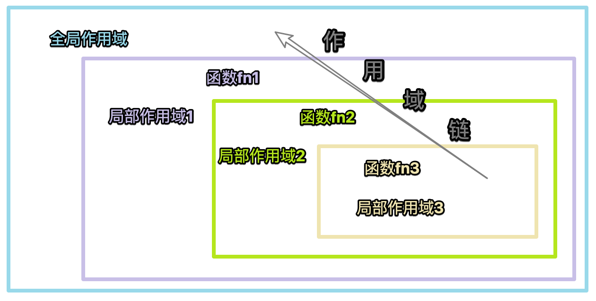
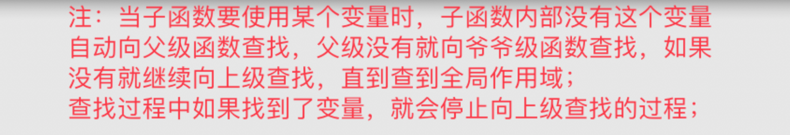

## 第0章 课前说明

### 0.1 学习方法及态度
没有学不会的知识，只有不努力的傻子！！！

学习的过程很痛苦，不学习的日子是苦难！！！


### 0.2 学前准备

1：拒绝一阳指和二指禅；
2：打字练习，及格线： 100/分


3：windows中的常用快捷键


### 0.3 开发工具

#### 0.3.1 浏览器

浏览器是指可以显示网页服务器或者文件系统的HTML文件（标准通用标记语言的一个应用）内容，并让用户与这些文件交互的一种软件。

国内网民计算机上常见的网页浏览器有，QQ浏览器、Internet Explorer、Firefox、Safari，Opera、Google Chrome、百度浏览器、搜狗浏览器、猎豹浏览器、360浏览器、UC浏览器、傲游浏览器、世界之窗浏览器等，浏览器是最经常使用到的客户端程序。


常用的五大浏览器：chrome，firefox，Safari，ie，opera；

**我们用的最多的则是 chrome(谷歌浏览器) 和 Firefox(火狐浏览器)**


#### 0.3.2 编辑器

Sublime Text、VSCode、Atom、Brackets、WebStorm、Notepad++、HBuilder、Vim、记事本......


### 0.4 JavaScript语言的强大
http://impress.github.io/impress.js/
http://naotu.baidu.com/ 
http://echarts.baidu.com/index.html


> 总结:
>
> 摆正学习心态；编程基本功要练好；编程使用的工具要熟悉且顺手；我们要学的 JavaScript 很强大；


## 第1章 JavaScript介绍

### 1.1 JavaScript编程语言
JavaScript，简称JS，是一种客户端脚本语言，主要用来向HTML网页添加各式各样的动态功能,为用户提供更流畅美观的浏览效果。

可以直接嵌入HTML页面，但写成单独的js文件有利于结构和行为的分离。

在绝大多数浏览器的支持下，可以在多种平台下运行（如[Windows](https://baike.baidu.com/item/Windows)、[Linux](https://baike.baidu.com/item/Linux)、Mac、Android、iOS等）

JS主要运行于客户端（浏览器），也可以运行在服务端（操作系统）


JavaScript 和 Java 是两种不同的编程语言：JavaScript主要用于客户端，Java用于服务端。


**JavaScript现在的意义(应用场景)**

JavaScript 发展到现在几乎无所不能。
1. **网页特效** *
2. **服务端开发(Node.js)** *
3. 命令行工具(Node.js)
4. 桌面程序(Electron)
5. App(Cordova)
6. 控制硬件-物联网(Ruff)
7. 游戏开发(cocos2d-js)


### 1.2 发展及历史


1994年Netscape公司推出免费版本浏览器 Netscape Navigator(网景浏览器1.0)
1995年微软公司发布 Internet Explorer 1.0。
1995年网景公司为适应市场变化，需要开发一门专门在浏览器运行的脚本语言，这个任务交给了布兰登，为了应付公司安排的任务，
他只用10天时间就提交了工作，并将这门语言命名为 LiveScript;
后来为了蹭sun公司java的热度,与sun公司合作，将其临时改名为“JavaScript”;
1996年8月，微软模仿JavaScript开发了一种相近的语言，取名为JScript，首先内置于IE 3.0
1997年7月，ECMA组织发布ECMAScript 1.0版；
此后，明争暗斗不断，1998年6月，ECMAScript 2.0版发布，1999年12月，ECMAScript 3.0版发布；
2007年10月，ECMAScript 4.0版草案发布，2008年7月中止ECMAScript 4.0的开发，并发布3.1版本；
会后不久，ECMAScript 3.1就改名为ECMAScript 5。
2011年6月，ECMAscript 5.1版发布，现在使用最为广泛的版本 版发布，现在使用最为广泛的版本；
2015年6月，ECMAScript 6正式发布，并且更名为“ECMAScript 2015”；
随后，ECMA组织决定，每年发布一个升级版本，以年号来代替版本号，如：ECMAScript 2016、ECMAScript 2017；

**另外：**
1996年，样式表标准CSS第一版发布；
1997年，DOM模式第一版正式应用，目前的通用版本是DOM3，下一代版本DOM 4正在拟定中。
1999年，IE5部署了XMLHttpRequest接口，允许JavaScript发出HTTP请求；
2001年，提出了JSON格式，用于取代XML格式。
2002年，Mozilla项目发布第一版Firefox。
2003年，苹果公司发布了Safari浏览器的第一版。
2006年，jQuery函数库诞生
2007年，Webkit引擎在iPhone手机中得到部署；
2008年，为Chrome浏览器而开发的V8编译器(解析引擎)诞生；
2009年，基于V8解析引擎的Node.js项目诞生,迎来前后端JS的霸权时代；
2009年，Google发布Chrome OS
2009年，Google发布Angular框架；
2013年，Mozilla基金会发布手机操作系统Firefox OS，该操作系统的整个用户界面都使用JavaScript；
2013年5月，Facebook发布UI框架库React；
2014年，尤雨溪发布开源前端开发库Vue.js；
2015年3月，Facebook公司发布了 React Native项目；


### 1.3 JavaScript和HTML、CSS

1. HTML：提供网页的结构，提供网页中的内容

2. CSS: 用来样式排版、美化网页

3. JavaScript: 可以用来控制网页内容，给网页增加动态的效果

   ​

### 1.4  JavaScript的组成

ECMA 欧洲计算机制造联合会；
ECMAScript 是一套标准，定义了一种语言的标准，规定了基本语法、数据类型、关键字、具体API的设计规范等，解析引擎设计的参考标准，但与具体实现无关；


#### 1.4.1 ECMAScript - JavaScript的核心

ECMAScript是一套语法标准，描述了JavaScript语言的基本语法和数据类型，是JavaScript的核心。 ES5   ES6

#### 1.4.2 BOM - 浏览器对象模型

一套操作浏览器功能的API

通过BOM可以操作浏览器窗口，比如：弹出框、控制浏览器跳转、获取分辨率等

#### 1.4.3 DOM - 文档对象模型

一套操作页面元素的API

DOM可以把HTML看做是文档树，通过DOM提供的API可以对树上的节点进行操作


### 1.5 JS学习概况

我们在学习JS时，需要学习的内容分为两部分，**语言结构**及**宿主环境**提供的API；

语言结构部分主要时语言规则及内置对象；

而宿主环境的API，根据宿主环境不同而不同，以浏览器为例(js还可以运行在服务器/操作系统)，最常见的三个类型：
浏览器控制类、DOM操作类、网络控制类；




>  总结：
>
>  JavaScript编程语言简称 JS，是一种嵌入式的脚本语言，应用范围及其广泛，由布兰登-艾奇开发，在20+年的发展中历经沧桑，学习 JS 分为语言规则及宿主环境两部分；


## 第2章 入门

### 2.1 如何写一段JS代码并运行

* 写在行内

```html
01.html: 
<input type="button" value="按钮" onclick="alert('Hello World')" />
```

* 写在script标签中 *

```html
02.html:
<head>
  <script>
    alert('Hello World!');
  </script>
</head>
```

* 写在外部js文件中，在页面引入

```html
03.html:
<script src="main.js"></script>
```

```js
main.js:

alert('Hello World!');
```


> 注意点： **引用外部js文件的 script 标签中不可以再写JavaScript代码，即使写了也不会执行，没有作用**


> 温馨提示：
>
> 下面开始进入 JS 基础语法的学习，非常枯燥，别睡着……
>
> 音乐很优美很动听，但学五线谱真的是乏味无聊痛苦不堪；


### 2.3 变量

#### 2.3.1 什么是变量

- 什么是变量

  变量是计算机内存中存储数据的标识符，根据变量名称可以获取到内存中存储的数据

- 为什么要使用变量

  使用变量可以方便的获取或者修改内存中的数据

**变量就是存储数据的容器；**

#### 2.3.2 如何使用变量

- var声明变量

```javascript
var age;
```

- 变量的赋值

```javascript
var age;
age = 18;
```

- 同时声明多个变量

```javascript
var age, name, sex;
age = 10;
name = 'zs';
```

- 同时声明多个变量并赋值

```javascript
var age = 10, name = 'zs';
```


#### 2.3.3 变量的命名规则和规范

- 规则 - 必须遵守的，不遵守会报错

  - 由字母、数字、下划线、$符号组成，且不能以数字开头

  - 区分大小写

  - 不能是关键字和保留字，例如：for、while。

    

- 规范 - 建议遵守的，不遵守不会报错

  - 变量名必须有意义
  - 遵守驼峰命名法。(首字母小写，后面单词的首字母需要大写。例如：userName、userPassword)

- 下面哪些变量名不合法

  ```
  a	    
  1
  age18
  18age
  name
  $
  $name
  _sex
  &sex
  theworld  
  theWorld
  ```


name变量名，本身不是保留字/关键字， 建议少用。 name在有的浏览器中，是自动声明过的。

#### 2.3.4 案例

1. 交换两个变量的值

```js
var a = '1';
var b = '2';
//  借助第三个变量
var c = a;
a=b;
b=c;
console.log(a,b);
```


2. 不使用临时变量，交换两个数值变量的值

```js
//第二种方式
var num1 = 10;
var num2 = 20;
//计算的方式:累加,然后相减
num1 = num1 + num2;//num1的结果是30
num2 = num1 - num2;//num2的结果是10
num1 = num1 - num2;//num1的结果是20
console.log(num1);
console.log(num2);
```

#### 2.3.5 代码调试（输出变量）


1. alert 弹框  :浏览器页面弹框

```js
var num1 = 10;
alert(num1);
```

2. console.log()  浏览器console控制台

```js
var num1 = 10;
var num2 = 20;
console.log(num1);
console.log(num1, num2);
```

3. document.write() 浏览器页面中

```js
var num1 = 10;
document.write(num1);
```

### 2.4 数据类型

#### 2.4.1 简单数据类型

Number、String、Boolean、Undefined、Null

##### 获取变量的类型

typeof

```javascript
var age = 18;
console.log(typeof age);  // 'number'
```


##### Number类型

- 数值字面量：数值的固定值的表示法（数值直接量）

  110 1024  60.5

- 浮点数（小数）

- 浮点数的精度问题

```
浮点数
	var n = 5e-324;   // 科学计数法  5乘以10的-324次方  
浮点数值的最高精度是 17 位小数，但在进行算术计算时其精确度远远不如整数
   var result = 0.1 + 0.2;    // 结果不是 0.3，而是：0.30000000000000004
   console.log(0.07 * 100);
   不要判断两个浮点数是否相等
```

- 数值范围

  ```js
  最小值：Number.MIN_VALUE，// 这个值为： 5e-324  5乘以10的-324次方
  最大值：Number.MAX_VALUE，// 这个值为： 1.7976931348623157e+308
  无穷大：Infinity
  无穷小：-Infinity
  ```

##### String类型

'abc'   "abc"  单双引号引起来的一连串字符

- 字符串字面量（直接量）

  '程序猿'，'程序媛', "黑马程序猿"


  思考：如何打印以下字符串。
  我是一个   "正直"  的人 
  我很喜欢   "黑马  '程序猿'  "

  注： 转义后单双引号 只能 就近和转义后的单双引号进行配对

- 转义符


注： \b  **退格符**  \f又叫走纸或进纸或 **换页符**

```js
var s = '我很喜欢   \"黑马  \'程序猿\'  \"';
console.log(s);
```


* 字符串长度

length属性用来获取字符串的长度

```js
var str = '黑马程序猿 Hello World';
console.log(str.length);
```


* 字符串拼接

字符串拼接使用 + 连接

```javascript
console.log(11 + 11);
console.log('hello' + ' world');
console.log('100' + '100');
console.log('11' + 11);
console.log('male:' + true);
```

1. 两边只要有一个是字符串，那么+就是字符串拼接功能
2. 两边如果都是数字，那么就是算术功能。


##### Boolean类型

- Boolean字面量：  true和false，区分大小写
- 计算机内部存储：true为1，false为0


##### Undefined和Null

1. undefined表示一个声明了没有赋值的变量，变量只声明的时候值默认是undefined
2. null表示一个空，变量的值如果想为null，必须手动设置


> 注: 关于undefined和null是一个面试中很容易被问到的问题


#### 2.4.2 复杂数据类型

​	Object   对象：保存很多数据的一种数据类型

后面详解；


> 题外话
>
> 如何使用谷歌浏览器，快速的查看数据类型？
>
> 字符串的颜色是黑色的，数值类型是蓝色的，布尔类型也是蓝色的，undefined和null是灰色的

```js
console.log('ss',2,null,undefined,true);
```


### 2.5 注释

被注释的内容是不执行的，不管什么内容都不会运行；

**单行注释**

用来描述下面一个或多行代码的作用

```javascript
// 这是一个变量
var name = 'hm';
```

**多行注释**

用来注释多条代码

```javascript
/*
var age = 18;
var name = 'zs';
console.log(name, age);
*/
```


> 总结：
>
> JS代码的书写，变量的声明方式，数据类型，注释；


## 第3章 数据类型转换

### 3.1 转换成字符串类型

- toString()

  ```js
  var num = 5;
  console.log(num.toString());
  ```

- String()

  ```js
  var s = null;
  console.log(s.toString());
  console.log(String(s));

  // String()函数存在的意义：有些值没有toString()，
  // 这个时候可以使用String()。比如：undefined和null
  ```

- 拼接字符串方式

  num  +  ""，当 + 两边一个操作符是字符串类型，一个操作符是其它类型的时候，会先把其它类型转换成字符串再进行字符串拼接，返回字符串


### 3.2 转换成数值类型

- Number()

  ```js
  var a = Number('1');
  var b = Number(1);
  var c = Number('c');
  var d = Number(null);
  var e = Number(undefined);

  console.log(a,b,c,d,e); // 1 1 NaN 0 NaN

  // Number()可以把任意值转换成数值，如果要转换的字符串中有一个不是数值的字符，返回NaN
  ```

- parseInt()

  ```js
  var a = parseInt('1.2df');
  var b = parseInt(1);
  var c = parseInt('c12');
  var d = parseInt(null);
  var e = parseInt(undefined);

  console.log(a,b,c,d,e); //1 1 NaN NaN NaN

  // 如果第一个字符是数字会解析,直到遇到非数字结束
  // 如果第一个字符不是数字或者符号就返回NaN
  ```

- parseFloat()

  ```js
  var a = parseFloat('1.2df');
  var b = parseFloat('1.3.4');
  var c = parseFloat('c12');
  var d = parseFloat(null);
  var e = parseFloat(undefined);

  console.log(a,b,c,d,e); //1.2 1.3 NaN NaN NaN

  // parseFloat() 把字符串转换成浮点数
  // parseFloat()和parseInt非常相似，
  // 不同之处在与parseFloat会解析第一个 . 遇到第二个.或者非数字结束
  // 如果解析的内容里只有整数，解析成整数
  ```

- +，-，-0 等运算

  ```javascript
  var str = '500';
  console.log(+str);		// 取正
  console.log(-str);		// 取负
  console.log(str - 0);   
  ```


### 3.3 转换成布尔类型

- Boolean()

```js
var a = Boolean('0');
var b = Boolean(0);
var c = Boolean('1');
var d = Boolean(null);
var e = Boolean(undefined);
var f = Boolean(NaN);

console.log(a,b,c,d,e,f); //true false true false false false

// 0、''(空字符串) 、null、 undefined 、NaN 会转换成false  其它都会转换成true
```


> 总结：
>
> 字符串、数值及布尔类型的数据类型转换


## 第4章 操作符

表达式：值和操作符，运算会有一个结果；

同时，表达式中的每个数值及部分表达式，又称为 `子表达式`



### 4.1 算术运算符

```
+ - * / %  取余（取模）
```

### 4.2 一元运算符 *

一元运算符：只有一个操作数的运算符，一元运算会直接修改原始变量的数据；

5 + 6  两个操作数的运算符 二元运算符

++  自身加 (自增)

--   自身减 (自减)


- 前置++

  ```js
  var num1 = 5;
  ++ num1; 

  var num2 = 6;
  console.log(num1 + ++ num2); //13
  ```

- 后置++

  ```javascript
  var num1 = 5;
  num1 ++;    
  var num2 = 6 
  console.log(num1 + num2 ++); //12
  ```

- 猜猜看

  ```javascript
  var a = 1; 
  var b = ++a + ++a; 
  console.log(b); //5

  var a = 1; 
  var b = a++ + ++a; 
  console.log(b);//4

  var a = 1; 
  var b = a++ + a++; 
  // console.log(b);  // 3

  var a = 1; 
  var b = ++a + a++; 
  console.log(b);//4
  ```

  **总结**
  **前置++：先加1，后参与运算**
  **后置++：先参与运算，后加1**

  **后置++ 运算的两个条件，满其一就会执行**

  **1：整个表达式结束；2表达式没结束但是又被使用了；**


  **上面两个理解后，下面两个自通**
  **前置--  ：先减1，后参与运算**
  **后置--  ：先参与运算，后减1**

### 4.3 逻辑运算符(布尔运算符) * 

```
&& 与 左边为真则取右边，左边为假则取左边
|| 或 左边为真则取左边，左边为假则边右边
!  非  取反
```


```js
var a = 1;
var b = 2;
var c = 0;

console.log(a || b); //1
console.log(b || a); //2
console.log(c && a); //0
console.log(a || c && b); //1

// JS逻辑运算中的逻辑或和逻辑与的运算结果：
// 决定整个表达式的子表达式的值
```


### 4.4 关系运算符(比较运算符)

```
<  >  >=  <= == != === !==
```

```javascript
==与===的区别：==只进行值得比较，===类型和值同时相等，则相等

var result = '55' == 55;  	// true
var result = '55' === 55; 	// false 值相等，类型不相等
var result = 55 === 55; 	// true
```


### 4.5 赋值运算符

注意与数学符号的差别；

=   +=   -=   *=   /=   %= 

```javascript
例如：
var num = 0;
num += 5;	//相当于  num = num + 5;
```


### 4.6 运算符的优先级 *




```
优先级从高到底
1. ()  优先级最高
2. 一元运算符  ++   --   !
3. 算数运算符  先*  /  %   后 +   -
4. 关系运算符  >   >=   <   <=
5. 相等运算符   ==   !=    ===    !==
6. 逻辑运算符 先&&   后||
7. 赋值运算符
```

```javascript
// 练习1：
var s = 4 >= 6 || '人' != '阿凡达' && !(12 * 2 == 144) && true
console.log(s); //true

// 练习2：
var num = 10;
var f = 5 == num / 2 && (2 + 2 * num)
console.log(f.toString() === 22) //false
```


> 总结：
>
> 操作符的使用，基本数学运算，一元运算符自增自减及前置后置的区别，逻辑运算符及取值，关系比较运算符，赋值运算符，运算符优先级；


## 第5章 流程控制

程序的三种基本结构

**顺序结构**： 从上到下执行的代码就是顺序结构

程序默认就是由上到下顺序执行的；

**分支结构**：根据不同的情况及判断，执行对应代码；

**循环结构**：重复执行一段代码；


### 5.1 分支结构

##### if语句

语法结构

```javascript
if (/* 条件表达式 */) {
  // 执行语句
}

if (/* 条件表达式 */){
  // 成立执行语句
} else {
  // 否则执行语句
}

if (/* 条件1 */){
  // 成立执行语句
} else if (/* 条件2 */){
  // 成立执行语句
} else if (/* 条件3 */){
  // 成立执行语句
} else {
  // 最后默认执行语句
}
```

**案例**

```js
//获取两个数字中的最大值
var num1=100;
var num2=20;
if(num1>num2){
    console.log(num1);
}else{
    console.log(num2);
}
```


```js
// 判断一个数是偶数还是奇数
var n = 10;
if(n%2==0){
    console.log('偶数');
}else{
    console.log('奇数');
}
```


```js
    /*
    * 例子:
    * 获取考试的分数,如果成绩是在90(含)分以上的,则显示级别:A
    * 如果成绩是大于等于80的则:B
    * 如果成绩是大于等于70的则:C
    * 如果成绩是大于等于60的则:D
    * 如果成绩是小于60的则:E
    *
    * */


    var score = 91;
    if (score >= 90) {
        console.log("A");
    } else if (score >= 80) {
        console.log("B");
    } else if (score >= 70) {
        console.log("C");
    } else if (score >= 60) {
        console.log("D");
    } else {
        console.log("E");
    }
```


> 作业：判断一个年份是闰年还是平年
>
> 闰年：能被4整除，但不能被100整除的年份 或者 能被400整除的年份


```js
var n = 2016;
if(n%4==0){
    if(n%100 !=0){
        console.log('闰年');
    }else if(n%400 ==0){
        console.log('闰年');
    }else{
        console.log('平年');
    }
}else{
    console.log('平年');
}
```


##### 三元运算符

```
表达式1 ? 表达式2 : 表达式3
是对if……else语句的一种简化写法
```


案例：

```js
// 是否年满18岁
var age = 18;
var s = age>=18?'Yes':'no';
console.log(s);
```


```js
// 从两个数中找最大值
var a1 = 110;
var a2 = 19;
var s = a1>a2?a1:a2;
console.log(s);
```


##### switch语句

语法格式:

```javascript
switch (expression) {
  case 常量1:
    语句;
    break;
  case 常量2:
    语句;
    break;
  …
  case 常量n:
    语句;
    break;
  default:
    语句;
    break;
}

/*
* 执行过程:
* 获取表达式的值,和值1比较,相同则执行代码1,遇到break跳出整个语句,结束
* 如果和值1不匹配,则和值2比较,相同则执行代码2,遇到break跳出整个语句,结束
* 如果和值2不匹配,则和值3比较,相同则执行代码3,遇到break跳出整个语句,结束
* 如果和值3不匹配,则和值4比较,相同则执行代码4,遇到break跳出整个语句,结束
* 如果和之前的所有的值都不一样,则直接执行代码5,结束
*/
```

```
break可以省略，如果省略，代码会继续执行下一个case
switch 语句在比较值时使用的是全等操作符, 因此不会发生类型转换（例如，字符串'10' 不等于数值 10）
```


```js
/* *
* 判断这个人的成绩的级别:
* 如果是A,则提示,分数在90分以上
* 如果是B,则提示,分数在80分以上
* 如果是C,则提示,分数在70分以上
* 如果是D,则提示,分数在60分以上
* 否则提示,不及格
* */

var jiBie="B";
switch (jiBie){
    case "A" : 
        console.log("分数在90分以上的");
        break;
    case "B" : 
        console.log("分数在80分以上的");
        break;
    case "C" : 
        console.log("分数在70分以上的");
        break;
    case "D" : 
        console.log("分数在60分以上的");
        break;
    default :
        console.log("不及格");
}

```


### 5.2 循环结构

> 在JS语言中，循环语句有三种，while、do..while、for循环。

#### 5.2.1 while语句

基本语法：

```javascript
// 当循环条件为true时，执行循环体，
// 当循环条件为false时，结束循环。
while (循环条件) {
  //循环体
}
```

案例1：计算1-100之间所有数的和

```javascript
// 初始化变量
var i = 1;
var sum = 0;
// 判断条件
while (i <= 100) {
  // 循环体
  sum += i;
  // 自增
  i++;
}
console.log(sum);
```


案例2：打印100以内 7的倍数

```js
var i = 1;
while(i<100){
    if(i%7==0){
        console.log(i);
    }
    i++;
}
```


案例3：打印100以内所有偶数

```js
var i = 1;
while(i<=100){
    if(i%2==0){
        console.log(i);
    }
    i++;
}
```


案例4：打印100以内所有偶数的和

```js
var i = 1;
var s = 0;
while(i<=100){
    if(i%2==0){
        s = s+i;
    }
    i++;
}
console.log(s);
```


**作业：**
    打印100以内的奇数
    打印100以内的奇数的和


#### 5.2.2 do...while语句

> do..while循环和while循环非常像，二者经常可以相互替代，
>
> 但是do..while的特点是不管条件成不成立，都会执行一次。

```js
do {
  // 循环体;
} while (循环条件);
```


案例：计算1+2+3+4+……+99+100 的结果

```js
// 初始化变量
var i = 0;
var sum = 1;
do {
  sum += i;//循环体
  i++;//自增
} while (i <= 100);//循环条件
```


#### 5.2.3 for语句

> while和do...while一般用来解决无法确认次数的循环。for循环一般在循环次数确定的时候比较方便

for循环语法：

```javascript
// for循环的表达式之间用的是;号分隔的，千万不要写成,
for (初始化表达式1; 判断表达式2; 自增表达式3) {
  // 循环体4
}
```

执行顺序：1243  ----  243   -----243(直到循环条件变成false)

1. 初始化表达式
2. 判断表达式
3. 自增表达式
4. 循环体

```js
//打印1-100之间所有数
for(var i=1;i<=100;i++){
    console.log(i);
}

//求1-100之间所有数的和
var s = 0;
for(var i=0;i<=100;i++){
    s+=i;
}
console.log(s);

//求1-100之间所有偶数的和
var s = 0;
for(var i=1;i<=100;i++){
    if(i%2==0){
        s+=i;
    }
}
console.log(s);

//打印正方形
var start = '';
for (var i = 0; i < 10; i++) {
  for (var j = 0; j < 10; j++) {
    start += '* ';
  }
  start += '\n';
}
console.log(start);

//打印直角三角形
var start = '';
for (var i = 0; i < 10; i++) {
  for (var j = i; j < 10; j++) {
    start += '* ';
  }
  start += '\n';
}
console.log(start);

//打印9*9乘法表
var str = '';
for (var i = 1; i <= 9; i++) {
  for (var j = i; j <=9; j++) {
    str += i + ' * ' + j + ' = ' + i * j + '\t';
  }
  str += '\n';
}
console.log(str);
```


#### 5.2.4 continue和break

> break:立即跳出整个循环，即循环结束，开始执行循环后面的内容（直接跳到大括号）
>
> continue:立即跳出当前循环，继续下一次循环（跳到i++的地方）


案例1：求1-100之间不能被7整除的整数的和（用continue）

```js
var s = 0;
for(var i=0;i<100;i++){
    if(i%7==0){
        continue;
    }
    s+=i;
}
console.log(s);
```


案例2：求200-300之间所有的奇数的和（用continue）

```js
var s = 0;
for(var i=200;i<=300;i++){
    if(i%2==0){
        continue;
    }else{
        s+=i;
    }
}
console.log(s);
```


案例3：求200-300之间第一个能被7整数的数（break）

```js
for(var i=200;i<=300;i++){
    if(i%7==0){
        console.log(i);
        break;
    }
}
```


> 总结：
>
> 代码的执行流程分为顺序、分支和循环三种结构，顺序结构是默认的，判断结构主要有if-else和switch-case两种，循环结构有while、do-while、for三种，其中continue和break是跳出循环；


## 第6章 JS中特殊的对象-数组

> 之前学习的数据类型，只能存储一个值(比如：Number/String)。我们想在一个变量中存储多个值，应该如何存储？


> 所谓数组，就是将多个元素（通常是同一类型）按一定顺序排列放到一个集合中，那么这个集合我们就称之为数组。




### 6.1 数组的创建

```js
// 字面量方式创建数组
var arr1 = []; //空数组
// 创建一个包含3个数值的数组，多个数组项以逗号隔开
var arr2 = [1, 3, 4]; 
// 创建一个包含2个字符串的数组
var arr3 = ['a', 'c']; 
console.log(arr1);
console.log(arr2);
console.log(arr3);

// 可以通过数组的length属性获取数组的长度
console.log(arr3.length);
// 可以设置length属性改变数组中元素的个数
arr3.length = 0;

console.log(arr3[0]);//undefined
```

 数组的元素可以是任意类型的数据，因此，有时数组中的某个元素的值又是一个数组，而这样的数组被称为多维数组，如果数组中只有其他类型的数据，而没有另外的数组值，这样的数组被称为一维数组；

通常，数组被嵌套N层，则称为N维数组，最常见的就是二维数组、三维数组、四维数组，超过一维的数组都会被泛称为多维数组；

数组的维度值越大，复杂度就越高，开发中尽量避免产生高维度值的数组；

```js
var arr1 = [a,b,c]; // 一维数组
var arr2 = [a,b,c,[d,e]]; // 二维数组
var arr3 = [a,b,c,[d,e,[f,g]]]; // 三维数组
var arr4 = [a,b,c,[d,e,[f,g,[h,t,y]]]]; // 四维数组
```


### 6.2 获取数组元素

```js
// 格式：数组名[下标]	下标又称索引
// 下标从0开始
// 功能：获取数组对应下标的那个值，如果下标不存在，则返回undefined。
var arr = ['red',, 'green'];
arr[0];	// red
arr[1];	// undefined 下标位置没有数据
arr[2]; // green
arr[5]; // 这个数组的最大下标为2,因此返回undefined
```

```js
// 获取多维数组的数据
var arr = ['路飞','娜美',['巴基','女帝',['佐助','乔巴']]];
console.log(arr[2][2][0]); //佐助
```


### 6.3 遍历数组

> 遍历：遍及所有，对数组的每一个元素都访问一次就叫遍历。

for循环数组遍历的基本语法：

```js
for(var i = 0; i < arr.length; i++) {
	// 数组遍历的固定结构
}
```

for循环示例：

```js
var arr1 = [1, 3, 4]; 

for(var i = 0;i<arr1.length;i++){
    console.log(arr1[i]);
}
```


whil循环示例：

```js
var arr1 = [1, 3, 4]; 

var i = 0;
while(i<arr1.length){
    console.log(arr1[i]);
    i++;
}
```


### 6.4 为数组修改添加元素

```js
// 格式：数组名[下标/索引] = 值;
// 如果下标有对应的值，会把原来的值覆盖，如果下标不存在，会给数组新增一个元素。
var arr = ["red", "green", "blue"];
// 把red替换成了yellow
arr[0] = "yellow";
// 给数组新增加了一个pink的值
arr[3] = "pink";
```


### 6.5 数组操作案例


案例1：求数组中的所有数的和

```js
//求和
var arr = [10, 20, 30, 40, 50];
//定义变量存储和
var sum = 0;
for (var i = 0; i < arr.length; i++) {
    sum += arr[i];
}
console.log("和为:" + sum);
```


案例2：获取数组中的最大值

```js
//最大值
var arr = [10, 20, 30, 40, 50, 60];
//假设这个变量中的值是最大的
var maxNum = arr[0];
//遍历数组
for (var i = 0; i < arr.length; i++) {
    //判断
    if (maxNum < arr[i]) {
        maxNum = arr[i];
    }
}
console.log("最大值是:" + maxNum);
```


案例3： 遍历出数组中所有的偶数

```js
// 遍历出数组中所有的偶数
var arr = [1,2,3,4,5,6,7];
for(var i=0;i<arr.length;i++){
    //判断
    if(arr[i]%2==0){
        console.log(arr[i]);
    }
}
```


案例4：将数组转为字符串并以 | 分割

```js
//把数组中的每个名字后面拼接一个|然后以字符串的方式输出
var names = ["卡卡西", "佐助", "凤姐", "鸣人", "黑崎一护"];
var str = "";//空的字符串,用来存储最后的拼接的结果的字符串
//不停的遍历数组的数据,并且拼接字符串
for (var i = 0; i < names.length - 1; i++) {
    str += names[i] + "|";//拼接字符串的方式
}
str += names[names.length - 1];
console.log(str);
```


> 总结：
>
> 数组就是多个数据的集合，有一维数组和多维数组之分，可以使用字面量方式创建数组，使用下标来获取数组元素数据，使用for或者while循环来遍历数组元素；


## 第7章 函数

> 把一段相对独立的具有特定功能的代码块封装起来，形成一个独立实体，就是函数，起个名字（函数名），在后续开发中可以反复调用
>
> 函数的作用就是封装一段代码，将来可以重复使用


### 7.1 函数的声明及调用

#### 7.1.1 声明

- 关键字声明

```javascript
function 函数名(){
  // 函数体
}
```

- 表达式声明

```javascript
var fn = function() {
  // 函数体
}
```

- 特点：

  函数声明的时候，函数体并不会执行，只要当函数被调用的时候才会执行。
  一个函数一般都特定的用来干 **一件** 事情


#### 7.1.2 调用

- 调用函数的语法：

```javascript
函数名();
```

- 特点：

  函数体只有在调用的时候才会执行，调用需要()进行调用。
  可以调用多次(重复使用)

```js
// 声明函数
function sayHi() {
  console.log("吃了没？");
}
// 调用函数
sayHi();

// 求1-100之间所有数的和
function getSum() {
  var sum = 0;
  for (var  i = 0; i < 100; i++) {
    sum += i;
  }
  console.log(sum);
}
// 一段代码可以多次调用
getSum();
getSum();
getSum();
```


### 7.2 参数

- 为什么要有参数

```javascript
function getSum() {
  var sum = 0;
  for (var i = 1; i <= 100; i++) {
    sum += i;
  }
  console.log();
}

// 虽然上面代码可以重复调用，但是只能计算1-100之间的值
// 如果想要计算n-m之间所有数的和，应该怎么办呢？
```

- 语法：

```js
// 函数内部是一个封闭的环境，可以通过参数的方式，把外部的值传递给函数内部
// 带参数的函数声明
function 函数名(形参1, 形参2, 形参...){
  // 函数体
}

// 带参数的函数调用
函数名(实参1, 实参2, 实参3);
```


* **形参和实参* **

> 1. 形式参数：在声明一个函数的时候，为了函数的功能更加灵活，有些值是固定不了的，对于这些固定不了的值。我们可以给函数设置参数。这个参数没有具体的值，仅仅起到一个占位置的作用，我们通常称之为形式参数，也叫形参。
> 2. 实际参数：如果函数在声明时，设置了形参，那么在函数调用的时候就需要传入对应的参数，我们把传入的参数叫做实际参数，也叫实参。


```js
function fn(a, b) {
  console.log(a + b);
}
var x = 5, y = 6;
fn(x,y); 
// x,y实参，有具体的值。
// 函数执行的时候会把x,y复制一份给函数内部的a和b，
// 函数内部的值是复制的新值，无法修改外部的x,y
```


> JS 函数在调用时，允许传多个实参，就是实参个数可以比形参个数多；


### 7.3 函数的返回值

> 当函数执行完的时候，并不是所有时候都要把结果打印。我们期望函数给我一些反馈（比如计算的结果返回进行后续的运算），这个时候可以让函数返回一些东西。也就是返回值。函数通过return返回一个值

返回值语法：

```js
//声明一个带返回值的函数
function 函数名(形参1, 形参2, 形参...){
  //函数体
  return 返回值;
}

//可以通过变量来接收这个返回值
var 变量 = 函数名(实参1, 实参2, 实参3);
```


**返回值详解：* **
    如果函数没有显示的使用 return语句 ，那么函数有默认的返回值：undefined
    如果函数使用 return语句，那么跟再return后面的值，就成了函数的返回值
    如果函数使用 return语句，但是return后面没有任何值，那么函数的返回值也是：undefined
    函数使用return语句后，这个函数会在执行完 return 语句之后停止并立即退出，也就是说return后面的所有其他代码都不会再执行。


### 7.4 函数相关的其它事情

#### 7.4.1 匿名函数与自调用函数

> 匿名函数：没有名字的函数

匿名函数如何使用：

将匿名函数赋值给一个变量，这样就可以通过变量进行调用

```js
var fun1 = function(){
    console.log(1);
}
fun1();
```


> 匿名函数如果没有任何变量来表示它，那么就不能直接调用来执行，因此可以通过匿名函数的自调用的方式来执行

```javascript
(function () {
  alert(123);
})();
```

**关于自执行函数（匿名函数自调用）的作用：防止全局变量污染。**


#### 7.4.2 函数本身也是值 * 

```js
function fn() {}
console.log(typeof fn);
```

- 函数作为参数

因为函数也是一种值类型，可以把函数作为另一个函数的参数，在另一个函数中调用

```js
function f1(f){
    f();
}
function f2(){
    console.log(2);
}
f1(f2); //2
```


- 函数做为返回值

因为函数是一种类型，所以可以把函数可以作为返回值从函数内部返回。

```javascript
function fn(b) {
  var a = 10;
  return function () {
    alert(a+b);
  }
}
var f = fn(5);
f();  //15
```


> 总结：
>
> 函数是一段代码的封装，可重复多次运行，函数的声明有表达式声明和关键字声明，使用 ·函数名()· 的方式进行调用，调用时传入的参数为实参，声明时的参数时形参，函数使用return返回值，函数可以是没有名字的匿名函数，函数本身也可以当做值使用；


## 第8章 作用域与JS代码的运行 * 

> 作用域：变量可以起作用的范围和区域

### 8.1 全局变量和局部变量 *

- 全局变量与全局作用域

  在任何地方都可以访问到的变量就是**全局变量**，全局变量所在的区域就是**全局作用域**

- 局部变量

  只在固定的代码片段内可访问到的变量，最常见的例如函数内部的变量，就是**局部变量**。局部变量所在的区域就是**局部作用域**(函数作用域)

```
不使用var声明的变量是全局变量，不推荐使用。
变量退出作用域之后会销毁，全局变量关闭网页或浏览器才会销毁
```


### 8.2 变量提升

```js
console.log(a); // undefined
var a = 2;
```

```js
console.log(a); //   a is not defined
```

- 变量提升

  定义变量的时候，变量的声明会被提升到作用域的最上面，变量的赋值不会提升。

- 函数提升

  JavaScript解析器首先会把当前作用域的函数声明提前到整个作用域的最前面

```js
f();
function f(){
    console.log(12); //12
}
```


```js
var f = 1;
function f(){
    console.log(12); //12
}
// 由于函数提升在前，所以被变量声明替换了；
// 执行阶段，变量被复制为1，不再是一个函数，
f(); // f is not a function
```

> 注：不管是普通变量还是函数，尽量不要出现重名；


### 8.3 JS代码的运行 * 

```js
console.log(s); //undefined
var s = 2;
```


> JavaScript代码的执行是由浏览器中的JavaScript解析器来执行的。
>
> JavaScript解析器执行JavaScript代码的时候，分为两个过程：**预解析(编译)过程和代码执行过程**

**预解析过程：**

0. 语法检查，如果有错误，直接停止后续步骤不再运行。

1. 把变量和函数的声明提升到当前作用域的最前面，只会提升声明，不会提升赋值和调用。
2. 先提升变量后提升函数，如果函数和变量同名，则被替换；


**代码执行过程**

变量的赋值，函数的调用，循环判断等，根据代码由上往下顺序执行；

```js
var a = 25;
function abc (){
  alert(a);//undefined
  var a = 10;
}
abc();


// 如果变量和函数同名的话，函数优先做提升
console.log(a);
function a() {
  console.log('aaaaa');
}
var a = 1;
console.log(a);

```


```js
// 1、----------------
var num = 10;
fun();
function fun() {
    console.log(num); //undefined
    var num = 20;
}

// 2、----------------
var a = 18;
f1();
function f1() {
    var b = 9;
    console.log(a); //undefined
    console.log(b); // 9
    var a = '123'; 
}

```


### 8.4 词法作用域

变量的作用域是在定义时决定而不是执行时决定的，也就是说词法作用域取决于编译阶段，通过静态分析就能确定，因此词法作用域也叫做静态作用域。

**在 js 中词法作用域规则:**

- 函数允许访问函数外的数据.
- 整个代码结构中只有函数可以限定作用域.
- 作用域规则首先使用提升规则分析
- 如果当前作用规则中有名字了, 就不考虑外面的名字

```javascript
var num = 123;
function foo() {
  console.log( num );
}
foo();

if ( false ) {
    var num = 123;
}
console.log( num ); // undefiend
```


也就是说：

**函数内部可以访问函数外部的变量，但是函数外部不可以访问函数内部的变量；**

**函数内部如果有变量，则优先使用内部的变量，如果函数内部没有，才会使用函数外部的变量；**


### 8.5 作用域链 *

```js
只有函数可以制造作用域结构， 那么只要是代码，就至少有一个作用域, 即全局作用域。凡是代码中有函数，那么这个函数就构成另一个作用域。如果函数中还有函数，那么在这个作用域中就又可以诞生一个作用域。

将这样的所有的作用域列出来，可以有一个结构: 函数内指向函数外的链式结构。就称作作用域链。
```


```js
var a = 1;
function fn1(){
    function fn2(){
        function fn3(){
            console.log(a);
        }
        fn3();
    }
    fn2();
}
fn1();
```







```js
var a = 1;
function fn1(){
    var a = 2;
    function fn2(){
        var a = 3;
        function fn3(){
            console.log(a);
        }
        fn3();
    }
    fn2();
}
fn1();
```


> 总结：
>
> 函数内部是JS代码的局部作用域，函数外部是全局作用域，JS 代码的运行分为与解析阶段和执行阶段，变量的声明实在与解析阶段的，所以变量存在提升，而变量只在自己的作用域中起作用，但是自己作用域是可以访问上级作用域的；


## 第9章 对象(Object)

### 9.1 什么是对象

**万物皆对象**

```
现实生活中：万物皆对象，对象是一个具体的事物，一个具体的事物就会有行为和特征。
举例： 一部车，一个手机
车是一类事物，门口停的那辆车才是对象
	特征：红色、四个轮子
	行为：驾驶、刹车
```

### 9.2 JavaScript中的对象

```
JavaScript中的对象其实就是生活中对象的一个抽象
JavaScript的对象是无序属性的集合。
其属性可以包含基本值、对象、数组或函数。
对象就是一组没有顺序的值。
我们可以把JavaScript中的对象想象成键值对，其中值可以是数据和函数。
对象的行为和特征
	特征---属性
	行为---方法
```

**事物的特征在对象中用属性来表示。**

**事物的行为在对象中用方法来表示。**

**属性和方法统称为对象的成员。**


### 9.3 如何得到一个对象

* 字面量方式创建对象

  ```js
  var obj1 = {};//得到一个空对象
  var obj2 = {name:'张三',age:18};//得到拥有两个属性的对象
  //得到拥有两个属性和一个方法的对象
  var obj3 = {
      name:'张三',
      age:18,
      fei:function(){
          console.log('你上天啊！');
      }
  }
  ```


* new Object() 创建对象 （内置构造函数）

  ```js
  var person = new Object();

  person.name = 'lisi';
  person.age = 35;
  person.sayHi = function(){
      console.log('Hello,everyBody');
  }
  ```

* 自定义构造函数创建对象

  ```js
  function Person(name,age,job){
        this.name = name;
        this.age = age;
        this.job = job;
        this.sayHi = function(){
          console.log('Hello,everyBody');
        }
  }
  var p1 = new Person('张三', 22, 'actor');
  ```


new关键字和构造函数

> 构造函数 ，是一种特殊的函数，又叫做函数构造器。主要用来在创建对象时初始化对象， 即为对象成员变量赋初始值，总与new运算符一起使用在创建对象的语句中。

1. 构造函数用于创建一类对象，首字母通常大写。

2. 构造函数要和new一起使用才有意义。

3. new 关键字也读做实例化。实例化构造函数，得到一个对象。

   ​

### 9.4 this 的指向

>  JavaScript中的this指向问题，比较复杂，有时候会让人难以捉摸，随着学习的深入，我们会不断接触this，
>
>  在学习过程中，我们可以不断总结，最终搞清楚this在何种情况下指向何处……
>
>  目前，我们只需要记住以下两点就可以了：
>
>  **1: 函数如果在某个对象下，this就指向这个对象**
>
>  **2: 函数如果被直接调用，this指向window对象**


```js
var o1 = {
    name: '山治',
    f: function () {
        console.log(this.name);
    }
}
o1.f(); // 山治
```


```js
function f(){
    console.log(this);
}
f();
console.log(window);
```


### 9.5 对象的使用

* **方法及属性的使用**

```js
对象.方法名()； //调用对象的方法
对象.属性；   //获取对象的属性
```


* 遍历对象的属性

通过for..in语法可以遍历一个对象

``` js
var obj1 = {
    name:'路飞',
    age : 17,
    sex : '男',
}

for(var k in obj1){
    console.log(k);
    console.log(obj1[k]);
}
```

> 注意：使用for …in语法，同样可以遍历数组
>
> 注意：如果属性名或方法名，是一个变量，则使用对象[变量名] 语法


* 删除对象的属性

```js
var obj1 = {
    name:'路飞',
    age : 17,
    sex : '男',
}

console.log(obj1.age); //17
delete obj1.age;  //删除对象中指定的属性
console.log(obj1.age); // undefined
```


> 总结：
>
> 创建对象有三种方式，字面量、new内置构造函数及自定义构造函数；对象中有属性及方法，this指向当前对象，使用 . (点) 语法调用属性及方法；


## 第10章 标准库对象(内置对象)

JavaScript 提供了很多个内置对象：Math/Array/Number/String/Boolean...

对象只是带有**属性**和**方法**的特殊数据类型。

我们在学习时其实就是要记住对象的每个属性和方法怎么使用，代表什么含义；

技术问题，遇到分歧，去哪里查找资料：

[火狐开发者社区--MDN](https://developer.mozilla.org/zh-CN/)

[微软开发者社区--MSDN](https://msdn.microsoft.com/zh-cn/library/d1et7k7c)


### 10.1 Math对象

https://developer.mozilla.org/zh-CN/docs/Web/JavaScript/Reference/Global_Objects/Math

#### 10.1.1 常用属性和方法

**Math** 是一个内置对象， 它具有数学常数和函数的属性和方法。不是一个函数对象。

与其它全局对象不同的是, `Math` 不是一个构造函数.  `Math` 的所有属性和方法都是静态的. 

跟数学相关的运算直接使用Math中的成员即可

```javascript
console.log(Math.PI); //圆周率3.141592653589793
Math.random();//介于 0 和 1 之间的伪随机数。

Math.ceil(6.6);//获取大于或等于提供数值的最小整数--向上取整
Math.floor(8.8);//获取小于或等于提供数值的最大整数--向下取整
Math.round(9.9);//四舍五入
Math.max(10,20,15);//取多个值中的最大值
Math.min(10,20,15);//取多个值中的最小值
Math.pow(10,2);//返回x的y次幂
Math.sqrt(100);//求平方根

```
#### 10.1.2 案例

- 求10-20之间的随机数

  ```js
  Math.floor(Math.random() * (max - min)) + min; 
  ```


#### 10.1.3 属性方法对照表

**Math对象的属性（常量）**

| 属性(常量)                                   | 描述                         |
| ---------------------------------------- | -------------------------- |
| [Math.E 常量](https://msdn.microsoft.com/zh-cn/library/ff806187(v=vs.94).aspx) | 数学常数 e。这是欧拉数，自然对数的底。       |
| [Math.LN2 常量](https://msdn.microsoft.com/zh-cn/library/ff806187(v=vs.94).aspx) | 2 的自然对数。                   |
| [Math.LN10 常量](https://msdn.microsoft.com/zh-cn/library/ff806187(v=vs.94).aspx) | 10 的自然对数。                  |
| [Math.LOG2E 常量](https://msdn.microsoft.com/zh-cn/library/ff806187(v=vs.94).aspx) | 以 2 为底 e 的对数。              |
| [Math.LOG10E 常量](https://msdn.microsoft.com/zh-cn/library/ff806187(v=vs.94).aspx) | 以 10 为底 e 的对数。             |
| [Math.PI 常量](https://msdn.microsoft.com/zh-cn/library/ff806187(v=vs.94).aspx) | Pi。这是圆的周长与直径的比值。           |
| [Math.SQRT1_2 常量](https://msdn.microsoft.com/zh-cn/library/ff806187(v=vs.94).aspx) | 0.5 的平方根，或相当于 1 除以 2 的平方根。 |
| [Math.SQRT2 常量](https://msdn.microsoft.com/zh-cn/library/ff806187(v=vs.94).aspx) | 2 的平方根。                    |

**Math对象的方法（函数）**

| 方法(函数)                                   | 描述                                  |
| ---------------------------------------- | ----------------------------------- |
| [Math.abs 函数](https://msdn.microsoft.com/zh-cn/library/09bx9f48(v=vs.94).aspx) | 返回数字的绝对值。                           |
| [Math.acos 函数](https://msdn.microsoft.com/zh-cn/library/w1ah75x5(v=vs.94).aspx) | 返回数字的反余弦值。                          |
| [Math.acosh 函数](https://msdn.microsoft.com/zh-cn/library/dn858239(v=vs.94).aspx) | 返回数字的双曲反余弦值（或反双曲余弦值）。               |
| [Math.asin 函数](https://msdn.microsoft.com/zh-cn/library/whc9ckbs(v=vs.94).aspx) | 返回数字的反正弦值。                          |
| [Math.asinh 函数](https://msdn.microsoft.com/zh-cn/library/mt179289(v=vs.94).aspx) | 返回数字的反双曲正弦。                         |
| [Math.atan 函数](https://msdn.microsoft.com/zh-cn/library/13bwes5d(v=vs.94).aspx) | 返回数字的反正切值。                          |
| [Math.atan2 函数](https://msdn.microsoft.com/zh-cn/library/a5h904dw(v=vs.94).aspx) | 将与 X 轴的角度（以弧度为单位）返回到由 y 和 x 坐标表示的点。 |
| [Math.atanh 函数](https://msdn.microsoft.com/zh-cn/library/mt179295(v=vs.94).aspx) | 返回数字的反双曲正切。                         |
| [Math.ceil 函数](https://msdn.microsoft.com/zh-cn/library/w0w5b52h(v=vs.94).aspx) | 返回大于或等于提供的数值表达式的最小整数。               |
| [Math.cos 函数](https://msdn.microsoft.com/zh-cn/library/d1b6ys0y(v=vs.94).aspx) | 返回数字的余弦值。                           |
| [Math.cosh 函数](https://msdn.microsoft.com/zh-cn/library/mt179292(v=vs.94).aspx) | 返回数字的双曲余弦。                          |
| [Math.exp 函数](https://msdn.microsoft.com/zh-cn/library/ttzd50c6(v=vs.94).aspx) | 返回 *e*（自然对数的底）的乘幂数。                 |
| [Math.expm1 函数](https://msdn.microsoft.com/zh-cn/library/mt179287(v=vs.94).aspx) | 返回 e（自然对数的底）的乘幂数减去 1 的结果。           |
| [Math.floor 函数](https://msdn.microsoft.com/zh-cn/library/sw6w4wz7(v=vs.94).aspx) | 返回小于或等于提供的数值表达式的最大整数。               |
| [Math.hypot 函数](https://msdn.microsoft.com/zh-cn/library/dn858234(v=vs.94).aspx) | 返回参数平方和的平方根。                        |
| [Math.imul 函数](https://msdn.microsoft.com/zh-cn/library/dn858242(v=vs.94).aspx) | 返回被视为 32 位带符号整数的两个数字的积。             |
| [Math.log 函数](https://msdn.microsoft.com/zh-cn/library/d3fzc1f3(v=vs.94).aspx) | 返回数字的自然对数。                          |
| [Math.log1p 函数](https://msdn.microsoft.com/zh-cn/library/mt179291(v=vs.94).aspx) | 返回 1 加上一个数字的的自然对数。                  |
| [Math.log10 函数](https://msdn.microsoft.com/zh-cn/library/mt179293(v=vs.94).aspx) | 返回数字以 10 为底的对数。                     |
| [Math.log2 函数](https://msdn.microsoft.com/zh-cn/library/mt179286(v=vs.94).aspx) | 返回数字以 2 为底的对数。                      |
| [Math.max 函数](https://msdn.microsoft.com/zh-cn/library/dxcwky7y(v=vs.94).aspx) | 返回提供的两个数值表达式中的较大值。                  |
| [Math.min 函数](https://msdn.microsoft.com/zh-cn/library/7x8968dh(v=vs.94).aspx) | 返回提供的两个数字中的较小值。                     |
| [Math.pow 函数](https://msdn.microsoft.com/zh-cn/library/0xhwcwy6(v=vs.94).aspx) | 返回基表达式的指定乘幂数的值。                     |
| [Math.random 函数](https://msdn.microsoft.com/zh-cn/library/41336409(v=vs.94).aspx) | 返回介于 0 和 1 之间的伪随机数。                 |
| [Math.round 函数](https://msdn.microsoft.com/zh-cn/library/5cza0web(v=vs.94).aspx) | 返回舍入到最近整数的指定数值表达式。                  |
| [Math.sign 函数](https://msdn.microsoft.com/zh-cn/library/mt146833(v=vs.94).aspx) | 返回数字符号，它指示数字为正数、负数还是 0。             |
| [Math.sin 函数](https://msdn.microsoft.com/zh-cn/library/4456w8t3(v=vs.94).aspx) | 返回数字的正弦值。                           |
| [Math.sinh 函数](https://msdn.microsoft.com/zh-cn/library/mt179296(v=vs.94).aspx) | 返回数字的反双曲正弦。                         |
| [Math.sqrt 函数](https://msdn.microsoft.com/zh-cn/library/95596f3d(v=vs.94).aspx) | 返回数字的平方根。                           |
| [Math.tan 函数](https://msdn.microsoft.com/zh-cn/library/c3d7c01f(v=vs.94).aspx) | 返回数字的正切值。                           |
| [Math.tanh 函数](https://msdn.microsoft.com/zh-cn/library/mt179294(v=vs.94).aspx) | 返回数字的双曲正切。                          |
| [Math.trunc 函数](https://msdn.microsoft.com/zh-cn/library/mt146827(v=vs.94).aspx) | 返回数字的整数部分，删除任何小数数字。                 |


### 10.2 Date对象（构造函数）

https://developer.mozilla.org/zh-CN/docs/Web/JavaScript/Reference/Global_Objects/Date

#### 10.2.1 常用属性和方法

创建 `Date` 实例用来处理日期和时间。Date 对象基于1970年1月1日（世界标准时间）起的毫秒数。

```javascript
// 获取当前时间，UTC世界时间，距1970年1月1日（世界标准时间）起的毫秒数
var now = new Date();
console.log(now.getTime());	// 获取距1970年1月1日（世界标准时间）起的毫秒数
console.log(now.valueOf());	// valueOf用于获取对象的原始值,与getTime()方法相同

Date构造函数的参数
1. 毫秒数 1498099000356		new Date(1498099000356)
2. 日期格式字符串  '2015-5-1'	 new Date('2015-5-1')
3. 年、月、日……				  new Date(2015, 4, 1)   // 月份从0开始
```


- 获取日期的毫秒形式

```javascript
var now = new Date();
console.log(now.getTime());
// valueOf用于获取对象的原始值
console.log(now.valueOf());

// HTML5中提供的方法，有兼容性问题
var now = Date.now();

// 不支持HTML5的浏览器，可以用下面这种方式
var now = + new Date();	// 隐式调用 Date对象的valueOf() 
```

- 日期格式化方法

```javascript
toString()		// 转换成字符串
valueOf()		// 获取毫秒值
// 下面格式化日期的方法，在不同浏览器可能表现不一致，一般不用
toDateString()
toTimeString()
toLocaleDateString()
toLocaleTimeString()
```

- 获取日期指定部分

```javascript
getTime()  	  // 返回毫秒数和valueOf()结果一样，valueOf()内部调用的getTime()
getSeconds()  // 返回0-59
getMinutes()  // 返回0-59
getHours()    // 返回0-23
getDay()      // 返回星期几 0周日   6周6
getDate()     // 返回当前月的第几天
getMonth()    // 返回月份，***从0开始***
getFullYear() //返回4位的年份  如 2016
```


#### 10.2.2 案例

- 案例1：写一个函数，格式化日期对象，返回yyyy-MM-dd HH:mm:ss的形式

```js
function formatDate(d) {
  //如果date不是日期对象，返回
  if (!date instanceof Date) {
    return;
  }
  var year = d.getFullYear(),
      month = d.getMonth() + 1, 
      date = d.getDate(), 
      hour = d.getHours(), 
      minute = d.getMinutes(), 
      second = d.getSeconds();
  month = month < 10 ? '0' + month : month;
  date = date < 10 ? '0' + date : date;
  hour = hour < 10 ? '0' + hour : hour;
  minute = minute < 10 ? '0' + minute:minute;
  second = second < 10 ? '0' + second:second;
  return year + '-' + month + '-' + date + ' ' + hour + ':' + minute + ':' + second;
}
```

- 计算时间差，返回相差的天/时/分/秒

```js
function getInterval(start, end) {
  var day, hour, minute, second, interval;
  interval = end - start;
  interval /= 1000;
  day = Math.round(interval / 60 /60 / 24);
  hour = Math.round(interval / 60 /60 % 24);
  minute = Math.round(interval / 60 % 60);
  second = Math.round(interval % 60);
  return {
    day: day,
    hour: hour,
    minute: minute,
    second: second
  }
}
```


#### 10.2.3 方法对照表

**Date对象 的方法。**

| 方法                                       | 描述                                       |
| ---------------------------------------- | ---------------------------------------- |
| [getDate 方法](https://msdn.microsoft.com/zh-cn/library/217fw5tk(v=vs.94).aspx) | 使用当地时间返回一个月某天的值。                         |
| [getDay 方法](https://msdn.microsoft.com/zh-cn/library/5wtd2bt8(v=vs.94).aspx) | 使用当地时间返回一个星期某天的值。                        |
| [getFullYear 方法](https://msdn.microsoft.com/zh-cn/library/29y2w2x3(v=vs.94).aspx) | 使用当地时间返回年份值。                             |
| [getHours 方法](https://msdn.microsoft.com/zh-cn/library/815z9tc9(v=vs.94).aspx) | 使用当地时间返回小时值。                             |
| [getMilliseconds 方法](https://msdn.microsoft.com/zh-cn/library/52s3k2tf(v=vs.94).aspx) | 使用当地时间返回毫秒值。                             |
| [getMinutes 方法](https://msdn.microsoft.com/zh-cn/library/t919zcb7(v=vs.94).aspx) | 使用当地时间返回分钟值。                             |
| [getMonth 方法](https://msdn.microsoft.com/zh-cn/library/z284z68x(v=vs.94).aspx) | 使用当地时间返回月份值。                             |
| [getSeconds 方法](https://msdn.microsoft.com/zh-cn/library/ct79zx09(v=vs.94).aspx) | 使用当地时间返回秒值。                              |
| [getTime 方法](https://msdn.microsoft.com/zh-cn/library/7hcawkw2(v=vs.94).aspx) | 将 **Date** 对象中的时间值返回为自 1970 年 1 月 1 日午夜起经过的毫秒数。 |
| [getTimezoneOffset 方法](https://msdn.microsoft.com/zh-cn/library/014ykh71(v=vs.94).aspx) | 返回主机的时间与协调通用时间 (UTC) 之间的分钟差值。            |
| [getUTCDate 方法](https://msdn.microsoft.com/zh-cn/library/z8d0k600(v=vs.94).aspx) | 使用 UTC 返回一个月某天的值。                        |
| [getUTCDay 方法](https://msdn.microsoft.com/zh-cn/library/aexkzf1c(v=vs.94).aspx) | 使用 UTC 返回一个星期某天的值。                       |
| [getUTCFullYear 方法](https://msdn.microsoft.com/zh-cn/library/47f8w843(v=vs.94).aspx) | 使用 UTC 返回年份值。                            |
| [getUTCHours 方法](https://msdn.microsoft.com/zh-cn/library/s12ec8ba(v=vs.94).aspx) | 使用 UTC 返回小时值。                            |
| [getUTCMilliseconds 方法](https://msdn.microsoft.com/zh-cn/library/tkx22wzs(v=vs.94).aspx) | 使用 UTC 返回毫秒值。                            |
| [getUTCMinutes 方法](https://msdn.microsoft.com/zh-cn/library/7xt0y1cc(v=vs.94).aspx) | 使用 UTC 返回分钟值。                            |
| [getUTCMonth 方法](https://msdn.microsoft.com/zh-cn/library/hkd7k0a3(v=vs.94).aspx) | 使用 UTC 返回月份值。                            |
| [getUTCSeconds 方法](https://msdn.microsoft.com/zh-cn/library/4y0y6x01(v=vs.94).aspx) | 使用 UTC 返回秒值。                             |
| [getVarDate 方法](https://msdn.microsoft.com/zh-cn/library/4d4x3w61(v=vs.94).aspx) | 将 **Date** 对象中的 VT_DATE 值返回。             |
| [getYear 方法](https://msdn.microsoft.com/zh-cn/library/x0a9sc10(v=vs.94).aspx) | 返回年份值。                                   |
| [hasOwnProperty 方法](https://msdn.microsoft.com/zh-cn/library/328kyd6z(v=vs.94).aspx) | 返回一个布尔值，该值指示一个对象是否具有指定名称的属性。             |
| [isPrototypeOf 方法](https://msdn.microsoft.com/zh-cn/library/bch72c9e(v=vs.94).aspx) | 返回一个布尔值，该值指示对象是否存在于另一个对象的原型链中。           |
| [propertyIsEnumerable 方法](https://msdn.microsoft.com/zh-cn/library/adebfyya(v=vs.94).aspx) | 返回一个布尔值，该值指示指定属性是否为对象的一部分以及该属性是否是可枚举的。   |
| [setDate 方法](https://msdn.microsoft.com/zh-cn/library/txfkf2t2(v=vs.94).aspx) | 使用当地时间设置一个月中某一日的数值。                      |
| [setFullYear 方法](https://msdn.microsoft.com/zh-cn/library/y367b7x8(v=vs.94).aspx) | 使用当地时间设置年份值。                             |
| [setHours 方法](https://msdn.microsoft.com/zh-cn/library/f4a5xhxy(v=vs.94).aspx) | 使用当地时间设置小时值。                             |
| [setMilliseconds 方法](https://msdn.microsoft.com/zh-cn/library/a92fx7ha(v=vs.94).aspx) | 使用当地时间设置毫秒值。                             |
| [setMinutes 方法](https://msdn.microsoft.com/zh-cn/library/3sbd2ey3(v=vs.94).aspx) | 使用当地时间设置分钟值。                             |
| [setMonth 方法](https://msdn.microsoft.com/zh-cn/library/tst8h9zw(v=vs.94).aspx) | 使用当地时间设置月份值。                             |
| [setSeconds 方法](https://msdn.microsoft.com/zh-cn/library/df6eb6zf(v=vs.94).aspx) | 使用当地时间设置秒值。                              |
| [setTime 方法](https://msdn.microsoft.com/zh-cn/library/767045xx(v=vs.94).aspx) | 设置 **Date** 对象中的日期和时间值。                  |
| [setUTCDate 方法](https://msdn.microsoft.com/zh-cn/library/xy2a08e6(v=vs.94).aspx) | 使用 UTC 设置一个月中某一日的数值。                     |
| [setUTCFullYear 方法](https://msdn.microsoft.com/zh-cn/library/c9sd3ksb(v=vs.94).aspx) | 使用 UTC 设置年份值。                            |
| [setUTCHours 方法](https://msdn.microsoft.com/zh-cn/library/cwybddk2(v=vs.94).aspx) | 使用 UTC 设置小时值。                            |
| [setUTCMilliseconds 方法](https://msdn.microsoft.com/zh-cn/library/ytffzy7a(v=vs.94).aspx) | 使用 UTC 设置毫秒值。                            |
| [setUTCMinutes 方法](https://msdn.microsoft.com/zh-cn/library/esssx44h(v=vs.94).aspx) | 使用 UTC 设置分钟值。                            |
| [setUTCMonth 方法](https://msdn.microsoft.com/zh-cn/library/d82ks7xe(v=vs.94).aspx) | 使用 UTC 设置月份值。                            |
| [setUTCSeconds 方法](https://msdn.microsoft.com/zh-cn/library/k0aw4t5d(v=vs.94).aspx) | 使用 UTC 设置秒值。                             |
| [setYear 方法](https://msdn.microsoft.com/zh-cn/library/0f0shhbs(v=vs.94).aspx) | 使用当地时间设置年份值。                             |
| [toDateString 方法](https://msdn.microsoft.com/zh-cn/library/3k6ahb3a(v=vs.94).aspx) | 以字符串值的形式返回一个日期。                          |
| [toGMTString 方法](https://msdn.microsoft.com/zh-cn/library/a34ehb82(v=vs.94).aspx) | 返回使用格林尼治标准时间 (GMT) 转换为字符串的日期。            |
| [toISOString 方法](https://msdn.microsoft.com/zh-cn/library/ff925953(v=vs.94).aspx) | 以字符串值的形式返回采用 ISO 格式的日期。                  |
| [toJSON 方法](https://msdn.microsoft.com/zh-cn/library/cc907896(v=vs.94).aspx) | 用于在 JSON 序列化之前转换目标类型的数据。                 |
| [toLocaleDateString 方法](https://msdn.microsoft.com/zh-cn/library/kecw102f(v=vs.94).aspx) | 将一个日期以字符串值的形式返回，该字符串应适合于宿主环境的当前区域设置。     |
| [toLocaleString 方法](https://msdn.microsoft.com/zh-cn/library/dn407520(v=vs.94).aspx) | 返回使用当前区域设置转换为字符串的对象。                     |
| [toLocaleTimeString 方法](https://msdn.microsoft.com/zh-cn/library/474de325(v=vs.94).aspx) | 以字符串值的形式返回一个时间，此字符串值应与宿主环境的当前区域设置相适应。    |
| [toString 方法](https://msdn.microsoft.com/zh-cn/library/jj155294(v=vs.94).aspx) | 返回表示对象的字符串。                              |
| [toTimeString 方法](https://msdn.microsoft.com/zh-cn/library/y3xxxf8e(v=vs.94).aspx) | 以字符串值形式返回时间。                             |
| [toUTCString 方法](https://msdn.microsoft.com/zh-cn/library/7ew14035(v=vs.94).aspx) | 返回使用 UTC 转换为字符串的日期。                      |
| [valueOf 方法](https://msdn.microsoft.com/zh-cn/library/jj155184(v=vs.94).aspx) | 返回指定对象的原始值。                              |


### 10.3 Array对象 

https://developer.mozilla.org/zh-CN/docs/Web/JavaScript/Reference/Global_Objects/Array

#### 10.3.1 常用属性和方法 

**length属性: 返回数组的成员数量。** 

```js
var arr = ['a', 'b'];
console.log(arr.length) // 2
```

**常用方法** 

* push方法用于在数组的末端添加一个或多个元素，并返回添加新元素后的数组长度。注意，该方法会改变原数组。 

  ```js
  var a = [];
  a.push(1) // 1
  a.push('a') // 2
  a.push(true, {}) // 4
  console.log(a); //[1, 'a', true, {}]
  ```


* pop方法用于删除数组的最后一个元素，并返回该元素。注意，该方法会改变原数组 

  ```js
  var a = ['a', 'b', 'c'];
  a.pop() // 'c'
  console.log(a);// ['a', 'b']
  ```


* slice方法用于提取原数组的一部分，返回一个新数组，原数组不变。 

  它的第一个参数为起始位置(从0开始)，第二个参数为终止位置(但该位置的元素本身不包括在内)。 如果省略第二个参数，则一直返回到原数组的最后一个成员。 

  ```js
  var a = ['a', 'b', 'c'];
  a.pop() // 'c'
  console.log(a);// ['a', 'b']
  ```

* join方法用于将数组元素以指定字符拼接为字符串，返回一个字符串，原数组不变。 

  ```js
  var a = ['a','b','c','d','e'];
  console.log(a.join('-')) // 'a-b-c-d-e'
  ```


* 返回数组的字符串表示形式。

  ```js
  var arr = [1, 2, 3, 4];
  console.log(arr.toString()); //1,2,3,4
  ```


#### 10.3.2 方法和属性对照表

**Array 对象的属性。**

| 属性                                       | 描述                                   |
| ---------------------------------------- | ------------------------------------ |
| [length 属性](https://msdn.microsoft.com/zh-cn/library/d8ez24f2(v=vs.94).aspx) | 返回一个整数值，此整数比数组中所定义的最高位元素大 1，是实际元素个数。 |

**Array 对象的方法。**

| 方法                                       | 描述                                       |
| ---------------------------------------- | ---------------------------------------- |
| [concat 方法（数组）](https://msdn.microsoft.com/zh-cn/library/2e06zxh0(v=vs.94).aspx) | 返回由两个数组组合而成的新数组。                         |
| [entries 方法](https://msdn.microsoft.com/zh-cn/library/dn858240(v=vs.94).aspx) | 返回包含数组的键/值对的迭代器。                         |
| [every 方法](https://msdn.microsoft.com/zh-cn/library/ff679981(v=vs.94).aspx) | 检查定义的回调函数是否为数组中的所有元素返回 **true**。         |
| [fill 方法](https://msdn.microsoft.com/zh-cn/library/dn858231(v=vs.94).aspx) | 使用指定值填充数组。                               |
| [filter 方法](https://msdn.microsoft.com/zh-cn/library/ff679973(v=vs.94).aspx) | 对数组的每个元素调用定义的回调函数，并返回回调函数为其返回 **true** 的值的数组。 |
| [findIndex 方法](https://msdn.microsoft.com/zh-cn/library/dn858235(v=vs.94).aspx) | 返回满足回调函数中指定的测试条件的第一个数组元素的索引值。            |
| [forEach 方法](https://msdn.microsoft.com/zh-cn/library/ff679980(v=vs.94).aspx) | 为数组中的每个元素调用定义的回调函数。                      |
| [hasOwnProperty 方法](https://msdn.microsoft.com/zh-cn/library/328kyd6z(v=vs.94).aspx) | 返回一个布尔值，该值指示某个对象是否具有指定名称的属性。             |
| [indexOf 方法（数组）](https://msdn.microsoft.com/zh-cn/library/ff679977(v=vs.94).aspx) | 返回某个值在数组中的第一个匹配项的索引。                     |
| [isPrototypeOf 方法](https://msdn.microsoft.com/zh-cn/library/bch72c9e(v=vs.94).aspx) | 返回一个布尔值，该值指示某个对象是否存在于另一个对象的原型链中。         |
| [join 方法](https://msdn.microsoft.com/zh-cn/library/59x7k999(v=vs.94).aspx) | 返回由一个数组的所有元素串联而成的 **String** 对象。         |
| [keys 方法](https://msdn.microsoft.com/zh-cn/library/dn858243(v=vs.94).aspx) | 返回包含数组的索引值的迭代器。                          |
| [lastIndexOf 方法（数组）](https://msdn.microsoft.com/zh-cn/library/ff679972(v=vs.94).aspx) | 返回指定值在数组中的最后一个匹配项的索引。                    |
| [map 方法](https://msdn.microsoft.com/zh-cn/library/ff679976(v=vs.94).aspx) | 对数组的每个元素调用定义的回调函数并返回包含结果的数组。             |
| [pop 方法](https://msdn.microsoft.com/zh-cn/library/hx9fbx10(v=vs.94).aspx) | 从数组中移除最后一个元素并将该元素返回。                     |
| [propertyIsEnumerable 方法](https://msdn.microsoft.com/zh-cn/library/adebfyya(v=vs.94).aspx) | 返回一个布尔值，该值指示指定属性是否为对象的一部分且是否可枚举。         |
| [push 方法](https://msdn.microsoft.com/zh-cn/library/6d0cbb1w(v=vs.94).aspx) | 将新元素追加到一个数组中，并返回数组的新长度。                  |
| [reduce 方法](https://msdn.microsoft.com/zh-cn/library/ff679975(v=vs.94).aspx) | 通过对数组中的所有元素调用定义的回调函数来累积单个结果。 回调函数的返回值是累积的结果，并且作为对回调函数的下一个调用中的参数提供。 |
| [reduceRight 方法](https://msdn.microsoft.com/zh-cn/library/ff679979(v=vs.94).aspx) | 通过对数组中的所有元素调用定义的回调函数来按降序顺序累积单个结果。 回调函数的返回值是累积的结果，并且作为对回调函数的下一个调用中的参数提供。 |
| [reverse 方法](https://msdn.microsoft.com/zh-cn/library/3333858x(v=vs.94).aspx) | 将元素顺序被反转的 **Array** 对象返回。                |
| [shift 方法](https://msdn.microsoft.com/zh-cn/library/9e7b4w20(v=vs.94).aspx) | 从数组中移除第一个元素并将返回该元素。                      |
| [slice 方法（数组）](https://msdn.microsoft.com/zh-cn/library/tkcsy6fe(v=vs.94).aspx) | 返回一个数组中的一部分。                             |
| [some 方法](https://msdn.microsoft.com/zh-cn/library/ff679978(v=vs.94).aspx) | 检查定义的回调函数是否为数组的任何元素返回 **true**。          |
| [sort 方法](https://msdn.microsoft.com/zh-cn/library/4b4fbfhk(v=vs.94).aspx) | 返回一个元素已经进行了排序的 **Array** 对象。             |
| [splice 方法](https://msdn.microsoft.com/zh-cn/library/wctc5k7s(v=vs.94).aspx) | 从一个数组中移除元素，如有必要，在所移除元素的位置上插入新元素，并返回所移除的元素。 |
| [toLocaleString 方法](https://msdn.microsoft.com/zh-cn/library/wb66sb9s(v=vs.94).aspx) | 返回使用当前区域设置的字符串。                          |
| [toString 方法](https://msdn.microsoft.com/zh-cn/library/jj155287(v=vs.94).aspx) | 返回数组的字符串表示形式。                            |
| [unshift 方法](https://msdn.microsoft.com/zh-cn/library/ezk94dwt(v=vs.94).aspx) | 在数组的开头插入新元素。                             |
| [valueOf 方法](https://msdn.microsoft.com/zh-cn/library/jj155290(v=vs.94).aspx) | 获取对数组的引用。                                |
| [values 方法](https://msdn.microsoft.com/zh-cn/library/dn858241(v=vs.94).aspx) | 返回包含数组的值的迭代器。                            |


### 10.4 String对象

https://developer.mozilla.org/zh-CN/docs/Web/JavaScript/Reference/Global_Objects/String

#### 10.4.1 常用属性和方法

```js
var s = 'JavaScript';
// length属性返回字符串的长度。
var i = s.length; //返回参数在字符串中第一次出现的位置
var i = s.indexOf('b'); //从原字符串取出子字符串并返回，不改变原字符串
var i = s.substr(2,4);//从下标第二个开始截取4个长度的字符串
//toLowerCase方法用于将一个字符串全部转为小写 
//toUpperCase则是全部转为大写
var i = s.toLowerCase();
var i = s.toUpperCase();

// 用于替换匹配的子字符串,只替换第一个匹配 
var i = s.replace('a','b');
console.log(i);
```

#### 10.4.2 方法和属性对照表

**String 对象的属性**。

| 属性                                       | 描述                   |
| ---------------------------------------- | -------------------- |
| [constructor 属性](https://msdn.microsoft.com/zh-cn/library/jj155297(v=vs.94).aspx) | 指定用于创建对象的函数。         |
| [length 属性（字符串）](https://msdn.microsoft.com/zh-cn/library/3d616214(v=vs.94).aspx) | 返回 **String** 对象的长度。 |
| [prototype 属性](https://msdn.microsoft.com/zh-cn/library/jj155280(v=vs.94).aspx) | 为对象的类返回原型的引用。        |

 **String 对象的方法。**

| 方法                                       | 描述                                       |
| ---------------------------------------- | ---------------------------------------- |
| [anchor 方法](https://msdn.microsoft.com/zh-cn/library/ff806183(v=vs.94).aspx) | 将具有 NAME 特性的 HTML 定位点放置在文本两侧。            |
| [big 方法](https://msdn.microsoft.com/zh-cn/library/ff806183(v=vs.94).aspx) | 将 HTML <BIG> 标记放置在文本两侧。                  |
| [blink 方法](https://msdn.microsoft.com/zh-cn/library/ff806183(v=vs.94).aspx) | 将 HTML <BLINK> 标记放置在文本两侧。                |
| [bold 方法](https://msdn.microsoft.com/zh-cn/library/ff806183(v=vs.94).aspx) | 将 HTML <B> 标记放置在文本两侧。                    |
| [charAt 方法](https://msdn.microsoft.com/zh-cn/library/65zt5h10(v=vs.94).aspx) | 返回指定索引处的字符。                              |
| [charCodeAt 方法](https://msdn.microsoft.com/zh-cn/library/hza4d04f(v=vs.94).aspx) | 返回指定字符的 Unicode 编码。                      |
| [codePointAt 方法](https://msdn.microsoft.com/zh-cn/library/dn890631(v=vs.94).aspx) | 返回一个 Unicode UTF-16 字符的码位。               |
| [concat 方法（字符串）](https://msdn.microsoft.com/zh-cn/library/c751eb33(v=vs.94).aspx) | 返回由提供的两个字符串串联而成的字符串。                     |
| [EndsWith 方法](https://msdn.microsoft.com/zh-cn/library/mt146835(v=vs.94).aspx) | 返回一个布尔值，该值指示字符串或子字符串是否以传入字符串结尾。          |
| [includes 方法](https://msdn.microsoft.com/zh-cn/library/dn858228(v=vs.94).aspx) | 返回一个布尔值，该值指示传入字符串是否包含在字符串对象中。            |
| [fixed 方法](https://msdn.microsoft.com/zh-cn/library/ff806183(v=vs.94).aspx) | 将 HTML <TT> 标记放置在文本两侧。                   |
| [fontcolor 方法](https://msdn.microsoft.com/zh-cn/library/ff806183(v=vs.94).aspx) | 将具有 COLOR 特性的 HTML <FONT> 标记放置在文本两侧。     |
| [fontsize 方法](https://msdn.microsoft.com/zh-cn/library/ff806183(v=vs.94).aspx) | 将具有 SIZE 特性的 HTML <FONT> 标记放置在文本两侧。      |
| [hasOwnProperty 方法](https://msdn.microsoft.com/zh-cn/library/328kyd6z(v=vs.94).aspx) | 返回一个布尔值，该值指示某个对象是否具有指定名称的属性。             |
| [indexOf 方法（字符串）](https://msdn.microsoft.com/zh-cn/library/53xtt423(v=vs.94).aspx) | 返回字符串内第一次出现子字符串的字符位置。                    |
| [isPrototypeOf 方法](https://msdn.microsoft.com/zh-cn/library/bch72c9e(v=vs.94).aspx) | 返回一个布尔值，该值指示某个对象是否存在于另一个对象的原型链中。         |
| [italics 方法](https://msdn.microsoft.com/zh-cn/library/ff806183(v=vs.94).aspx) | 将 HTML <I> 标记放置在文本两侧。                    |
| [lastIndexOf 方法（字符串）](https://msdn.microsoft.com/zh-cn/library/6d20k718(v=vs.94).aspx) | 返回字符串内子字符串的最后一个匹配项。                      |
| [link 方法](https://msdn.microsoft.com/zh-cn/library/ff806183(v=vs.94).aspx) | 将具有 HREF 特性的 HTML 定位点放置在文本两侧。            |
| [localeCompare 方法](https://msdn.microsoft.com/zh-cn/library/62b7ahzy(v=vs.94).aspx) | 返回一个值，该值指示两个字符串在当前区域设置中是否相等。             |
| [match 方法](https://msdn.microsoft.com/zh-cn/library/7df7sf4x(v=vs.94).aspx) | 通过使用提供的**正则表达式**对象来搜索字符串并以数组形式返回结果。      |
| [normalize 方法](https://msdn.microsoft.com/zh-cn/library/mt146836(v=vs.94).aspx) | 返回指定字符串的 Unicode 范式。                     |
| [propertyIsEnumerable 方法](https://msdn.microsoft.com/zh-cn/library/adebfyya(v=vs.94).aspx) | 返回一个布尔值，该值指示指定属性是否为对象的一部分且是否可枚举。         |
| [repeat 方法](https://msdn.microsoft.com/zh-cn/library/dn858244(v=vs.94).aspx) | 返回一个新的字符串对象，它的值等于重复了指定次数的原始字符串。          |
| [replace 方法](https://msdn.microsoft.com/zh-cn/library/t0kbytzc(v=vs.94).aspx) | 使用正则表达式替换字符串中的文本并返回结果。                   |
| [search 方法](https://msdn.microsoft.com/zh-cn/library/tbc7a78k(v=vs.94).aspx) | 返回正则表达式搜索中第一个子字符串匹配项的位置。                 |
| [slice 方法（字符串）](https://msdn.microsoft.com/zh-cn/library/6w1bzf9f(v=vs.94).aspx) | 返回字符串的片段。                                |
| [small 方法](https://msdn.microsoft.com/zh-cn/library/ff806183(v=vs.94).aspx) | 将 HTML <SMALL> 标记放置在文本两侧。                |
| [split 方法](https://msdn.microsoft.com/zh-cn/library/t5az126b(v=vs.94).aspx) | 返回一个字符串拆分为若干子字符串时所产生的字符串数组。              |
| [StartsWith 方法](https://msdn.microsoft.com/zh-cn/library/mt146831(v=vs.94).aspx) | 返回一个布尔值，该值指示字符串或子字符串是否以传入字符串开头。          |
| [strike 方法](https://msdn.microsoft.com/zh-cn/library/ff806183(v=vs.94).aspx) | 将 HTML <STRIKE> 标记放置在文本两侧。               |
| [sub 方法](https://msdn.microsoft.com/zh-cn/library/ff806183(v=vs.94).aspx) | 将 HTML <SUB> 标记放置在文本两侧。                  |
| [substr 方法](https://msdn.microsoft.com/zh-cn/library/0esxc5wy(v=vs.94).aspx) | 返回一个从指定位置开始且具有指定长度的子字符串。                 |
| [substring 方法](https://msdn.microsoft.com/zh-cn/library/3cz15ahb(v=vs.94).aspx) | 返回 **String** 对象中指定位置处的子字符串。             |
| [sup 方法](https://msdn.microsoft.com/zh-cn/library/ff806183(v=vs.94).aspx) | 将 HTML <SUP> 标记放置在文本两侧。                  |
| [toLocaleLowerCase 方法](https://msdn.microsoft.com/zh-cn/library/94h6w1kx(v=vs.94).aspx) | 返回一个字符串，其中所有字母字符都转换为小写形式，并将考虑主机环境的当前区域设置。 |
| [toLocaleString 方法](https://msdn.microsoft.com/zh-cn/library/wb66sb9s(v=vs.94).aspx) | 返回使用当前区域设置转换为字符串的对象。                     |
| [toLocaleUpperCase 方法](https://msdn.microsoft.com/zh-cn/library/6t6xaca8(v=vs.94).aspx) | 返回一个字符串，其中所有字母字符都转换为大写形式，并将考虑主机环境的当前区域设置。 |
| [toLowerCase 方法](https://msdn.microsoft.com/zh-cn/library/es5c2d38(v=vs.94).aspx) | 返回一个字符串，其中所有字母字符都转换为小写形式。                |
| [toString 方法](https://msdn.microsoft.com/zh-cn/library/jj155282(v=vs.94).aspx) | 返回字符串。                                   |
| [toUpperCase 方法](https://msdn.microsoft.com/zh-cn/library/kk06d70k(v=vs.94).aspx) | 返回一个字符串，其中所有字母字符都转换为大写形式。                |
| [trim 方法](https://msdn.microsoft.com/zh-cn/library/ff679971(v=vs.94).aspx) | 返回已移除前导空格、尾随空格和行终止符的字符串。                 |
| [valueOf 方法](https://msdn.microsoft.com/zh-cn/library/jj155295(v=vs.94).aspx) | 返回字符串。                                   |


### 10.5 包装对象

对象是 JavaScript 语言最主要的数据类型，三种原始类型的值——数值、字符串、布尔值——在一定条件下，也会自动转为对象，也就是原始类型的“包装对象”。

所谓“包装对象”，就是分别与数值、字符串、布尔值相对应的`Number`、`String`、`Boolean`三个原生对象。这三个原生对象可以把原始类型的值变成（包装成）对象。


```js
var v1 = new Number(123);
var v2 = new String('abc');
var v3 = new Boolean(true);

typeof v1 // "object"
typeof v2 // "object"
typeof v3 // "object"

v1 === 123 // false
v2 === 'abc' // false
v3 === true // false
```


包装对象的最大目的，首先是使得 JavaScript 的对象涵盖所有的值，其次使得原始类型的值可以方便地调用某些方法。

**原始类型的值，可以自动当作对象调用，即调用各种对象的方法和参数。**

**这时，JavaScript 引擎会自动将原始类型的值转为包装对象实例，在使用后立刻销毁实例。**


比如，字符串可以调用`length`属性，返回字符串的长度。

```js
'abc'.length // 3
```

上面代码中，`abc`是一个字符串，本身不是对象，不能调用`length`属性。

JavaScript 引擎自动将其转为包装对象，在这个对象上调用`length`属性。

调用结束后，这个临时对象就会被销毁。这就叫原始类型与实例对象的自动转换。


> 注意：JS的内置对象还有很多，我们只不过是学习了比较常用的几个而已；
>
> 在后面的学习中，我们还有讲解使用其他类型的内置对象；
>
> 可以查看狐火和微软开发者社区，获取更多知识……


## 课外知识：


### JS代码规范&编程风格

* 缩进：

   空格和tab键都可以，尽量保持一致，使用一种；

   	两个空格和四个空格都行，尽量保持一致就行，但是使用4个空格的多一些；

* 分号：

   尽量不要忘记，每一行的结束都要加分号

   	while 与 for 循环后面不要加分号

   	if else、switch等分支语句后面不要加分号

   	关键字声明函数，后面不要加分号

   	表达式声明函数，函数后面加分号

* 区块：

   两种写法

```
if(){
    
}

if()
{
    
}
```

​	理论上两种都可以，但是尽量使用第一种，因为js会在行尾自动添加分号，有时会出现意外情况；


* 圆括号

  函数的声明和调用、表达式运算

  1：函数调用时，函数名和括号之间没有空格

  2：函数声明时，函数名和括号之间没有空格

  3：参与表达式运算时，括号的前面和后面，都要加空格


* 变量的声明

  ```JS
  console.log(x);
  var x = 10;

  //等价于

  var x;
  console.log(x);
  x = 10;
  ```

  为了避免此种情况的出现，建议将所有在本作用域下声明的变量都提到最前面声明并赋值；


* 自增自减运算

  因为 ++ 在前和++ 在后的运算结果不同，所以，尽量使用 ` +=1  -=1`  替代，

  提高代码的可读性；

  你的团队中一定有搞不明白++在前和在后的区别的二傻子；生活不易，请善待他们；


* 赋值 = 

  赋值前后加空格；


**变量命名和代码缩进 规范，是一个程序员必备的基本编程素质；**

让别人给你调试BUG的第一前提条件就是 **缩进要规范**；


