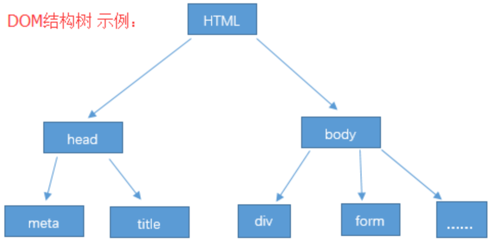
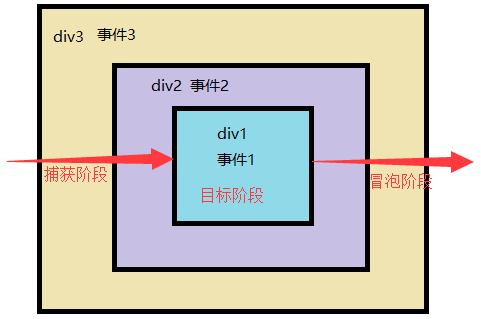
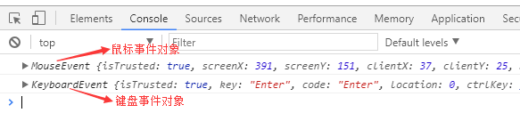
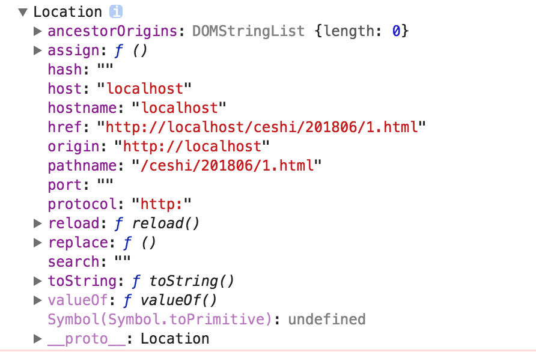

# JS基础-浏览器API

> 传智播客 & 黑马程序员


## 第0章 API介绍

> HTML：用来存储网页内容;
>
> CSS：用来定义这些内容的显示样式；
>
> JavaScript：用来创造丰富的页面效果或者网页应用。


### 0.1 API 介绍

API（Application Programming Interface,应用程序编程接口）是一些预先定义的函数，目的是提供应用程序与开发人员基于某软件或硬件得以访问一组例程的能力，而又无需访问源码，或理解内部工作机制的细节。

- 任何开发语言都可以有自己的API
- API的特征输入和输出(I/O)
- API的使用方法


### 0.2 Web API 接口的概念

浏览器提供的一套操作浏览器功能和页面元素的API(BOM和DOM)

此处的Web API特指浏览器给JS提供的API(一组方法)，Web API在后面的课程中有其它含义


前面我们说过，浏览器的API一共提供了三种类型；

分别是 浏览器操控类(BOM)、页面文档操控类(DOM)、网络控制类；


但实际上，浏览器提供的API并不只有这三类，而是有很多类：

文档对象模型、设备API、通信API、数据管理API、特权API、已认证应用程序的私有API；


## 第1章 文档对象模型 (DOM) 

### 1.1 基本概念

DOM是JavaScript操作网页的接口，全称为“文档对象模型”(Document Object Model)。 它的作用是将网页转为一个JavaScript对象，从而可以用脚本进行各种操作(增删改查)。 

浏览器会根据DOM模型，将结构化文档(比如HTML和XML)解析成一系列的节点， 再由这些节点组成一个树状结构(DOM Tree)。 所有的节点和最终的树状结构，都有规范的对外接口。 

JavaScript是一门编程语言，而DOM是浏览器对HTML文档结构化后的一个模型; 

严格地说，DOM不属于JavaScript，但是我们最常用的就是使用JavaScript操作DOM; 





### 1.2 节点的概念 

DOM的最小组成单位叫做节点(node)。文档的树形结构(DOM树)，就是由各种不同类型的节点组成。 

每个节点都可以看作是文档树的一片叶子。

最顶层的节点就是document节点，它代表了整个文档；是文档的根节点。

每张网页都有自己的document节点，window.document属性就指向这个节点的。

只要浏览器开始载入HTML文档，这个节点对象就存在了，可以直接调用。 

每一个HTML标签元素，在DOM树上都会转化成一个Element节点对象; 

文档里面最高一层一般是HTML标签，其他HTML标签节点都是它的下级。 


除了根节点以外，其他节点对于周围的节点都存在三种关系:

```js
父节点关系(parentNode):直接的那个上级节点 
子节点关系(childNodes):直接的下级节点 
同级节点关系(sibling):拥有同一个父节点的节点
```

常用dom操作：

查找页面的标签元素

标签增加、修改、删除等操作

标签的属性相关操作

给标签元素绑定事件（设置当什么什么时候，做什么什么事情）


### 1.3 查找节点

上一节我们知道，整个文档的节点就是document节点，那么想要具体找到某个节点，
我们可以使用document提供的一系列方法：

```html
<div>
	<p id="p1">1111111111</p>
	<i>2222222222</i>
	<p class='p'>1111111111</p>
	<i>2222222222</i>
	<p class="p">1111111111</p>
	<i>2222222222</i>
	<div id="p">
	    <p name="p">3333333333</p>
	</div>
</div>
```


**getElementsByTagName()**
返回所有指定HTML标签的元素，返回值是一个类似数组的HTMLCollection对象；匹配失败，返回[]
参数是想要获取节点的具体节点名称，就是 标签名；

```js
var p = document.getElementsByTagName('p');
//标签节点.style.样式名 = '样式值'  可以给标签节点设置css样式
p[3].style.background = 'red';
```

**getElementsByClassName()**
返回所有class名字符合指定条件的元素,返回值是一个类似数组的HTMLCollection对象；匹配失败，返回[]
参数为 标签的class属性的值

```js
var p = document.getElementsByClassName('p');
p[1].style.background = 'yellow';
```

**getElementsByName()**
选择拥有name属性的HTML元素，返回值是一个类似数组的HTMLCollection对象；匹配失败，返回[]
参数为 标签的name属性的值;
注意，使用时，最好选择原生具有name属性的元素；

```js
var p = document.getElementsByName('p');
p[0].style.background = 'yellow';
```

**getElementById()**
返回匹配指定id属性的元素节点;没有发现匹配的节点，则返回null
参数为 标签的id属性的值,参数大小写敏感;

```js
var p = document.getElementById('p');
p.style.background = 'yellow';
```

**querySelector()、querySelectorAll()**
document.querySelector方法接受一个**CSS选择器**作为参数，返回匹配该选择器的元素节点；
如果有多个节点满足匹配条件，则返回第一个匹配的节点。如果没有发现匹配的节点，则返回null；

document.querySelectorAll方法与querySelector用法类似，
区别是返回一个类似数组的HTMLCollection对象，包含所有匹配给定选择器的节点。

```js
var p = document.querySelector('.p');
p.style.background = 'yellow';
```

```js
var p = document.querySelectorAll('.p');
p[1].style.background = 'yellow';
```

多个参数值，使用,（英文逗号）隔开，而querySelector()返回第一个选中的节点；

```js
var p = document.querySelectorAll('i,.p');
for(var i=0;i<p.length;i++){
    p[i].style.background = 'yellow';
}
```

这两个方法都支持复杂的CSS选择器。

```js
//选中 id 属性值为p1的元素
// var p = document.querySelectorAll('[id="p1"]');
//选中div元素的class属相值为p的元素
// var p = document.querySelectorAll('div.p');
//选中所有的p标签，但是class值为p的除外
var p = document.querySelectorAll('p:not(.p)');

for(var i=0;i<p.length;i++){
    p[i].style.background = 'yellow';
}
```

但是，它们不支持CSS伪元素的选择器（比如:first-line和:first-letter）
和伪类的选择器（比如:link和:visited），即无法选中伪元素和伪类。

 

## 第2章 事件

### 2.1 什么是事件

>  一种 触发—响应  的机制；
>
>  用户的行为  +  浏览器感知（捕获）到用户的行为 + 事件处理程序

**事件三要素：**

- 事件源:(被)触发事件的元素
- 事件类型:事件的触发方式(例如鼠标点击或键盘点击)
- 事件处理程序:事件触发后要执行的代码(函数形式)


### 2.2 事件绑定

- 行内方式绑定(元素属性) 

```html
<body>
    <input type="button" value="按钮" id="btn" onclick="alert(2)">
</body>

<body>
    <input type="button" value="按钮" id="btn" onclick="f()">
</body>
<script>
    function f(){
        console.log(3);
    }
</script>
```

onclick 其实就是html元素的一个属性，而属性的值需要是 **一段可执行的JS代码**


- 动态绑定 (节点对象属性)

```html
<body>
    <input type="button" value="按钮" id="btn">
</body>
<script>
    var btn = document.getElementById('btn');
    btn.onclick = function(){
        alert(4);
    }
</script>
```

获取节点对象，然后 **修改** **节点对象** 的 `属性 onclick` 的值，值是一个 **匿名函数** 即可；


> 以上两种事件绑定方式，需要在事件名称前加  on  ;


- 事件监听(节点对象方法)

```html
<body>
    <input type="button" value="按钮" id="btn">
</body>
<script>
    var btn = document.getElementById('btn');
    btn.addEventListener('click',function(){
        alert(5);
    });
</script>
```

每一个节点对象都提供了 `addEventListener` **方法**，这个方法可以给选中的节点添加指定类型的事件及事件处理程序；


* 移除事件监听

```html
<body>
    <input type="button" value="按钮" id="btn">
</body>
<script>
    function f(){
        alert(5);
    }
    var btn = document.getElementById('btn');
    btn.addEventListener('click',f);
    btn.removeEventListener('click',f);
</script>
```

> **注意:**
> removeEventListener方法移除的监听函数，
> 必须与对应的addEventListener方法的参数完全一致，
> 而且必须在同一个元素节点，否则无效。


### 2.3 三种事件绑定比较

this关键字
在JavaScript中，每一个函数的内部都存在一个this关键字，其随着运行环境的不同，其指向也是不同的。

```html
<body>
    <p id="t">ttttt</p>
</body>
<script>
    var d = document.getElementById('t');
    d.onclick = function(){
		//this指代本对象 就是 d 
        console.log(this);
    }
</script>
```

将上述代码的动态绑定，改为行内绑定：

```html
<body>
    <p id="t" onclick="f()">ttttt</p>
</body>
<script>
    function f(){
        console.log(this); //window对象
    }
</script>
```

由此可知：
行内绑定，其事件处理程序内部的this指向了全局的window对象。
动态绑定，其事件处理程序内部的this指向了当前正在操作的dom对象。

需求：同一个元素的同一个事件，绑定多个处理函数：

```html
<body>
    <!--行内绑定,谁在前谁执行-->
    <p id="t"  onclick="t()" onclick="f()">ttttt</p>
</body>
<script>
    function f(){
        alert(1);
    }
    function t(){
        alert(2);
    }
</script>
```

```html
<body>
    <p id="t" >ttttt</p>
</body>
<script>
    //动态绑定,后边的执行函数会将前面的覆盖掉
    var d = document.getElementById('t');
    d.onclick = function(){
        alert(1);
    }
    d.onclick = function (){
        alert(2);
    }
</script>
```

```html
<body>
    <p id="t" >ttttt</p>
</body>
<script>
    var d = document.getElementById('t');
    function f1() {
        console.log(this);
    }
    d.addEventListener('click', f1, false);
    d.addEventListener('click', function(){console.log('f2');}, false);
</script>
```

总结：
第一种 "HTML标签的on-属性"，违反了HTML与JavaScript代码相分离的原则；处理函数中 this 指向的window对象；
第二种 "Element节点的事件属性" 的缺点是，同一元素同一个事件只能定义一个监听函数，也就是说，如果定义两次onclick属性，后一次定义会覆盖前一次。但是处理函数中的 this 指向的选中的对象；
第三种：addEventListener方法可以针对同一个元素的同一个事件，添加多个监听处理函数。处理函数中的 this 指向的也是选中的元素；


### 2.4 事件类型

事件类型一览表：

https://developer.mozilla.org/zh-CN/docs/Web/Events


#### 2.3.1 页面事件(资源事件)

| 事件名称 | 何时触发             |
| ---- | ---------------- |
| load | 一个资源及其相关资源已完成加载。 |

```html
<body onload="f1()" >
</body>
<script>
    function f1(){
        alert('f1');
    }
</script>
```

#### 2.3.2 焦点事件

| 事件名称  | 何时触发   |
| ----- | ------ |
| focus | 元素获得焦点 |
| blur  | 元素失去焦点 |

```html
<body>
    <input type="text" id="t" value="请输入用户名" onfocus="f1()" onblur="f2()">
</body>
<script>
    function f1(){
        document.getElementById('t').value = '';
    }
    function f2(){
        var v = document.getElementById('t').value;
        alert(v);
    }
</script>
```


#### 2.3.3 鼠标事件

| 事件名称        | 何时触发                      |
| ----------- | ------------------------- |
| mouseenter  | 指针移到有事件监听的元素内             |
| mouseover   | 指针移到有事件监听的元素或者它的子元素内      |
| mousemove   | 指针在元素内移动时持续触发             |
| mousedown   | 在元素上按下任意鼠标按钮              |
| mouseup     | 在元素上释放任意鼠标按键              |
| click       | 在元素上按下并释放任意鼠标按键           |
| dblclick    | 在元素上双击鼠标按钮                |
| contextmenu | 右键点击 (右键菜单显示前).           |
| mouseleave  | 指针移出元素范围外（不冒泡）            |
| mouseout    | 指针移出元素，或者移到它的子元素上         |
| select      | 文本被选中（input标签、textarea标签） |
| copy        | 元素内容被拷贝时                  |

```html
 <body>
    <div id="d" style="width:200px;height:200px;border:1px solid red">
        来啊
    </div>
</body>
<script>
    var d = document.getElementById('d');
    //当鼠标悬浮时触发
    d.onmouseover = function(){
        console.log('来了?');
    }
	//当鼠标离开时触发
    d.onmouseout = function(){
        console.log('不要啊');
    }
	//当鼠标按下时触发
    d.onmousedown = function(){
        console.log('用力啊');            
    }
	//当鼠标弹起时触发
    d.onmouseup = function(){
        console.log('再来');            
    }
	//当鼠标移动时触发
    d.onmousemove = function(){
        console.log('别乱动');            
    }
    
    //当点击右键时
    d.oncontextmenu = function(){
        console.log('你想干什么？');
        return false;
    }
	
    // 当复制内容时
    d.oncopy = function(){
        console.log('你敢复制我？');
        return false;
    }
    
</script>
```

#### 2.3.4 键盘事件

| 事件名称     | 何时触发                                  |
| -------- | ------------------------------------- |
| keydown  | 按下任意按键                                |
| keypress | 除 Shift, Fn, CapsLock 外任意键被按住. (连续触发) |
| keyup    | 释放任意按键                                |

```html
<body>
    <input type="text"  value="" id="t">
</body>
<script>
    var d = document.getElementById('t');
    //当键盘按下时触发
    d.onkeydown = function(){
        console.log('推到?');
    }
    //当键盘按下时触发
    d.onkeypress = function(){
        console.log('撩起2?');
    }
    //当键盘弹起时触发
    d.onkeyup = function(){
        console.log('撩起?');
    }
</script>
```

#### 2.3.5 form表单事件

| Event Name | Fired When                               |
| ---------- | ---------------------------------------- |
| reset      | 点击重置按钮时 （`<input type=’reset’ value=’重置’ />`） |
| submit     | 点击提交按钮                                   |

```html
<body>
    <form id="f" action="1.2.5.php">
        姓名:<input type="text" name="" value=""> <br>
        <input type="submit" name="" value="提交">
        <input type="reset" name="" value="重置">
    </form>
</body>
<script>
    var d = document.getElementById('f');
	//当表单提交时触发
    d.onsubmit = function(){
        alert('t');
    }
	//当表单重置时触发
    d.onreset = function(){
        alert('re');
    }
</script>
```

#### 2.3.6 内容变化事件

change： 当内容改变且失去焦点时触发 （存储事件）
input ： 当内容改变时触发 （值变化事件）

```html
<body>
    <input type="text" id="t" value="">
</body>
<script>
    var d = document.getElementById('t');
    //当内容改变且失去焦点时触发
    d.onchange = function(){
        console.log('t');
    }
    //当内容改变时触发
    d.oninput = function(){
        console.log('in');
    }
</script>
```


### 2.4 事件的传播

三个包裹着的DIV，都绑定了点击事件，问：
当点击 div1 时，会发生什么现象？

```html
<head>
    <title></title>
    <meta charset="UTF-8">
    <style>
        div{padding: 40px}
        #div3{width: 300px;height: 300px;background-color: red}
        #div2{width: 200px;height: 200px;background-color: yellow}
        #div1{width: 100px;height: 100px;background-color: blue}
    </style>
</head>
<body>
    <div id="div3">3
        <div id="div2">2
            <div id="div1">1</div>
        </div>
    </div>
</body>
<script>
    var d1 = document.getElementById('div1');
    var d2 = document.getElementById('div2');
    var d3 = document.getElementById('div3');

    d1.onclick = function(){
        alert('1');
    }
    d2.onclick = function(){
        alert('2');
    }
    d3.onclick = function(){
        alert('3');
    }
</script>
```


当点击div1时，触发 事件1，但是，紧跟着，事件2和事件3也被触发了；

这种现象，我们称为 **事件冒泡**

在JS中当一个事件发生以后，它会在不同的DOM节点之间传播。
这种传播分成三个阶段：
第一阶段：从window对象传导到目标节点，称为 **捕获阶段**。
第二阶段：在目标节点上触发，称为 **目标阶段**。
第三阶段：从目标节点传导回window对象，称为 **冒泡阶段**。




事件传播的最上层对象是window；
事件的传播顺序，在捕获阶段依次为window、document、html、body、div；
在冒泡阶段依次为div、body、html、document、window。

> **注意：** 三种事件绑定方式全部 默认 监听冒泡阶段事件；


### 2.5 改变事件触发的阶段

想让事件监听在捕获阶段，只能通过 addEventListener 方法的进行设置：

```html
<script>
    var d1 = document.getElementById('div1');
    var d2 = document.getElementById('div2');
    var d3 = document.getElementById('div3');
    d1.addEventListener('click',function(){
        alert('m1');
    });//目标阶段触发

    d2.addEventListener('click',function(){
        alert('b2');
    },true);//捕获阶段触发

    d3.addEventListener('click',function(){
        alert('b3');
    },true);//捕获阶段触发


    d1.addEventListener('click',function(){
        alert('mm1');
    });//目标阶段触发

    d2.addEventListener('click',function(){
        alert('p2');
    });//冒泡阶段触发
	d3.addEventListener('click',function(){
        alert('p3');
    },false);//冒泡阶段触发
</script>
```

### 2.6 案例

#### 为选中的的元素绑定事件

```html
<body>
<input type="button" value="按钮" id="btn" />
<script>
  //根据id获取元素
  document.getElementById("btn").onclick=function () {
      alert("哈哈,我又变帅了");
  };
</script>
</body>
```


#### 一次性事件案例(下载按钮点一次则失效)

```html
<body>
    <input type="button" id="btn" value="下载">
</body>
<script>
    var btn = document.getElementById('btn');
    function f(){
        alert(123);
        btn.removeEventListener('click',f);
    }
    
    btn.addEventListener('click',f);
</script>
```


#### 点击每个图片弹出对话框

```html
<body>


<script>
  //点击每个图片都可以弹出对话框
  //根据标签名字获取元素,分别注册点击事件,分别添加事件处理函数
  var imgObjs=document.getElementsByTagName("img");
  //遍历
  for(var i=0;i<imgObjs.length;i++){
    //为每个图片元素注册点击事件,添加事件处理函数
    imgObjs[i].onclick=function () {
      alert("啊,我被点击了");
    };

  }
</script>

</body>
```


## 第3章 节点操作

> 页面元素节点的操作，都离不开DOM对象

### 3.1 节点操作-增删改

**document.createElement()**
用来生成网页元素节点，参数为元素的标签名；

**document.createTextNode()**
用来生成文本节点，参数为所要生成的文本节点的内容；

**node.appendChild()**
接受一个节点对象作为参数，将其作为最后一个子节点，插入当前节点；

**node.hasChildNodes()**
返回一个布尔值，表示当前节点是否有子节点

**node.removeChild()**
接受一个子节点作为参数，用于从当前节点移除该子节点

**node.cloneNode()**
用于克隆一个选中的节点。
它接受一个布尔值作为参数，表示是否同时克隆子节点，默认是false，即不克隆子节点。
**注意:** 不会克隆绑定到该元素上的事件；

**node.innerHTML**
返回该元素包含的 HTML 代码。该属性可读写，常用来设置某个节点的内容；（不属于W3C DOM规范）

**node.innerText** 

返回该元素包含的内容。该属性可读写

```html
<body>
    <div id="d">
        <span>111</span>
    </div>
</body>
<script>
    //创建元素节点
    var p = document.createElement('p');
    //创建文本节点
    var t = document.createTextNode('女娲');
    //添加节点
    p.appendChild(t);
    var d = document.querySelector('#d')
    d.appendChild(p);

    //判断是否有子节点
    if(d.hasChildNodes('span')){
        var s = document.querySelector('span');
        //删除子节点
        d.removeChild(s);
    }

    // 克隆一个节点
    var c = d.cloneNode(true);
    d.appendChild(c);

	//操作选中元素的HTML代码，有值则是设置，无值则是获取
    alert(d.innerHTML);
    
    console.log(document.getElementById('d').innerText);
    console.log(document.getElementById('d').innerHTML);
</script>
```


案例：

点击按钮创建img节点，添加到body中

```html
<body>
    <input type="button" value="我要图" id="btn">
</body>
<script>
    var btn = document.getElementById('btn');
    btn.onclick = function(){
        // var img = document.createElement('img');
        // img.src = '/img/c2.jpg';
        // document.getElementsByTagName('body')[0].appendChild(img);
        
        // 直接
        document.getElementsByTagName('body')[0].innerHTML += "";
    }
</script>
```


动态创建文本框

```html
<body>
    <input type="button" value="++" id="btn">
    <div id="bo"></div>
</body>
<script>
    var btn = document.getElementById('btn');
    btn.onclick = function () {
        // document.getElementById('bo').innerHTML += '<input type="text">';
        
        var inp = document.createElement('input');
        document.getElementById('bo').appendChild(inp);
    }
</script>
```


### 3.2 节点属性

#### 3.2.1 原生属性

HTML元素节点的标准属性（即在标准中定义的属性），会自动成为元素节点对象的属性

```html
<body>
    <div id="d" a="b" class="a b c d e"></div>
</body>
<script>

    var d = document.querySelector('#d');
    //获取原有属性值
    console.log(d.id);
    //修改原有属性值
    d.id = 'ff';
    console.log(d.a); // undefined
    //特殊：获取class类名，需使用className属性
  	console.log(d.className);
    d.className += ' hello';
</script>
```


#### 3.2.2 属性操作的标准方法

**node.getAttribute()**
返回当前元素节点的指定属性。如果指定属性不存在，则返回null；

**node.setAttribute()**
为当前元素节点新增属性。如果同名属性已存在

```html
<body>
    <div id="d"></div>
</body>
<script>
    var d = document.querySelector('#d');
    //设置属性，有则修改，无则添加，可设置非标准属性
    d.setAttribute('id','ffdd');
    d.setAttribute('aa','kk');
    //获取属性值，可获取非标准属性
    console.log(d.getAttribute('aa'));
</script>
```

**node.hasAttribute()**
返回一个布尔值，表示当前元素节点是否包含指定属性

**node.removeAttribute()**
从当前元素节点移除属性

```js
//如果有id属性
if(d.hasAttribute('id')){
    //删除id属性
    d.removeAttribute('id');
}
```


### 3.3 节点操作-层级关系

**node.nextElementSibling**
返回紧跟在当前节点后面的第一个同级Element节点，如果当前节点后面没有同级节点，则返回null；

**node.previousElementSibling**
返回紧跟在当前节点前面的第一个同级Element节点，如果当前节点前面没有同级节点，则返回null；

**node.parentElement**
返回当前节点的父级Element节点；

**node.childNodes**
返回一个NodeList集合，成员包括当前节点的所有子节点(注意空格回车也算)。

**node.firstChild** 

返回树中节点的第一个子节点，如果节点是无子节点，则返回 `null。`

**node.lastChild** 

返回该节点的最后一个子节点，如果该节点没有子节点则返回`null`。


```html
<body>
    <div id="d1">
        <p id="p1">11111</p>
        <p id="p2">222</p>
        <p id="p3">33333</p>
        <p id="p4">4444</p>
    </div>
    <div id="d2">
        <p id="p5">55555</p>
        <p id="p6">66666</p>
    </div>
</body>
<script>
    var p2 = document.querySelector('#p2');
    //下一个兄弟节点
    p2.nextElementSibling.style.background = 'red';
    //上一个兄弟节点
    p2.previousElementSibling.style.background = 'red';
    //父级节点
    p2.parentElement.style.background = 'red';

    var d1 = document.querySelector('#d1');
	//所有子节点列表
    d1.childNodes[3].style.background = 'red';
</script>
```


### 3.4 CSS样式操作 

每个DOM对象都有style属性，我们可以直接操作，用来读写 **行内CSS样式**。
之前，我们已经简单的使用过JS控制元素的CSS样式；
在具体使用的时候还有一些需要重点注意的细节：

1. 名字需要改写，将横杠从CSS属性名中去除，然后将横杠后的第一个字母大写：

   比如background-color写成backgroundColor

2. 属性值都是字符串，设置时必须包括单位：

   比如，div.style.width的值不能写为100，而要写为100px

```html
<body>
    <div id="d1" style="width:400px;height: 200px;border: 1px solid red"></div>
</body>
<script>
    var d1 = document.querySelector('#d1');
    d1.onclick = function(){
        //赋值则是设置
        d1.style.backgroundColor = 'red';
        //不赋值则是获取
        alert(d1.style.width);
    }
</script>
```

以上代码中，我们获取的CSS样式，均是行内样式；


如果将 样式表写在 style 标签内，我们将无法获取和修改；

**getComputedStyle()**
接受一个节点对象，返回该节点对象最终样式信息的对象，所谓“最终样式信息”，指的是各种CSS规则叠加后的结果。

> 注意: **getComputedStyle()** 是window对象下的方法，不是DOM对象

```html
<style>
    #d1{
        width: 200px;height: 200px;
        border: 1px solid red;
    }
</style>

<body>
    <div id="d1" ></div>
</body>

<script>
    var d1 = document.querySelector('#d1');
    d1.onclick = function(){
        //获取不到
        console.log(d1.style.width);
        //获取计算后的样式
        console.log(getComputedStyle(d1).width);
    }
</script>
```

点击变大小案例:

```html
<head>
<meta charset="UTF-8">
<title>Document</title>
<style>
    #d1{
        width: 200px;height: 200px;
        border: 1px solid red;
    }
</style>
</head>
<body>
    <div id="d1" ></div>
</body>
<script>
    var d1 = document.querySelector('#d1');
    d1.onclick = function(){
        var w = parseInt(getComputedStyle(d1).width);
        var h = parseInt(getComputedStyle(d1).height);
        d1.style.width = w+10+'px';
		d1.style.height = h+10+'px';
    }
</script>
```


其他方法和属性：

document.documentURI   返回文档的 URL。

node.replaceChild(newChild, oldChild) 用指定的节点替换当前节点的一个子节点，并返回被替换掉的节点。

node.insertBefore() : parentElement.insertBefore(newElement,referenceElement)；


### 3.5 案例（节点属性） 

#### 网页开关灯效果实现（类名操作）

```html
<style>
    .cls {
      background-color: black;
    }
  </style>
</head>
<body>
<input type="button" value="开/关灯" id="btn"/>

<script>
  document.getElementById("btn").onclick = function () {
    //document.body.className="cls";
//console.log(document.body.className);
    //判断body标签是否应用了cls类样式,同时设置body标签的类样式
    document.body.className = document.body.className == "cls" ? "" : "cls";
  };
</script>
```


#### 点击按钮显示一个图片

```html
<body>
<input type="button" value="显示图片" id="btn"/>

<script>
  //根据id获取按钮,注册点击事件,添加事件处理函数
  document.getElementById("btn").onclick=function () {
    //根据id获取图片标签,设置src属性即可
    var imgObj=document.getElementById("im");
    //设置路径src属性
    imgObj.src="images/liuyan.jpg";
  };
</script>
</body>
```


#### 案例点击按钮修改p标签内容

```html
<body>
<input type="button" value="设置p的内容" id="btn"/>
<p id="p1">这是一个p</p>
<script>
  //点击按钮,设置p的内容
  //根据id获取按钮,注册点击事件,添加事件处理函数
  document.getElementById("btn").onclick = function () {
    //var pObj = document.getElementById("p1");
    document.getElementById("p1").innerText = "哦,这是p啊";
  };
</script>

</body>
```


#### 点击按钮设置a标签的地址和热点文字

```html
<input type="button" value="显示效果" id="btn"/>
<a href="http://www.baidu.com" id="ak">百度</a>
<script>
  //案例:点击按钮修改a的地址和热点文字
  //根据id获取按钮,注册点击事件,添加事件处理函数
  document.getElementById("btn").onclick=function () {
    var aObj=document.getElementById("ak");
    aObj.href="http://www.itcast.cn";
    aObj.innerText="传智播客";
  };
</script>
</body>
```


#### 点击按钮设置所有的p的内容

```html
<body>
<input type="button" value="改变内容" id="btn"/>
<p>红烧榴莲</p>
<p>清蒸臭豆腐</p>
<p>油炸大蒜</p>
<p>爆炒助教</p>
<p>凉拌班主任</p>
<script>

  //document.getElementsByTagName("标签的名字");

  //点击按钮,修改所有的p的内容
  //根据id获取按钮,注册点击事件,添加事件处理函数
  document.getElementById("btn").onclick = function () {
    //获取所有的p标签---根据标签名字来获取---伪数组
    var pObjs = document.getElementsByTagName("p");
    //循环遍历这个伪数组
    for (var i = 0; i < pObjs.length; i++) {
      pObjs[i].innerText = "我们都是p";
    }
  };

</script>

</body>
```


#### 点击按钮修改图片的alt和title

```html
<body>
<input type="button" value="显示效果" id="btn"/>

<script>
  //点击按钮,修改图片的宽和高,alt和title属性值
  //根据id获取按钮,注册点击事件,添加事件处理函数
  document.getElementById("btn").onclick = function () {
    //根据id获取图片标签
    var imgObj = document.getElementById("im");
    //设置属性
    imgObj.width = "500";
    imgObj.height = "600";
    imgObj.alt = "好漂亮";
    imgObj.title = "美女";
  };
</script>
</body>
```


#### 点击按钮修改按钮的值

```html
<body>
<input type="button" value="按钮" id="btn"/>
<script>
  //案例:点击按钮修改按钮的value属性值
  //根据id获取按钮,注册点击事件,添加事件处理函数
//  document.getElementById("btn").onclick=function () {
//    document.getElementById("btn").value="改变吧";
//  };

  //在某个元素的自己的事件中,this就是当前的这个元素

  document.getElementById("btn").onclick=function () {
    //当前对象
    this.value="改变吧";
  };
</script>

</body>
```


#### 点击图片修改自身的宽和高

```html
<body>

<script>
  //点击图片,修改自身的宽和高
  //根据id获取图片,注册点击事件,添加事件处理函数
  document.getElementById("im").onclick=function () {
    this.width="300";
    this.height="400";
  };
</script>

</body>
```


#### 点击按钮修改所有的文本框的值

```html
<body>
<input type="button" value="显示效果" id="btn"/><br/>
<input type="text" value=""/><br/>
<input type="text" value=""/><br/>
<input type="text" value=""/><br/>
<input type="text" value=""/><br/>
<input type="text" value=""/><br/>
<script>
  //根据id获取按钮,注册点击事件,添加事件处理函数
  document.getElementById("btn").onclick=function () {
    //根据标签名字获取文本框,所有的input标签
    var inputs=document.getElementsByTagName("input");
    for(var i=0;i<inputs.length;i++){
      //判断当前input是不是文本框
      if(inputs[i].type=="text"){
        inputs[i].value="我是文本框";
      }
    }

  };
</script>
```


#### 排他功能

```html
<body>
<input type="button" value="没怀孕"/>
<input type="button" value="没怀孕"/>
<input type="button" value="没怀孕"/>
<input type="button" value="没怀孕"/>
<input type="button" value="没怀孕"/>
<script>

  //获取所有的按钮
  var btnObjs = document.getElementsByTagName("input");
  //循环,为每个按钮注册点击事件,添加事件处理函数
  for (var i = 0; i < btnObjs.length; i++) {
    //每个按钮注册点击事件
    btnObjs[i].onclick = function () {
      //把所有的按钮的value值还原
      for (var j = 0; j < btnObjs.length; j++) {
        btnObjs[j].value = "没怀孕";
      }
      //设置当前的这个按钮的value
      this.value = "怀孕了";
    };
  }
</script>
```


#### 点击按钮禁用文本框

```html
<input type="button" value="禁用文本框" id="btn"/>
<input type="text" value="" id="txt"/>
<script src="common.js"></script>
<script>
  //点击按钮禁用这个文本框
 document.getElementById("btn").onclick = function () {
    document.getElementById("txt").disabled = true;
  };
</script>
```


#### 鹦鹉学舌

```html
<body>
    <input type="text" id="t1" > <br>
    <input type="text" id="t2" >
</body>
<script>
    document.getElementById('t1').oninput = function(){
        document.getElementById('t2').value = this.value;
    }
</script>
```


#### 全选和全不选

```html
<style>
    table {
        border-collapse: collapse;
        border-spacing: 0;
        border: 1px solid #c0c0c0;
        width: 500px;
    }

    th,
    td {
        border: 1px solid #d0d0d0;
        color: #404060;
        padding: 10px;
    }
</style>

<body>
    <table>
        <thead>
            <tr>
                <th>
                    <input type="checkbox" id="th" />
                </th>
                <th>菜名</th>
                <th>饭店</th>
            </tr>
        </thead>
        <tbody id="tb">
            <tr>
                <td>
                    <input type="checkbox" />
                </td>
                <td>红烧肉</td>
                <td>田老师</td>
            </tr>
            <tr>
                <td>
                    <input type="checkbox" />
                </td>
                <td>西红柿鸡蛋</td>
                <td>田老师</td>
            </tr>
            <tr>
                <td>
                    <input type="checkbox" />
                </td>
                <td>油炸榴莲</td>
                <td>田老师</td>
            </tr>
            <tr>
                <td>
                    <input type="checkbox" />
                </td>
                <td>清蒸助教</td>
                <td>田老师</td>
            </tr>
        </tbody>
    </table>
</body>
<script>
    document.getElementById('th').onclick = function () {
        var tb = document.getElementsByTagName('input');
        if (this.checked == true) {
            // console.log(tb);
            for (var i = 0; i < tb.length; i++) {
                tb[i].checked = true;
            }
        } else {
            for (var i = 0; i < tb.length; i++) {
                tb[i].checked = false;
            }
        }
    }
</script>
```

> 作业，实现反选


#### 表格鼠标悬浮高亮(接上一个案例)

```js
var t = document.getElementsByTagName('tbody')[0];
t.onmouseover = function(e){
    e.target.parentElement.style.background = '#F5F5F5';
}
t.onmouseout = function(e){
    e.target.parentElement.style.background = '#fff';
}
```

### 3.6 案例（样式操作）

#### 节点方式隔行变色

```html
<body>
    <input type="button" value="隔行变色" id="btn" />
    <ul id="uu">
        <li>雪花啤酒</li>
        <li>金士百啤酒</li>
        <li>青岛啤酒</li>
        <li>燕京啤酒</li>
        <li>百威啤酒</li>
        <li>哈尔滨啤酒</li>
        <li>乐宝啤酒</li>
        <li>崂山啤酒</li>
    </ul>
</body>
<script>
    //点击按钮,所有的li隔行变色---奇红偶黄
    document.getElementById("btn").onclick = function () {
        var count = 0;
        //要获取ul中所有的子节点
        var nodes = document.getElementById("uu").childNodes;
        for (var i = 0; i < nodes.length; i++) {
            var node = nodes[i];
            //判断这个节点是不是li
            if (node.nodeType == "1" && node.nodeName == "LI") {
                node.style.backgroundColor = count % 2 == 0 ? "red" : "yellow";
                count++;//记录li标签的个数
            }
        }
    };
</script>
```


#### 验证密码的长度改变背景颜色

```html
<input type="text" value="" id="txt"/>
<script>
  //根据id获取文本框---失去焦点的事件
  document.getElementById("txt").onblur=function () {
    //判断文本框中输入的内容长度是否在6到10个之间,如果是这样的,则背景颜色为绿色
    if(this.value.length>=6&&this.value.length<=10){
      this.style.backgroundColor="green";
    }else{
      this.style.backgroundColor="red";
    }
  };
</script>
```


#### div的高亮显示

```html
<style>
    div {
        width: 200px;
        height: 200px;
        background-color: green;
        float: left;
        margin-right: 20px;
        cursor: pointer;
        border: 2px solid green;
    }
</style>

<body>
    <div></div>
    <div></div>
    <div></div>
    <div></div>
    <div></div>

    <script>
        //根据标签名字获取所有的div
        var divObjs = document.getElementsByTagName("div");
        //循环遍历
        for (var i = 0; i < divObjs.length; i++) {
            //为每个div添加鼠标进入事件
            divObjs[i].onmouseover = mouseoverHandle;
            //为每个div添加鼠标离开事件
            divObjs[i].onmouseout = mouseoutHandle;
        }
        function mouseoverHandle() {
            this.style.border = "2px solid red";
        }
        function mouseoutHandle() {
            //希望这个样式属性的值还原成默认的时候,值就是""空的字符串
            this.style.border = "";
        }
    </script>
```


#### 鼠标点哪图片飞到哪里

思路：给整个dom绑定鼠标点击事件，获取点击位置后修改图片位置

```html
<style>
    img {
        position: absolute;
        width: 50px;
        height: 50px;
    }
</style>

<body>
    
</body>
<script>
    var im = document.getElementsByTagName('img')[0];
    document.onclick = function (e) {
        im.style.left = e.clientX + 'px';
        im.style.top = e.clientY + 'px';
    }
</script>
```


#### 跟着鼠标飞的天使

思路：点击图片后，给整个dom绑定鼠标移动事件，让图片跟随

```html
<style>
    img {
        position: absolute;
        width: 50px;
        height: 50px;
    }
</style>

<body>
    
</body>
<script>
    var im = document.getElementsByTagName('img')[0];
    im.onclick = function () {
        document.onmousemove = function (e) {
            im.style.left = e.clientX + 'px';
            im.style.top = e.clientY + 'px';
        }
    }
</script>
```


#### 实时获取鼠标在div内的坐标

```html
<body>
    <div id="div3">3
       <p id="p"></p>
    </div>

</body>
<script>
    var p = document.getElementById('p');
    document.getElementById('div3').onmousemove = function(e){
        p.innerHTML = e.clientX+','+e.clientY;
        p.style.top = e.clientY+"px";
        p.style.left = e.clientX+"px";
    }
</script>
```


#### 点击按钮设置div的宽和高及背景颜色

```html
<head>
  <meta charset="UTF-8">
  <title>title</title>
  <style>
    div{
      width: 100px;
      height: 50px;
      background-color: yellow;
    }
  </style>
</head>
<body>
<input type="button" value="显示效果" id="btn"/>
<div id="dv"></div>
<script>

  //点击按钮,设置div的宽和高,及背景颜色
  //根据id获取按钮,注册点击事件,添加事件处理函数
  document.getElementById("btn").onclick=function () {
    //获取div
    var dvObj=document.getElementById("dv");
    dvObj.style.width="300px";
    dvObj.style.height="200px";
    //css中的属性如果是多个单词连接的,在js代码DOM操作中多个单词中间的-干掉,后面单词的首字母变大写
    dvObj.style.backgroundColor="pink";
  };

</script>
```


#### 点击按钮隐藏div

```html
  <style>
    div{
      width: 200px;
      height: 100px;
      background-color: orangered;
    }
  </style>
</head>
<body>
<input type="button" value="隐藏" id="btn"/>
<input type="button" value="显示" id="btn2"/>
<div id="dv"></div>
<script src="common.js"></script>
<script>
  //点击按钮隐藏div
  document.getElementById("btn").onclick=function () {
    //获取div,隐藏
    document.getElementById("dv").style.display="none";
  };
  document.getElementById("btn2").onclick=function () {
    document.getElementById("dv").style.display="block";
  };
</script>
```


#### 点击按钮改变列表的背景颜色

```html
<input type="button" value="改变颜色" id="btn"/>
<ul id="uu">
  <li>乔峰</li>
  <li>卡卡西</li>
  <li>佐助</li>
  <li>自来也</li>
  <li>纲手</li>
  <li>雏田</li>
  <li>露琪亚</li>
</ul>
<script src="common.js"></script>
<script>
  //获取按钮,注册点击事件,添加事件处理函数
  document.getElementById("btn").onclick=function () {
    document.getElementById("uu").style.backgroundColor="pink";
  };
</script>
```


#### 点击按钮列表隔行变色

```html
<input type="button" value="隔行变色" id="btn"/>
<ul id="uu">
  <li>五菱宏光</li>
  <li>路虎</li>
  <li>兰博基尼</li>
  <li>布加迪威龙</li>
  <li>玛莎拉蒂</li>
  <li>奥拓</li>
  <li>拖拉机</li>
  <li>桑塔纳</li>
</ul>
<script>
  //点击按钮,li隔行变色:奇红偶黄
  //获取按钮,添加点击事件
  document.getElementById("btn").onclick = function () {
    //获取id为uu的ul中所有的li
    var list = getElementsByTagName("li");
    //遍历
    for (var i = 0; i < list.length; i++) {
//      if (i % 2 == 0) {
//        list[i].style.backgroundColor = "red";
//      } else {
//        list[i].style.backgroundColor = "yellow";
//      }

      list[i].style.backgroundColor = i % 2 == 0 ? "red" : "yellow";
    }
  };
</script>
```


### 3.7 案例（节点操作）

#### 动态可编辑表格

```html
<style>
    table {
        border-collapse: collapse;
        border-spacing: 0;
        border: 1px solid #c0c0c0;
        width: 500px;
    }

    th,
    td {
        border: 1px solid #d0d0d0;
        color: #404060;
        padding: 10px;
    }
</style>

<body>
    <input type="button" value="添加一行" id="addrow">
    <table>
        <thead>
            <tr>
                <td>菜名</td>
                <td>饭店</td>
                <td>厨师</td>
            </tr>
        </thead>
        <tbody id="tb"></tbody>
    </table>
</body>
<script>
    var tbs = document.getElementsByTagName('table')[0];
    tbs.onclick = function (e) {
        var clicks = e.target;
        if (clicks.nodeName == 'TD') {
            // var inp = document.createElement('input');
            // inp.value = clicks.innerText;
            // console.log(clicks.parentElement);
            clicks.innerHTML = '<input value=' + clicks.innerText + '>';
            tbs.getElementsByTagName('input')[0].onblur = function () {
                clicks.innerHTML = this.value;
            }
        }
    }

    var addrow = document.getElementById('addrow');
    addrow.onclick = function(){
        var tr = document.createElement('tr');
        for(var i = 0; i<3;i++){
            tr.appendChild(document.createElement('td'));
        }
        document.getElementById('tb').appendChild(tr);
    }

</script>
```


#### 无刷新评论

```html
<body>
    <div id="cont">
        <div>
            <p>name:</p>
            <p>我是评论内容</p>
            <hr>
        </div>
    </div>

    <div>
        昵称:
        <input type="text" value="" id="userName" /><br/><br/>
        <textarea name="" id="tt" cols="103" rows="10"></textarea><br/>
        <input type="button" value="评论一下" id="btn" /><br/>
    </div>
</body>
<script>
    var un = document.getElementById('userName');
    var tt = document.getElementById('tt');

    document.getElementById('btn').onclick = function(){
        var d = document.createElement('div');
        d.innerHTML = '<p>'+un.value+':</p>';
        d.innerHTML += '<p>'+tt.value+'</p>';
        d.innerHTML += '<hr>';
        document.getElementById('cont').appendChild(d);
        un.value = '';
        tt.value = '';
    }

</script>
```


## 第4章 事件对象

### 4.1 概述

事件的触发，大部分情况下是用户的一种行为，也就是说，我们并不能确定用户什么时间触发；

而且，由于事件的传播机制，我们甚至不能确定事件具体触发在哪个节点；这是一件很不爽的事情；

如何解决呢？

事件发生以后，系统会调用我们写好的**事件处理程序** 

系统会在调用处理程序时，将事件发生时有关事件的一切信息，封装成一个对象，

作为参数传给监听函数(事件处理程序)，我们把这个对象称为  **事件对象**。
**有关事件发生的一切信息**，都包含在这个事件对象中；

根据事件类型的不同，事件对象中包含的信息也有所不同；
如点击事件中，包含鼠标点击的横纵坐标位置，键盘事件中，包含键盘的键值等；

```html
<body>
    <div id="div">
        <p>pppp</p>
    </div>
    <input type="text" value="" id="i">
</body>
<script>
var d = document.getElementById('div');
//鼠标事件
d.addEventListener('click',function(e){
    console.log(e);
});

var i = document.getElementById('i');
//键盘事件
i.addEventListener('keydown',k);
function k(e){
    console.log(e);
}
</script>
```




### 4.2 事件对象中的常用属性及方法

#### 4.2.1属性

**event.bubbles**:属性返回一个布尔值，表示当前事件是否会冒泡;
**event.eventPhase**：返回一个整数值，表示事件流在传播阶段的位置

> 0:事件目前没有发生。
> 1:事件目前处于捕获阶段。
> 2:事件到达目标节点。
> 3:事件处于冒泡阶段。

**event.type**:返回一个字符串，表示事件类型，大小写敏感;
**event.timeStamp**:返回一个毫秒时间戳，表示事件发生的时间;

**clientX、clientY** :获取鼠标事件触发的坐标


```html
<body>
    <div id="d">
        <p id="p">sdf</p>
    </div>
</body>
<script>
    var p = document.getElementById('p');
    p.onclick = function(e){
        //当前事件是否会冒泡
        console.log(e.bubbles);
        //事件目前所处的节点
        console.log(e.eventPhase);
        //事件类型
        console.log(e.type);
        //事件发生的时间戳
        console.log(e.timeStamp);
    }
</script>
```


#### 4.2.2 事件代理/委托

**event.target**：对事件起源目标的引用，属性返回触发事件的那个节点。
**event.currentTarget**：属性返回事件当前所在的节点，即正在执行的监听函数所绑定的那个节点。
作为比较，target属性返回事件发生的节点。

```js
var d = document.getElementById('d');
d.onclick = function(e){
    //返回事件节点
    console.log(e.currentTarget);
    //返回触发节点
    console.log(e.target);
}
```

由于事件会在冒泡阶段向上传播到父节点，因此可以把子节点的监听函数定义在父
节点上，由父节点的监听函数统一处理多个子元素的事件。
这种方法叫做事件的代理也叫 **事件委托** 也有人称为 **事件代理**

```html
<head>
    <title></title>
    <meta charset="UTF-8">
    <style>
        div{padding: 40px}
        #div3{width: 300px;height: 300px;border: 1px solid red;}
        #div2{width: 200px;height: 200px;border: 1px solid red;}
        #div1{width: 100px;height: 100px;border: 1px solid red}
    </style>
</head>
<body>
    <div id="div3">3
        <div id="div2">2
            <div id="div1">1</div>
        </div>
    </div>
</body>
<script>
    var d = document.getElementById('div3');
    d.onclick = function(e){
        e.target.style.background = 'red';
    }
</script>
```


#### 4.3.3 阻止浏览器默认行为&阻止事件传播

**event.preventDefault()**：
方法取消浏览器对当前事件的默认行为，
比如点击链接后，浏览器跳转到指定页面，或者按一下空格键，页面向下滚动一段距离。

**event.stopPropagation()**：
方法阻止事件在DOM中继续传播，防止再触发定义在别的节点上的监听函数

```html
<body>
    <div id="div2">2
        <div id="div1">1
            <a id="a" href="http://qq.com">王者喝农药</a>
        </div>
    </div>
</body>
<script>
    var d2 = document.getElementById('div2');
    var d1 = document.getElementById('div1');
    var a = document.getElementById('a');
    d2.onclick = function(e){
       alert('d2');
    }
    d1.onclick = function(e){
       alert('d1');
    }
    a.onclick = function(e){
        //阻止事件传播
        // e.stopPropagation();
       alert('a');
       //阻止浏览器默认行为
       e.preventDefault();
    }
</script>
```


### 4.3 案例

#### 阻止超链接默认跳转

```html
<body>
<!--第1种写法-->
<a href="http://www.baidu.com" onclick="alert('哈哈'); return false;">百度</a>


<!--第2种写法-->

<script>
  function f1() {
    alert("嘎嘎");
    return false;
  }
</script>
<a href="http://www.baidu.com" onclick="return f1();">百度</a>

<!--第3种写法-->
<a href="http://www.baidu.com" id="ak">百度</a>
<script>
  document.getElementById("ak").onclick=function () {
    alert("哈哈");
    return false;
  };
</script>
```


#### 点击小图显示大图

```html
<body>
<a id="ak" href="images/1.jpg"></a>
<script>
  //点击小图片,显示大图---修改了这个图片标签的src的属性值
  //根据id获取小图,注册点击事件,添加事件处理函数
  document.getElementById("im").onclick=function () {
    //根据id获取超链接
    var aObj=document.getElementById("ak");
    this.src=aObj.href;
    //阻止超链接的默认跳转事件
    return false;
  };
</script>
```


## 第5章 浏览器对象模型

### 5.1 介绍

浏览器对象模型(Browser Object Model)--英文简称 BOM，浏览器对象模型提供了独立于内容的、可以与浏览器窗口进行互动的对象结构。我们使用JavaScript与浏览器交互的所有内容，均来自 **浏览器对象模型**。

浏览器对象模型的具体实例化对象就是 `window` 对象；

`window` 对象下有很多属性和方法，我们前面学过的DOM对象，就是window对象的一个属性，只不过这个属性的值又是一个对象，因此也成为window对象的子对象；

https://developer.mozilla.org/zh-CN/docs/Web/API/Window


### 5.2 对话框

`window.alert()` : 显示一个警告对话框,上面显示有指定的文本内容以及一个"确定"按钮。

`window.prompt()` : 显示一个对话框,对话框中包含一条文字信息,用来提示用户输入文字.

```js
var s = window.prompt('你觉得很幸运吗?','是的');
console.log(s);
```

`window.confirm()` ：方法显示一个具有一个可选消息和两个按钮(确定和取消)的模态对话框 。


### 5.3 页面加载事件

onload

```javascript
window.onload = function () {
  // 当页面加载完成执行
  // 当页面完全加载所有内容（包括图像、脚本文件、CSS 文件等）执行
}
```

### 5.4 浏览器控制台

window.console : 返回console对象的引用，该对象提供了对浏览器调试控制台的访问。

`Console.clear()` : 清空控制台。

`Console.error()`  : 打印一条错误信息

`Console.table()` : 将数组或对象数据在控制台以表格形式打印

`Console.log()` ： 打印字符串，使用方法比较类似C的printf、PHP的echo等格式输出


### 5.5 定时器

#### setTimeout()和clearTimeout()

在指定的毫秒数到达之后执行指定的函数，只执行一次

```javascript
// 创建一个定时器，1000毫秒后执行，返回定时器的标示
var timerId = window.setTimeout(function () {
  console.log('Hello World');
}, 1000);

// 取消定时器的执行
window.clearTimeout(timerId);
```

#### setInterval()和clearInterval()

定时调用的函数，可以按照给定的时间(单位毫秒)周期调用函数

```javascript
// 创建一个定时器，每隔1秒调用一次
var timerId = window.setInterval(function () {
  var date = new Date();
  console.log(date.toLocaleTimeString());
}, 1000);

window.clearInterval(timerId);
```

###  

### 5.6 案例

#### 一起来摇摆

```html
<style>
    #div{
        position: absolute;
    }
</style>
<body>
    <input type="button" value="摇起来" id="btn1">
    <div id="div">
        
        
    </div>
</body>
<script>
    var b1 = document.getElementById('btn1');
    var b2 = document.getElementById('btn2');

    b1.onclick = function(){
        
        if(this.value != '停止'){
            this.value = '停止';
            var d = document.getElementById('div');
            c = window.setInterval(function(){
                d.style.left = parseInt(Math.random() * 100 +1) + 'px'
                d.style.top = parseInt(Math.random() * 100 +1) + 'px'
            },50);
        }else{
            this.value = '摇起来';
            clearInterval(c);
        }
    }
</script>   
```


#### 眼看着图片就这个飞走了

```html
<style>
    #div{
        position: absolute;
    }
</style>
<body>
    <input type="button" value="摇起来" id="btn1">
    <div id="div">
        
    </div>
</body>
<script>
    var b1 = document.getElementById('btn1');
    b1.onclick = function(){
        var d = document.getElementById('div');
        window.setInterval(function(){
            var s = parseInt(getComputedStyle(d)['top']);
            var l = parseInt(getComputedStyle(d)['left']);
            // console.log(l);
            d.style.top = s-1+'px';
            d.style.left = l+5+'px';
        },50)
    }
</script> 
```


### 5.7 location对象

https://developer.mozilla.org/zh-CN/docs/Web/API/Location

**window.location** 只读属性，返回一个  `Location`对象，其中包含有关文档当前位置的信息；

#### URL

统一资源定位符 (Uniform Resource Locator, URL)

URL的组成:

```
scheme://host:port/path?query#fragment
scheme:通信协议
	常用的http,ftp,maito等
host:主机
	服务器(计算机)域名系统 (DNS) 主机名或 IP 地址。
port:端口号
	整数，可选，省略时使用方案的默认端口，如http的默认端口为80。
path:路径
	由零或多个'/'符号隔开的字符串，一般用来表示主机上的一个目录或文件地址。
query:查询
	可选，用于给动态网页传递参数，可有多个参数，用'&'符号隔开，每个参数的名和值用'='符号隔开。例如：name=zs
fragment:信息片断
	字符串，锚点.
```

#### 

`console.log(location);`




页面跳转

```js
location.href = 'http://qq.com'
```


### 5.8 history对象 

https://developer.mozilla.org/zh-CN/docs/Web/API/History

history.back() : 前往上一页, 用户可点击浏览器左上角的返回按钮模拟此方法

history.forward() ： 在浏览器历史记录里前往下一页，用户可点击浏览器左上角的前进按钮模拟此方法

history.go() : 通过当前页面的相对位置从浏览器历史记录( 会话记录 )加载页面。比如：参数为-1的时候为上一页，参数为1的时候为下一页. 


### 5.9 navigator对象

https://developer.mozilla.org/zh-CN/docs/Web/API/Navigator

userAgent : 通过userAgent可以判断用户浏览器的类型

platform : 通过platform可以判断浏览器所在的系统平台类型.

geolocation :  位置定位对象；


> 参考: https://developer.mozilla.org/zh-CN/docs/Web/Reference/API