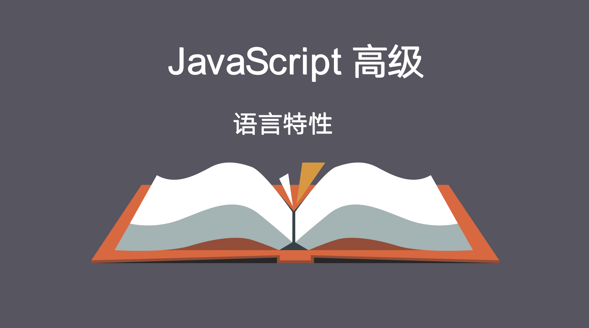
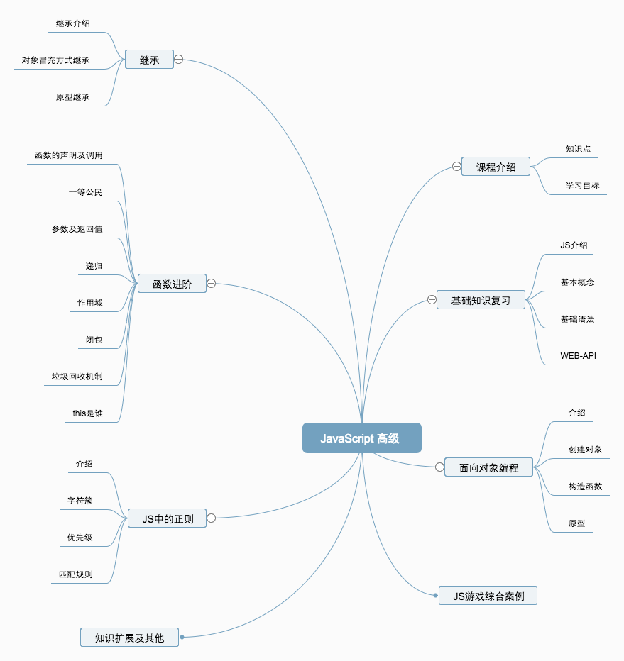
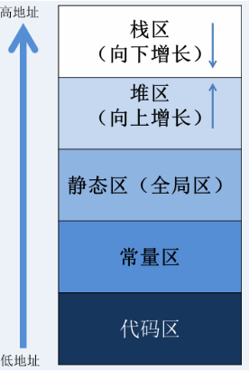
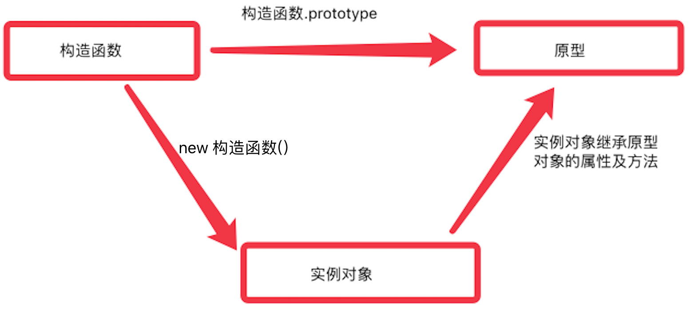
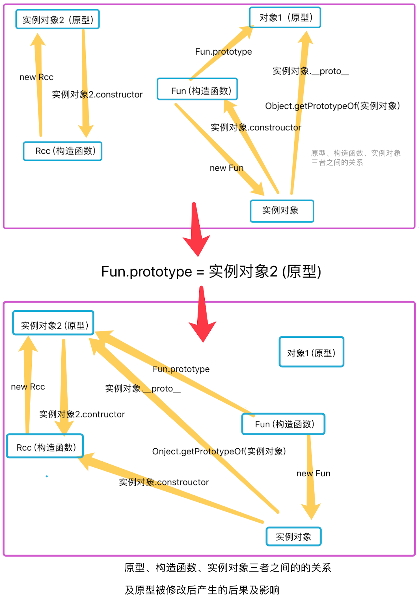
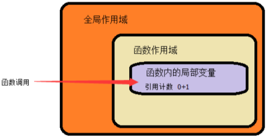
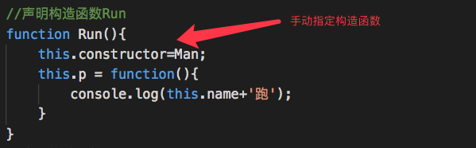

-----


## 第0章 课程回顾


### 0.1 JS语法基础-复习

* 变量：变量的声明及命名规则
* 数据类型：数值、字符串、布尔、undefined、null、对象
* 运算符：+ - * \ == != < >  ?: &&  ||
* 流程控制结构： if else 、 switch  case 、while 、for ；
* 数组及函数：声明、访问、调用……


* 作用域：全局作用域、局部作用域、作用链


* 对象：声明、调用、属性、方法


* 内置对象：Math、Date、Array、String

* JS代码执行流程

  ​

### 0.2 JS-web-api-复习

**API：浏览器对象模型**

* 定时器（setTimeout()、setInterval()）
* location对象、history对象、navigator对象
* 事件：鼠标、键盘、表单、绑定、事件传播、事件对象(事件发生瞬间的一切信息，都包含在事件对象中)


**DOM：文档对象模型**

DOM对象、节点对象、节点属性、获取节点元素、节点元素的增删改查

createElement、childNodes、removeChild、parentNode、nextSibling、firstChild、innerHTML……

### 0.3 JS高级课程介绍




### 0.4 案例：交换变量的值

临时变量、加减运算、数组方式、对象方式

### 0.5 数组遍历

for()循环    for in索引遍历    数组.forEach方法  for of 值遍历（ES6）

### 0.6  数据在内存中的存储

内存地址分区：



基本类型：非对象 string  number  boolean  undefined null  数据直接存储在栈区

```javascript
var a = 1;
```

| 变量   | 栈区   | 堆区   |
| ---- | ---- | ---- |
| a    | 1    |      |

```javascript
var a = 1;
var b = a;
```

| 变量   | 栈区   | 堆区   |
| ---- | ---- | ---- |
| a    | 1    |      |
| b    | 1    |      |

```javascript
var a = 1;
var b = a;
b = 2;
```

| 变量   | 栈区   | 堆区   |
| ---- | ---- | ---- |
| a    | 1    |      |
| b    | 2    |      |

引用类型：对象（array  object  function）  堆区存数据，  栈区存数据在堆区的地址

```javascript
var obj = {"age":40, "sex":"男"};
```

| 变量   | 栈区             | 堆区                    | 堆区地址     |
| ---- | -------------- | --------------------- | -------- |
| obj  | 00000001(堆区地址) | {"age":40, "sex":"男"} | 00000001 |

```javascript
var obj = {"age":40, "sex":"男"};
var obj2 = obj;
```

| 变量   | 栈区       | 堆区                    | 堆区地址     |
| ---- | -------- | --------------------- | -------- |
| obj  | 00000001 | {"age":40, "sex":"男"} | 00000001 |
| obj2 | 00000001 |                       |          |

```javascript
var obj = {"age":40, "sex":"男"};
var obj2 = obj;
obj2.age = 30;
```

| 变量   | 栈区       | 堆区                    | 堆区地址     |
| ---- | -------- | --------------------- | -------- |
| obj  | 00000001 | {"age":30, "sex":"男"} | 00000001 |
| obj2 | 00000001 |                       |          |

传值方式： 

值传递 ：基本数据类型，直接将变量放在栈区的值，复制一份，传给另外一个变量。

 引用传递：对象类型，将变量放在堆区的值的地址，传给另外一个变量。

js中，对象（object , array,  function）, 传递过程中，都使用引用传递。

## 第1章 JS面向对象编程


**学习目标**

* 初步理解对象是什么及面向对象编程的概念
* 能够自己创建一个对象


### 1.1 面向对象介绍 

**什么是对象？**

>  Everything is object （万物皆对象）, JS语言中将一切都视为  对象  


* 对象是对概念的具体化体现：

一本书、一辆汽车、一个人都可以是对象，一个数据库、一张网页、一个与远程服务器的连接也可以是对象。

当实物被抽象成对象，实物之间的关系就变成了对象之间的关系，从而就可以模拟现实情况，针对对象进行编程。


* 编程中对象是一个容器，封装了属性（property）和方法（method）

属性是对象的状态，方法是对象的行为（完成某种任务）。比如，我们可以把动物抽象为animal对象，使用“属性”记录具体是那一种动物，使用“方法”表示动物的某种行为（奔跑、捕猎、休息等等）。

也可以将其简单理解为：**数据集或功能集**。

ECMAScript 把对象定义为：**无序属性的集合，其属性可以包含基本值、对象或者函数**。
严格来讲，这就相当于说对象是一组没有特定顺序的值。对象的每个属性或方法都有一个名字，而每个名字都
映射到一个值。


### 1.2 面向对象编程

面向过程：以前写js代码，都是面向过程。

面向对象不是新的东西，它只是过程式代码的一种高度封装，目的在于提高代码的开发效率和可维护性。


面向对象编程 —— Object Oriented Programming，简称 OOP ，是一种编程开发思想。
它将真实世界各种复杂的关系，抽象为一个个对象，然后由对象之间的分工与合作，完成对真实世界的模拟。

典型问题：将大象关进冰箱分几步

面向过程式：

开门（冰箱）

放进（冰箱，大象）

关门（冰箱）

面向对象式：

两个对象：大象、冰箱

冰箱.开门()

冰箱.放进（大象）

冰箱.关门()

在面向对象程序开发思想中，每一个对象都是功能中心，具有明确分工，可以完成接受信息、处理数据、发出信息等任务。
因此，面向对象编程具有灵活、代码可复用、高度模块化等特点，容易维护和开发，比起由一系列函数或指令组成的传统的过程式编程（procedural programming），更适合多人合作的大型软件项目。

面向对象与面向过程：

- 面向过程就是亲力亲为，事无巨细，面面俱到，步步紧跟，有条不紊
- 面向对象就是找一个对象，指挥得结果
- 面向对象将执行者转变成指挥者
- 面向对象不是面向过程的替代，而是面向过程的封装

面向对象的特性：

- 封装性：对象中的属性、方法，对外提供一组方法（操作数据的接口），使用时无需关心内部具体实现。
- 继承性：将同一类对象，公共的属性方法，提取到一个单独公共对象中，具体的子对象可以使用这个公共对象中的成员
- [多态性]：动物的叫声为例，同一类的对象，有相同的方法（动物会叫）， 但是每个具体的对象，方法实现的效果不一样（每个动物叫声不一样）

扩展阅读：

- [维基百科 - 面向对象程序设计](https://zh.wikipedia.org/wiki/%E9%9D%A2%E5%90%91%E5%AF%B9%E8%B1%A1%E7%A8%8B%E5%BA%8F%E8%AE%BE%E8%AE%A1)
- [知乎：如何用一句话说明什么是面向对象思想？](https://www.zhihu.com/question/19854505)
- [知乎：什么是面向对象编程思想？](https://www.zhihu.com/question/31021366)


### 1.3 创建对象

JavaScript 语言(ES5)的对象体系，不基于“类” 创建对象，是基于构造函数（constructor）和原型链（prototype）。


**简单方式创建对象**

我们可以直接通过 `new Object()` 创建：

```js
var person = new Object()
person.name = 'Jack'
person.age = 18

person.sayName = function () {
    console.log(this.name)
}
```

**字面量方式创建对象**

每次创建通过 `new Object()` 比较麻烦，所以可以通过它的简写形式对象字面量来创建：

```js
var person = {
  name: 'Jack',
  age: 18,
  sayName: function () {
    console.log(this.name)
  }
}
```

对于上面的写法固然没有问题，但是假如我们要生成两个 `person` 实例对象呢？

```js
var person1 = {
  name: 'Jack',
  age: 18,
  sayName: function () {
    console.log(this.name)
  }
}

var person2 = {
  name: 'Mike',
  age: 16,
  sayName: function () {
    console.log(this.name)
  }
}
```

通过上面的代码我们不难看出，这样写的代码太过冗余，重复性太高。

**简单方式的改进：工厂函数**

我们可以写一个函数，解决代码重复问题：

```js
function createPerson (name, age) {
  return {
    name: name,
    age: age,
    sayName: function () {
      console.log(this.name)
    }
  }
}
```

然后生成实例对象：

```js
var p1 = createPerson('Jack', 18)
var p2 = createPerson('Mike', 18)
```

这样封装确实爽多了，通过工厂模式我们解决了创建多个相似对象代码冗余的问题，
但是这依然没有脱离 使用 **字面量方式创建对象** 的本质；


## 第2章 构造函数

**学习目标**

- 构造函数语法
- 分析构造函数
- 构造函数和实例对象的关系
  - 实例的 constructor 属性
  - instanceof 操作符
- 普通函数调用和构造函数调用的区别
- 构造函数的返回值
- 构造函数的问题


### 2.1 构造函数

JavaScript 语言使用构造函数作为对象的模板。
所谓 ”构造函数”，就是一个普通的函数，只不过我们专门用它来生成对象（new 构造函数），这样使用的函数，就是构造函数；

它提供模板，描述对象的基本结构。
一个构造函数，可以生成多个对象，这些对象都有相同的结构。


```js
function Person (name, age) {
  this.name = name
  this.age = age
  this.sayName = function () {
    console.log(this.name)
  }
}

var p1 = new Person('Jack', 18)
p1.sayName() // => Jack

var p2 = new Person('Mike', 23)
p2.sayName() // => Mike
```

**解析 构造函数代码 的执行**

在上面的示例中，`Person()` 函数取代了 `createPerson()` 函数，但是实现效果是一样的。
这是为什么呢？

我们注意到，`Person()` 中的代码与 `createPerson()` 有以下几点不同之处：

- 没有显式的创建对象（没有使用字面量）
- 直接将属性和方法赋给了 `this` 
- 没有 `return` 语句
- 函数名使用的是大写的 `Person`

而要创建 `Person` 实例，则必须使用 `new` 操作符。

以这种方式调用构造函数会经历以下 5 个步骤：

1. 创建一个空对象，作为将要返回的对象实例。
2. 将这个空对象的原型，指向构造函数的`prototype`属性。`先记住，后面讲` 
3. 将这个空对象赋值给函数内部的`this`关键字。
4. 执行构造函数内部的代码。
5. 返回新对象


```js
function Person (name, age) {
  // 当使用 new 操作符调用 Person() 的时候，实际上这里会先创建一个对象
  // 然后让内部的 this 指向新创建的对象
  // 接下来所有针对 this 的操作实际上操作的就是刚创建的这个对象

  this.name = name
  this.age = age
  this.sayName = function () {
    console.log(this.name)
  }

  // 在函数的结尾处会将 this 返回，也就是这个新对象
}
```


**构造函数和实例对象的关系**

构造函数是根据具体的事物抽象出来的抽象模板

实例对象是根据抽象的构造函数模板得到的具体实例对象

实例对象由构造函数而来，一个构造函数可以生成很多具体的实例对象，而每个实例对象都是独一无二的；


每个对象都有一个 `constructor` 属性，该属性指向创建该实例的构造函数

**反推出来，每一个对象都有其构造函数**

```js
console.log(p1.constructor === Person) // => true
console.log(p2.constructor === Person) // => true
console.log(p1.constructor === p2.constructor) // => true
```


因此，我们可以通过实例对象的 `constructor` 属性判断实例和构造函数之间的关系


注意：这种方式不严谨，推荐使用 `instanceof` 操作符，后面学原型会解释为什么

```js
console.log(p1 instanceof Person) // => true
console.log(p2 instanceof Person) // => true
```

constructor 既可以判断也可以获取

instanceof 只能用于判断


### 2.2 构造函数存在的问题

以构造函数为模板，创建对象，对象的属性和方法都可以在构造函数内部定义；

```js
function Cat(name, color) {
  this.name = name;
  this.color = color;
  this.say = function () {
    console.log('hello'+this.name,this.color);
  };
}
var cat1 = new Cat('猫', '白色'); 
var cat2 = new Cat('猫', '黑色'); 
cat1.say();
cat2.say();
```


在该示例中，从表面上看好像没什么问题，但是实际上这样做，有一个很大的弊端。
那就是对于每一个实例对象， `name` 和 `say` 都是一模一样的内容，
每一次生成一个实例，都必须为重复的内容，多占用一些内存，如果实例对象很多，会造成极大的内存浪费。


对于这种问题我们可以把需要共享的函数定义到构造函数外部：

```js
function say(){
    console.log('hello'+this.name,this.color);
}

function Cat(name, color) {
  this.name = name;
  this.color = color;
  this.say = say;
}
var cat1 = new Cat('猫', '白色'); 
var cat2 = new Cat('猫', '黑色'); 
cat1.say();
cat2.say();
```

这样确实可以了，但是如果有多个需要共享的函数的话就会造成全局变量（函数名）冲突的问题。

你肯定想到了可以把多个函数放到一个对象中用来避免全局变量（函数名）冲突的问题：


```js
var s = {
    sayhello:function (){
        console.log('hello'+this.name,this.color);
    },
    saycolor:function(){
        console.log('hello'+this.color);
    }
}

function Cat(name, color) {
  this.name = name;
  this.color = color;
  this.sayhello = s.sayhello;
  this.saycolor = s.saycolor;
}
var cat1 = new Cat('猫', '白色'); 
var cat2 = new Cat('猫', '黑色'); 
cat1.sayhello();
cat2.saycolor();
```


至此，我们利用自己的方式基本上解决了构造函数的内存浪费问题。
但是代码看起来还是那么的格格不入，那有没有更好的方式呢？

**小结** 

- 构造函数语法
- 分析构造函数
- 构造函数和实例对象的关系
  - 实例的 constructor 属性
  - instanceof 操作符
- 构造函数的问题


## 第3章 原型

**学习目标**

- 使用 prototype 原型对象解决构造函数的问题
- 理解什么是原型(原型对象)
- 构造函数、prototype 原型对象、实例对象 三者之间的关系
- 实例对象读写原型对象
- 属性成员搜索原则：原型链
- 原型对象的简写形式
- 原生对象的原型
- 原型对象的问题及使用建议


### 3.1 构造函数的 prototype属性

JavaScript 的每个对象都继承另一个父级**对象**，父级对象称为 **原型 ** (prototype)对象。

原型也是一个对象，原型对象上的所有属性和方法，都能被子对象 (派生对象) 共享
**通过构造函数生成实例对象时，会自动为实例对象分配原型对象。**
而每一个**构造函数**都有一个**prototype**属性，这个属性就是实例对象的**原型对象**。

>  null没有自己的原型对象。		

这也就意味着，我们可以把所有对象实例需要共享的属性和方法直接定义在构造函数的 `prototype` 属性上，

也就是实例对象的原型对象上。


```js
function Cat(color) {
  this.color = color;
}

Cat.prototype.name = "猫";
Cat.prototype.sayhello = function(){
    console.log('hello'+this.name,this.color);
}
Cat.prototype.saycolor = function (){
    console.log('hello'+this.color);
}

var cat1 = new Cat('白色'); 
var cat2 = new Cat('黑色'); 
cat1.sayhello();
cat2.saycolor();
```

这时所有实例的 `name` 属性和 `sayhello()` 、`saycolor` 方法，
其实都是同一个内存地址，指向构造函数的 `prototype` 属性，因此就提高了运行效率节省了内存空间。


### 3.2 构造函数、实例、原型三者之间的关系




**构造函数的prototyp属性，就是由这个构造函数new出来的所有实例对象的 原型对象**

前面已经讲过，每个对象都有一个 `constructor` 属性，该属性指向创建该实例的构造函数

对象.\__proto__ (两边都是两个下划线):获取对象的原型对象;

```js
console.log(cat1.__proto__ == Cat.prototype); // true
```

> 注意：ES6标准规定，\__proto__属性只有浏览器环境下才需要部署，其他环境可以不部署,因此不建议使用


### 3.3 原型对象的获取及修改

上节可以看到，想要获取一个实例对象的原型对象，有两种方式：

1：通过实例对象的构造函数的prototype属性获取: `实例对象.constructor.prototype`

2：通过实例对象的 \__proto__ 属性获取:  `实例对象.__proto__`

而这两种方式，我们都不建议使用：

`obj.constructor.prototype`在手动改变原型对象时，可能会失效。

```js
function P() {};
var p1 = new P();

function C() {};
// 修改构造函数的prototype属性的值为p1
C.prototype = p1; //也就是说，此后所有有C构造函数得到的对象的原型对象都是p1；

var c1 = new C();

console.log(c1.constructor.prototype === p1) // false
```


**推荐设置获取实例对象的原型的方式**：

Object.getPrototypeOf(实例对象) 方法返回一个对象的原型对象。

这是获取原型对象的标准方法。

```js
function Cat(name, color) {
    this.name = name;
}
var cat1 = new Cat('猫'); //获取cat1对象的原型对象
var s = Object.getPrototypeOf(cat1); 
console.log(s);
```

Object.setPrototypeOf(实例对象，原型对象) 为现有对象设置原型对象
第一个是实例对象，第二个是要设置成为实例对象的原型对象的对象
这是设置原型对象的标准方法。

```js
function Cat(name) {
    this.name = name;
}
var ob = {p:'波斯'};
var cat1 = new Cat('猫'); 
//设置cat1的原型对象为ob 
Object.setPrototypeOf(cat1,ob); 
console.log(cat1.p);//cat1的原型对象中有p属性 
console.log(Object.getPrototypeOf(cat1));
console.log(cat1.__proto__);
//注意：如果对象的原型被改变，不会影响构造函数获取的原型的结果
console.log(Cat.prototype == cat1.__proto__); //false
```

> 以上的两种方法，都是在ES6新标准中添加的；


**重要图示**




### 3.4 原型及原型链

所有对象都有原型对象；

```
function Cat(name, color) {
    this.name = name;
 }

var cat1 = new Cat('猫');

console.log(cat1.__proto__.__proto__.__proto__);

```

而原型对象中的属性和方法，都可以被实例对象直接使用；


每当代码读取某个对象的某个属性时，都会执行一次搜索，目标是具有给定名字的属性

- 搜索首先从对象实例本身开始

- 如果在实例中找到了具有给定名字的属性，则返回该属性的值

- 如果没有找到，则继续搜索原型对象，在原型对象中查找具有给定名字的属性

- 如果在原型对象中找到了这个属性，则返回该属性的值

- 如果还是找不到，就到原型的原型去找，依次类推。

- 如果直到最顶层的Object.prototype还是找不到，则返回undefined。


而这正是多个对象实例共享原型所保存的属性和方法的基本原理。

对象的属性和方法，有可能是定义在自身内，也有可能是定义在它的原型对象上。
由于原型本身也是对象，又有自己的原型，所以形成了一条 **原型链**(prototype chain)。


### 3.5 更简单的原型语法

我们注意到，前面例子中每添加一个属性和方法就要敲一遍 `构造函数.prototype` 。
为减少不必要的输入，更常见的做法是用一个包含所有属性和方法的对象字面量来重写整个原型对象：

```js
function Person (name, age) {
  this.name = name
  this.age = age
}

Person.prototype = {
  type: 'human',
  sayHello: function () {
    console.log('我叫' + this.name + '，我今年' + this.age + '岁了')
  }
}
```

在该示例中，我们将 `Person.prototype` 重置到了一个新的对象。
这样做的好处就是为 `Person.prototype` 添加成员简单了，但是也会带来一个问题，那就是原型对象丢失了 `constructor` 成员(构造函数)。

所以，我们为了保持 `constructor` 的指向正确，建议的写法是：

```js
function Person (name, age) {
  this.name = name
  this.age = age
}

Person.prototype = {
  // 将这个对象的构造函数指向Person
  //constructor: Person, // => 手动将 constructor 指向正确的构造函数
  type: 'human',
  sayHello: function () {
    console.log('我叫' + this.name + '，我今年' + this.age + '岁了')
  }
}

var p = new Person();
```


### 3.6 原生对象的原型

所有构造函数都有prototype属性；

- Object.prototype
- Function.prototype
- Array.prototype
- String.prototype
- Number.prototype
- Date.prototype
- ……


为内置对象扩展原型方法：

例：

```js
var ar = [1,5,23,15,5];
//获取数组中小于10的数
function f(){
    var minarr = [];
    this.forEach(function(v,k){
        if(v<10){
            minarr.push(v);
        }
    })
    return minarr;
}

Object.getPrototypeOf(ar).min10 = f;
console.log(ar.min10());//[1, 5, 5]

// 其他数组对象也具有相应的方法
var a = [1,2,34,7];
console.log(a.min10()); //[1, 2, 7]
```


> 这种技术被称为猴子补丁，并且会破坏封装。尽管一些流行的框架（如 Prototype.js）在使用该技术，但仍然没有足够好的理由使用附加的非标准方法来混入内置原型。


### 3.7 原型对象的问题及使用建议

**性能问题：**

在原型链上查找属性时是比较消耗资源的，对性能有副作用，这在性能要求苛刻的情况下很重要。

另外，**试图访问不存在的属性时会遍历整个原型链**。

```js
//声明构造函数Man
function Man(name){
    this.name = name;
    this.p = function(){
      console.log(this.name+'跑');
  }
}

var m = new Man('张三');

console.log(m.hasOwnProperty('name')); // true
console.log(m.hasOwnProperty('age')); //false
```

`hasOwnProperty` 是 JavaScript 中唯一处理属性并且不会遍历原型链的方法。

注意：检查属性是否`undefined`还不够。该属性可能存在，但其值恰好设置为`undefined`。


```js
//声明构造函数Man
function Man(name){
    this.name = name;
    this.n = undefined;
    this.p = function(){
      console.log(this.name+'跑');
  }
}

var m = new Man('张三');

if(m.n == undefined){
    console.log('没有n属性')
}

console.log(m.hasOwnProperty('name')); // true
console.log(m.hasOwnProperty('name')); // true
console.log(m.hasOwnProperty('n')); //true
```


## 第4章 继承

**学习目标**

* 理解什么是继承
* 原型继承


### 4.1 什么是继承

- 现实生活中的继承
- 程序中的继承

所谓的继承，其实就是在子类(子对象)能够使用父类(父对象)中的属性及方法;

赋予后辈调用祖辈资源的权限，就是继承；

### 4.2 原型链继承

```js
//声明构造函数Run
function Run(){
  this.p = function(){
      console.log(this.name+'跑');
  }
}
//声明构造函数Man
function Man(name){
    this.name = name;
}
//设置构造函数Man的原型为Run,实现继承
Man.prototype = new Run();

var m = new Man('张三');

m.p();
```


>  但是，并不建议使用原型链继承，而且JS 中不止有原型链继承，还有其他的继承方式，后面会讲到；


## 第5章 函数进阶

学习目标

* 函数的声明调用参数等基本语法
* 理解作用域
* 闭包
* this的指向和使用
* 改变this指向的方法


### 5.1 函数的声明及调用

**关键字声明**

```js
function f1(){
    console.log('f1');
}
```

**表达式声明**

```js
var f2 = function(){
    console.log('f2');
}
```

这种写法将一个匿名函数赋值给变量。这时，这个匿名函数又称函数表达式（Function Expression）

**构造函数方式声明**

```js
var add = new Function(
  'x',
  'y',
  'console.log( x + y )'
);
add(1,2);
```

上面代码与下面的代码等同；

```js
// 等同于
function add(x, y) {
  console.log( x + y )
}
add(1,2);
```

因此，我们只关注前两种即可，后一种只做了解，不建议使用，这种声明函数的方式非常不直观，几乎无人使用；

那么，**关键字声明**和**表达式声明** 有什么区别？

- 关键字声明必须有名字
- 关键字声明会函数提升，在预解析阶段就已创建，声明前后都可以调用
- 函数表达式类似于变量赋值
- 函数表达式没有函数名字
- 函数表达式没有变量提升，在执行阶段创建，必须在表达式执行之后才可以调用


```js
// 先调用后声明
f1();
function f1(){
    console.log('f1');
}
//由于“变量提升”，函数f被提升到了代码头部，也就是在调用之前已经声明了
//因此可以正常调用

```

而表达式方式：

```js
f();
var f = function (){};
// TypeError: undefined is not a function
```

上面的代码等同于下面的形式。

```js
var f;
f();
f = function () {};
```

上面代码第二行，调用`f`的时候，`f`只是被声明了，还没有被赋值，等于`undefined`，所以会报错。

因此，如果同时采用`function`命令和表达式声明同一个函数，最后总是采用表达式的定义。

```js
var f = function () {
  console.log('1');
}

function f() {
  console.log('2');
}

f() // 1
```


### 5.2 第一等公民

JavaScript 语言将函数看作一种值，与其它值（数值、字符串、布尔值等等）地位相同。凡是可以使用值的地方，就能使用函数。比如，可以把**函数赋值给变量和对象的属性**，也可以当作**参数传入其他函数**，或者**作为函数的结果返回**。函数只是一个可以执行的值，此外并无特殊之处。

由于函数与其他数据类型地位平等，所以在 JavaScript 语言中又称函数为 **第一等公民**。

**函数作为参数**

```js
function eat (callback) {
  setTimeout(function () {
    console.log('吃完了')
    callback()
  }, 1000)
}

eat(function () {
  console.log('去唱歌')
})
```


**函数作为返回值**

```js
function f1(){
    var s = 1;
    function f2(){
        console.log(s);
    }
    return f2;
}
var f = f1();
f();// 1
```


JS中一切皆对象，函数也是对象，后面还会讲到


### 5.3 参数及返回值

#### 5.3.1 参数

**形参和实参**

```js
// 函数内部是一个封闭的环境，可以通过参数的方式，把外部的值传递给函数内部
// 带参数的函数声明
function 函数名(形参1, 形参2, 形参...){
  // 函数体
}

// 带参数的函数调用
函数名(实参1, 实参2, 实参3);
```

解释：

> 1. 形式参数：在声明一个函数的时候，为了函数的功能更加灵活，有些值是固定不了的，对于这些固定不了的值。我们可以给函数设置参数。这个参数没有具体的值，仅仅起到一个占位置的作用，我们通常称之为形式参数，也叫形参。
> 2. 实际参数：如果函数在声明时，设置了形参，那么在函数调用的时候就需要传入对应的参数，我们把传入的参数叫做实际参数，也叫实参。


```js

function fn(a, b) {
  console.log(a + b);
}
var x = 5, y = 6;
fn(x,y); 
//x,y实参，有具体的值。函数执行的时候会把x,y复制一份给函数内部的a和b，函数内部的值是复制的新值，无法修改外部的x,y
```


```js
var f = function (one) {
  console.log(one);
}
f(1, 2, 3)
```

由于 JavaScript 允许函数有不定数目的参数，所以需要一种机制，可以在函数体内部读取所有参数。

**arguments对象 **— 函数的实参参数集合

```js
var f = function (one) {
  console.log(arguments);
  console.log(arguments[0]);
  console.log(arguments[1]);
  console.log(arguments[2]);
}

f(1, 2, 3)
```


#### 5.3.2 返回值

> 当函数执行完的时候，并不是所有时候都要把结果打印。我们期望函数给我一些反馈（比如计算的结果返回进行后续的运算），这个时候可以让函数返回一些东西。也就是返回值。函数通过return返回一个返回值

```js
//声明一个带返回值的函数
function 函数名(形参1, 形参2, 形参...){
  //函数体
  return 返回值;
}

//可以通过变量来接收这个返回值
var 变量 = 函数名(实参1, 实参2, 实参3);
```


函数的调用结果就是返回值，因此我们可以直接对函数调用结果进行操作。

**返回值详解**：
    如果函数没有显示的使用 return语句 ，那么函数有默认的返回值：undefined
    如果函数使用 return语句，那么跟在return后面的值，就成了函数的返回值
    如果函数使用 return语句，但是return后面没有任何值，那么函数的返回值也是：undefined ,

​	

​    函数使用return语句后，这个函数会在执行完 return 语句之后停止并立即退出，也就是说return后面的所有其他代码都不会再执行。

return后没有任何内容，可以用来调试代码。


#### 5.3.3 递归

执行代码，查看执行结果：

```js
function fn1 () {
  console.log(111)
  fn2()
  console.log('fn1')
}

function fn2 () {
  console.log(222)
  fn3()
  console.log('fn2')
}

function fn3 () {
  console.log(333)
  fn4()
  console.log('fn3')
}

function fn4 () {
  console.log(444)
  console.log('fn4')
}

fn1()
/*
** 执行结果为： 
111
222
333
444
fn4
fn3
fn2
fn1
*/
```

最简单的一句话介绍递归：函数内部自己调用自己


递归案例：

计算 1+2+3+......+100 的结果

```js
function sum(n){
    if(n>1){
        return n + sum(n-1);
    }else{
        return 1; 
    }
}
var jieguo = sum(5);
console.log(jieguo);
```


**递归必须要有判断条件，不加判断会死；**


### 5.4 作用域

作用域（scope）指的是变量存在的范围。在 ES5 的规范中，Javascript 只有两种作用域：一种是全局作用域，变量在整个程序中一直存在，所有地方都可以读取；另一种是函数作用域(局部作用域)，变量只在函数内部。

函数外部声明的变量就是全局变量（global variable），它可以在函数内部读取。

```js
var v = 1;

function f() {
  console.log(v);
}

f()
// 1
```

在函数内部定义的变量，外部无法读取，称为“**局部变量**”（local variable）。

```js
function f(){
  var v = 1;
}

v // ReferenceError: v is not defined
```

注意，对于`var`命令来说，局部变量只能在函数内部声明，在其他区块中声明，一律都是全局变量。


#### 5.4.1 作用域链 

只有函数可以制造作用域结构， 那么只要是代码，就至少有一个作用域, 即全局作用域。凡是代码中有函数，那么这个函数就构成另一个作用域。如果函数中还有函数，那么在这个作用域中就又可以诞生一个作用域。

将这样的所有的作用域列出来，可以有一个结构: 函数内指向函数外的链式结构。就称作作用域链。

```js
function f1() {
    var num = 123;
    function f2() {
        console.log( num );
    }
    f2();
}
var num = 456;
f1();
```


### 5.5 函数内部的变量声明的提升

与全局作用域一样，函数作用域内部也会产生“变量提升”现象。

`var`命令声明的变量，不管在什么位置，变量声明都会被提升到函数体的头部。

```js
function foo() {
    console.log(y);//undefined
    var y = 'Bob';
} 
foo();
```

**注意:** JavaScript引擎自动提升了变量y的声明，但不会提升变量y的赋值。

对于上述foo()函数，JavaScript引擎看到的代码相当于:

```js
function foo() {
	var y; // 提升变量y的申明 
    var x = 'Hello, ' + y; 
    alert(x);
	y = 'Bob';
}
```

### 5.6 函数本身的作用域

```js
var a = 1;
var x = function () {
  console.log(a);
};
function f() {
  var a = 2;
  x();
}
f() // 1 
// 讨论结果为什么是 1  ？
```

函数本身也是一个值，也有自己的作用域。
它的作用域与变量一样，就是其声明时所在的作用域，与其运行时所在的作用域无关。
总之，函数执行时所在的作用域，是定义时的作用域，而不是调用时所在的作用域。

```js
var x = function () {
  console.log(a);
};
function y(f) {
	var a = 2;
	f(); 
}
y(x);// ReferenceError: a is not defined
```


```js
function foo() {
    var x = 1;
    function bar() {
        console.log(x);
    }
	return bar; 
}
var x = 2;
var f = foo();
f() // 1
```


### 5.7 闭包

#### 5.7.1 关于作用域的问题

```js
var n = 999;
function f1() { 
    console.log(n);
}
f1() // 999
```

函数内部可以直接读取全局变量，函数 f1 可以读取全局变量 n。

但是，在函数外部无法读取函数内部声明的变量。

```js
function f1() {
  var n = 99;
}
f1()
console.log(n);
```

有时我们却需要在函数外部访问函数内部的变量;
正常情况下，这是办不到的，只有通过变通方法才能实现。
那就是在函数的内部，再定义一个函数。

```js
function f1() {
    var n = 999;
 
	var f2 = function() {
     	console.log(n);
	} 
	return f2;
}
var f = f1();
f();
```

上面代码中，函数f2就在函数f1内部，这时f1内部的所有局部变量，对f2都是可见的。
但是反过来就不行，f2内部的局部变量，对f1就是不可见的。

这就是JavaScript语言特有的”链式作用域”结构(chain scope)，子级会一层一层地向上寻找所有父级的变量。
所以，父级的所有变量，对子级都是可见的，反之则不成立。

既然f2可以读取f1的局部变量，那么只要把f2作为返回值，我们不就可以在f1外部读取它的内部变量了吗!


闭包就是函数f2，即能够读取其他函数内部变量的函数。
由于在JavaScript语言中，只有函数内部的子函数才能读取内部变量，

因此可以把闭包简单理解成**“定义在一个函数内部的函数”**。
闭包最大的特点，就是它可以“记住”诞生的环境，比如f2记住了它诞生的环境f1，所以从f2可以得到f1的内部变量。
在本质上，**闭包就是将函数内部和函数外部连接起来的一座桥梁**;


闭包（closure）是 Javascript 语言的一个难点，也是它的特色，很多高级应用都要依靠闭包实现。

理解闭包，首先必须理解变量作用域。


#### 5.7.2 关于JS垃圾回收机制的问题

```js
function f1() { 
    var n = 99;
	console.log(++n);
}
f1(); //100 
f1(); //100
```



当我们在函数内部引入一个变量或函数时，系统都会开辟一块内存空间;还会将这块内存的引用计数器进行初始化，初始化值为0，如果外部有全局变量或程序引用了这块空间，则引用计数器会自动进行+1操作，当函数执行完毕后,变量计数器重新归零，系统会运行垃圾回收，将函数运行产生的数据销毁;如计数器不是 0 ，则不会清楚数据;

这个过程就称之为 "JS的垃圾回收机制" ;


如果将上节的代码，改为闭包形式:

```js
function f1() {
    var n = 99;
    function f2(){
        console.log(++n);
	}
	return f2; 
}
var f = f1();
f(); //100
f(); //101
```


运行代码发现，函数调用一次，其变量 n 变化一次;

因 函数f1被调用时，返回的结果是f2函数体，也就是说，f2函数被当作值返回给f1的调用者，
但是f2函数并没有在此时被调用执行，
所以整个 f1 函数体，无法判断子函数f2会对其产生何种影响，无法判断 变量n是否会被使用;
即使f1函数被调用结束，整个f1函数始终保留在内存中，不会被垃圾回收机制回收;

**闭包的最大用处有两个，一个是可以读取函数内部的变量，另一个就是让这些变量始终保持在内存中，**
**即闭包可以使得它诞生环境一直存在;**


> **注意**，外层函数每次运行，都会生成一个新的闭包，而这个闭包又会保留外层函数的内部变量，所以内存消耗很大。
>
> 因此不能滥用闭包，否则会造成网页的性能问题。


闭包小案例：缓存随机数

需求：获取随机数，随机数一旦生成，会在程序中多次使用，所以，在多次使用中不变；

```js
function f1(){
    var num = parseInt(Math.random()*100)+1;
    return function (){
        console.log(num);
    }
}
var f2 = f1();
f2();
f2();
f2();
```


闭包点赞案例：

```html
<ul>
  <li><br/><input type="button" value="赞(1)"></li>
  <li><br/><input type="button" value="赞(1)"></li>
  <li><br/><input type="button" value="赞(1)"></li>
  <li><br/><input type="button" value="赞(1)"></li>
</ul>
<script>
  function f1() {
    var value=1;
    return function () {
      this.value="赞("+(++value)+")";
    }
  }
  //获取所有的按钮

  var btnObjs=document.getElementsByTagName("input");
  for(var i=0;i<btnObjs.length;i++){
    var ff=f1();
    //将 闭包函数 绑定给事件
    btnObjs[i].onclick=ff;
  }
</script>
```


思考以下两段代码的运行结果：

```js
var name = "The Window";
var object = {
  name: "My Object",
  getNameFunc: function () {
    return function () {
        console.log(this.name);
    };
  }
};

object.getNameFunc()() 
```


```js
var name = "The Window";　　
var object = {　　　　
  name: "My Object",
  getNameFunc: function () {
    var that = this;
    return function () {
        console.log(that.name);
    };
  }
};
object.getNameFunc()(); 
```


通过分析代码得知，其中的 `this` 是关键，那么this到底是什么？

### 5.8 this 到底是谁 

#### 5.8.1 this的不同指向

`this`关键字是一个非常重要的语法点。毫不夸张地说，不理解它的含义，大部分开发任务都无法完成。

记住一点：`this`不管在什么地方使用：**它永远指向一个对象**。

下面是一个实际的例子。

```js
var person = {
  name: '张三',
  describe: function () {
    console.log('姓名：'+ this.name);
  }
};

person.describe()
// "姓名：张三"
```

上面代码中，`this.name`表示`name`属性所在的那个对象。由于`this.name`在`describe`方法中调用，而`describe`方法所在的当前对象是`person`，因此`this`指向`person`，`this.name`就是`person.name`。


由于对象的属性可以赋给另一个对象，所以属性所在的当前对象是可变的，即`this`的指向是可变的。

```js
var A = {
  name: '张三',
  describe: function () {
    console.log('姓名：'+ this.name);
  }
};

var B = {
  name: '李四'
};

B.describe = A.describe;
B.describe()
// "姓名：李四"
```

上面代码中，`A.describe`属性被赋给`B`，于是`B.describe`就表示`describe`方法所在的当前对象`B`，所以`this.name`就指向`B.name`。


稍稍重构这个例子，`this`的动态指向就能看得更清楚。

```js
function f() {
  console.log('姓名：'+ this.name);
}

var A = {
  name: '张三',
  describe: f
};

var B = {
  name: '李四',
  describe: f
};

A.describe() // "姓名：张三"
B.describe() // "姓名：李四"
```

上面代码中，函数`f`内部使用了`this`关键字，随着`f`所在的对象不同，`this`的指向也不同。


只要函数被赋给另一个变量，`this`的指向就会变。

```js
var A = {
  name: '张三',
  describe: function () {
    console.log('姓名：'+ this.name);
  }
};

var name = '李四';
var f = A.describe;
f() // "姓名：李四"
```

上面代码中，`A.describe`被赋值给变量`f`，的内部`this`就会指向`f`运行时所在的对象（本例是顶层对象）。

案例：判断数值合法性

```html
<input type="text" name="age" size=3 onChange="validate(this, 10, 20);">

<script>
function validate(obj, x, y){
  if ((obj.value < x) || (obj.value > y)){
    console.log('合法');
  }else{
    console.log('不合法');
  }
}
</script>
```

上面代码是一个文本输入框，每当用户输入一个值，鼠标离开焦点就会触发onChange事件，并执行`validate`回调函数，验证这个值是否在指定范围。浏览器会向回调函数传入当前对象，因此`this`就代表传入当前对象（即文本框），就然后可以从`this.value`上面读到用户输入的值。


> JavaScript语言之中，一切皆对象，运行环境也是对象，所以函数都是在某个对象下运行的，`this`就是函数运行时所在的对象（环境）。这本来并不会让我们糊涂，但是JavaScript支持运行环境动态切换，也就是说，`this`的指向是动态的，没有办法事先确定到底指向哪个对象，这才是最初初学者感到困惑的地方。


#### 5.8.2 使用场合

**（1）全局环境**

全局环境使用`this`，它指的就是顶层对象`window`。

```js
this === window // true

function f() {
  console.log(this === window);
}
f() // true
```

**（2）构造函数**

构造函数中的`this`，指的是实例对象。

```js
function F(){
    this.hello=function(){
        console.log('Hello'+this.name);
    }
}
var f1 = new F();
f1.name = '张三';
f1.hello();


var f2 = new F();
f2.name = '刘能';
f2.hello();
```


**(3)对象的方法**

方法在哪个对象下，this就指向哪个对象。

```js
var o1 = {
    s1:'123',
    f1:function (){
        console.log(this.s1)
    }
}

var o2 = {
    s1:'456',
    f1:o1.f1
}

o2.f1();
```

#### 5.8.3 使用this时的注意事项

**(1) 避免包含多层this**

```js
var o = {
  f1: function () {
    console.log(this);
    var f2 = function () {
      console.log(this);
    }
    f2();
  }
}

o.f1()
// Object  
// Window  
```

如果要在内层函数中使用外层的this指向，一般的做法是：

```js
var o = {
  f1: function () {
    console.log(this);
    var that = this;
    var f2 = function () {
      console.log(that);
    }
    f2();
  }
}

o.f1()
// Object  
// Object  
```


**(2)不在循环数组中使用this**

```js
var ar = ['a','b','c'];
ar.forEach(function(v,k,ar){
    console.log(this[k])
})
```

`this`的动态切换，固然为JavaScript创造了巨大的灵活性，但也使得编程变得困难和模糊。

有时，需要把`this`固定下来，避免出现意想不到的情况；JavaScript提供了`call`，`apply`，`bind`这三个方法，来切换/固定`this`的指向。

### 5.9 call()方法、apply()方法、bind()方法

**call()方法**

```js
var lisi = {names:'lisi'};
var zs = {names:'zhangsan'};
function f(age){
    console.log(this.names);
    console.log(age);
    
}
f(23);//undefined
f.call(zs,32);//zhangsan
```

> call方法使用的语法规则
>
> 函数名称.call(obj,arg1,arg2...argN);
>
> 参数说明:
>
> obj:函数内this要指向的对象,
>
> arg1,arg2...argN :参数列表，参数与参数之间使用一个逗号隔开


**apply()方法**

> 函数名称.apply(obj,[arg1,arg2...,argN])
>
> 参数说明:
>
> obj :this要指向的对象
>
> [arg1,arg2...argN] : 参数列表，但是要求格式为数组
>


```js
var lisi = {name:'lisi'}; 
var zs = {name:'zhangsan'}; 
function f(age,sex){
	console.log(this.name+age+sex); 
}
f.apply(zs,[23,'nan']);
```


**bind()方法**

`bind`方法用于将创建一个新的函数，且将新函数中的`this`绑定到具体的某个对象上

```js
function foo() {
    console.log(this.a);
}
var obj2 = {
    a: 2,
};
// 创建新函数，并将新函数中的this固定的指向obj2对象；
var new_foo = foo.bind(obj2);

new_foo(); //2
foo();     //undefined
```


## 第6章 再谈 面向对象

学习目标：

* 了解ES6中新的对象语法
* 正确使用继承


### 6.1 对象

#### 6.1.1 谁说JS没有类

在JS中，想要获取一个对象，有多种方式：

`var o1 = {}`  `var o2 = new Object()` 

自定义构造函数方式

```js
function Point(x, y) {
  this.x = x;
  this.y = y;
  this.toString = function () {
  	return this.x + ', ' + this.y;
  };
}

var p = new Point(1, 2);
console.log(p.toString());
```

但是上面这种使用构造函数获取对象的写法跟传统的面向对象语言（比如 C++ 和 Java）差异很大，很容易让新学习这门语言的程序员感到困惑。

ES6 提供了更接近传统语言的写法，引入了 Class（类）这个概念，作为对象的模板。

通过`class`关键字，可以定义类。


基本上，ES6 的`class`可以看作只是一个**语法糖**，它的绝大部分功能，ES5 都可以做到，新的`class`写法只是让对象原型的写法更加清晰、更像面向对象编程的语法而已。

上面的代码用 ES6 的`class`改写，就是下面这样。

```js
//定义类
class Point {
  constructor(x, y) {
    this.x = x;
    this.y = y;
  }

  toString() {
    return  this.x + ', ' + this.y ;
  }
}
var p = new Point(1, 2);
console.log(p.toString());
```

上面代码定义了一个“类”，可以看到里面有一个`constructor`方法，这就是**构造方法**(后面还会讲到)，而`this`关键字则代表实例对象。也就是说，ES5 的构造函数`Point`，对应 ES6 的类`Point`。

`Point`类除了构造方法，还定义了一个`toString`方法。注意，定义“类”的方法的时候，前面不需要加上`function`这个关键字，直接把函数定义放进去了就可以了。另外，方法之间不需要逗号分隔，加了会报错。


ES6 的类，完全可以看作构造函数的另一种写法。

使用的时候，也是直接对类使用`new`命令，跟构造函数的用法完全一致。


类同样也有`prototype`属性，而属性的值依然是实例对象的原型对象；

```js
class Point {
  constructor(x, y) {
    this.x = x;
    this.y = y;
  }

  toString() {
    return  this.x + ', ' + this.y ;
  }
}
Point.prototype.toValue = function(){
    console.log('123');
}
var p = new Point(1, 2);
p.toValue();
console.log(p.toString());
```


#### 6.1.2 constructor 方法 

`constructor`方法是类的默认方法，通过`new`命令生成对象实例时，自动调用该方法。一个类必须有`constructor`方法，如果没有显式定义，一个空的`constructor`方法会被默认添加。

```js
class Point {
}

// 等同于
class Point {
  constructor() {}
}
```

类必须使用`new` 进行实例化调用，否则会报错。

而类一旦实例化，`constructor()`方法就会被执行，就像 人一出生就会哭一样；

`constructor`方法默认返回实例对象（即`this`）；

但是返回值完全可以指定返回另外一个对象；


```js
var o1 = {
    f1:function(){
        console.log('f1');
    }
}
class Point{
    constructor (){
        return o1;
    }
    f2(){
        console.log('f2');
    }
}

var p = new Point();
p.f1(); // f1
p.f2(); //Uncaught TypeError: p.f2 is not a function
```

> `constructor`方法默认返回值尽量不要修改，一旦修改，我们获取的对象将脱离其原型；


#### 6.1.3 变量提升

我们知道，在JS中，不管是全局变量还是局部变量都存在变量提升的特性，函数也有提升的特性，也可以先调用后声明，构造函数也一样；如下面的代码，完全没问题：

```js
var p = new Point();
p.f2();

function Point(){
    this.f2 = function(){
        console.log('f2');
    }
}
```


但是，需要注意： **类不存在变量提升（hoist），这一点与 ES5 完全不同。**

```js
new Man();
class Man{}

// Man is not defined
```


> 注意，class只是在原有面向对象的基础上新加的关键字而已，本质上依然没有改变JS面向对象方式；


### 6.2 再谈继承

#### 6.2.1 原型链继承的问题 

```js
//声明构造函数Run
function Run(){
  this.p = function(){
      console.log(this.name+'跑');
  }}
//声明构造函数Man
function Man(name){
    this.name = name;
}
//设置构造函数Man的原型为Run,实现继承
Man.prototype = new Run();

var m = new Man('张三');

m.p();

// 由构造函数获取原型 
console.log(Man.prototype); // 函数对象 Run
//标准方法获取对象的原型 
console.log(Object.getPrototypeOf(m)); // 函数对象 Run
//获取对象的构造函数
console.log(m.constructor); // Run 函数
```

运行上面的代码，我们发现对象 `m` 本来是通过构造函数`Man` 得到的，可是，`m` 对象丢失了构造函数，并且原型链继承的方式，打破了原型链的完整性，不建议使用；


> 这个问题，在3.5章节也提到过，想解决也很简单，只要在父级中手动指定子级正确的构造函数即可：

> 修改上面的代码：

>  


#### 6.2.2 冒充方式的继承

前面我们在学习JS面向中的面向对象编程时，谈到了继承；

所谓的继承，其实就是在子类(子对象)能够使用父类(父对象)中的属性及方法;

```js
function f1(){
    this.color = '黑色';
    this.h = function(){
        console.log(this.color+this.sex);
    }
}

function F2(){
    this.sex = '铝';
    this.fn = f1;
}

var b = new F2();
b.fn();
b.h();
```

运行以上代码可知，由构造函数获取的对象 `b`可以调用函数f1中的属性及方法；

有运行结果可知，`f1` 函数中的`this` 实际指向了对象`b` ，对象`b` 实际上已经继承了`f1`

这种方式称为 **对象冒充 **方式继承，ES3之前的代码中经常会被使用，但是现在基本不使用了；


为什么不使用了呢？

还是要回到上面的代码，本质上讲，我们只是改变了函数`f1` 中this的指向，

f1中的this指向谁，谁就会继承f1; 

而call和apply就是专门用来改变 函数中this指向的；


**call或apply 实现继承**

```js
function Run(){
    this.p = function(){
        console.log('ppp');
    }
}
function Man(){
//将Run函数内部的this指向Man的实例化对象;
    Run.call(this);
}
var m = new Man();
m.p();

//获取对象的构造函数
console.log(m.constructor); // Man 函数
// 由构造函数获取原型 
console.log(Man.prototype); // 函数对象 Man
//标准方法获取对象的原型 
console.log(Object.getPrototypeOf(m)); // 函数对象 Man
```

call或apply 实现的继承依然是使用对象冒充方式实现， 此方式即实现了继承的功能，同时也不再出现原型继承中出现的问题；


#### 6.2.4 Object.create() 创建实例对象及原型继承

构造函数作为模板，可以生成实例对象。但是，有时拿不到构造函数，只能拿到一个现有的对象。我们希望以这个现有的对象作为模板，生成新的实例对象，这时就可以使用`Object.create()`方法。

```js
var person1 = {
  name: '张三',
  age: 38,
  greeting: function() {
    console.log('Hi! I\'m ' + this.name + '.');
  }
};

var person2 = Object.create(person1);

person2.name // 张三
person2.greeting() // Hi! I'm 张三.

console.log(Object.getPrototypeOf(person2) == person1); //true
```

上面代码中，对象`person1`是`person2`的模板，后者**继承**了前者所有的属性和方法；

**`Object.create` 的本质就是创建对象；**

```
var obj1 = Object.create({});
var obj2 = Object.create(Object.prototype);
var obj3 = new Object();

//下面三种方式生成的新对象是等价的。
```

如果想要生成一个不继承任何属性（比如没有`toString`和`valueOf`方法）的对象，可以将`Object.create`的参数设为`null`。

```js
var obj = Object.create(null);

obj.valueOf()
// TypeError: Object [object Object] has no method 'valueOf'
```

> 使用`Object.create`方法的时候，必须提供对象原型，即参数不能为空，或者不是对象，否则会报错。


#### 6.2.5 Class 的继承

```js
class Run{
    p(){
        console.log('ppp');
    }
}
class Man extends Run{
}
var m = new Man();
m.p();
```

Class 可以通过`extends`关键字实现继承，这比 ES5 的通过修改原型链实现继承，要清晰和方便很多。

ES5 的继承，实质是先创造子类的实例对象，然后再将父类的方法添加到上面（`Parent.call(this)`）。

ES6 的继承机制完全不同，是先创造父类的实例对象,然后再用子类的构造函数修改。


```js
class Run{
    p(){
        console.log('ppp');
    }
}
class Man extends Run{
   	// 显式调用构造方法 
    constructor(){}
}
var m = new Man();
m.p();
// Uncaught ReferenceError: Must call super constructor in derived class before accessing 'this' or returning from derived
```

上面代码中，`Man`继承了父类`Run`，但是子类并没有先实例化`Run`，导致新建实例时报错。

```js
class Run{
    p(){
        console.log('ppp');
    }
}
class Man extends Run{
    constructor(){
        // 调用父类实例（实现父类构造方法）
        super();
    }
}
var m = new Man();
m.p();
```


## 第7章 综合案例


整体思路：

先玩几次，思考大概的实现思路；


1：创建基本的静态页面；

2：让div动起来

3：动态创建Div

4：动起来后，填补缺失的div 

5：随机创建黑块

6：绑定点击事件

7：点击判断输赢

8：游戏结束后的限制处理

9：黑块触底的处理

10：加分

11：加速


注意变量作用域和this指向的问题

insertBefore、firstChild、getComputedStyle、appendChild、createElement、Math.random、Math.floor


```html
<!DOCTYPE html>
<html lang="en">
<head>
    <meta charset="UTF-8">
    <title>Document</title>
    <style>
        #cont {
            margin-top:100px; 
            width: 400px;
            height: 400px; 
            border-top:1px solid blue; 
            position: relative; 
            /*隐藏顶部*/ 
            overflow: hidden;
        }
        #main {
            width: 400px;
            height: 400px; 
            /*去掉红框*/
            /* border:1px solid red; */
            position: relative; 
            top:-100px;
        }
        .row {
            height: 100px;
        }
        .row div {
            width: 98px;
            height: 98px;
            border:1px solid gray;
            float: left;
        }
        .black {
            background: black;
        }
    </style>
</head>
<body>
    <input type="text" id="fen" value="0" disabled>
    <div id="cont">
        <div id="main"></div>
    </div>
</body>

<script>
    function Youxi(){
        // 获取main节点对象
        this.main = document.getElementById('main');
        this.interval = ''; // 定时器
        this.over = false; // 有是否结束的标志
        this.sudu = 1; // 初始化下降速度

        // 创建DIV的方法
        this.cdiv = function(classNames){
            // 创建一个div节点对象
            var div = document.createElement('div');
            // 根据传入的值，创建不同class属性的div
            if(classNames){
                div.className = classNames;
            }
            return div;
        }

        //一次生成一行div
        this.crow = function(init){
            var row = this.cdiv('row');
            // 获取0-3的随机数
            var k = Math.floor(Math.random()*4)
            // 每行div根据随机数，随机设置一个黑块
            for(var i=0;i<4;i++){
                // 随机出现黑块
                if(i==k){
                    row.appendChild(this.cdiv('black'));
                }else{
                    row.appendChild(this.cdiv());
                }
            }
            return row;
        }

        // 初始化运行
        this.init = function(){
            // 循环创建4行，并添加到main中
            for(var i = 0;i<4;i++){
                var row = this.crow();
                this.main.appendChild(row);
            }
            // 绑定点击事件
            this.clicks();
            // 设置定时器，使DIV动起来
            this.interval = window.setInterval('start.move()' , 15);
        }
        
        // 绑定点击事件
        this.clicks = function(){
            // 因为在其他作用域中要使用本对象，
            // 防止this指向冲突，将this赋值给一个新的变量，在其他作用域中使用新的变量代替this
            var that = this;
            // 为整个main绑定点击事件
            this.main.onclick = function(ev){
                // 通过事件对象，获取具体点击的节点
                var focus = ev.target;
                // 如果游戏已经结束了
                if(that.over){
                    alert('别挣扎了，游戏已经结束了！');
                }
                // 如果点击的元素有值为black的class属性，
                // 证明用户点击的是黑色块
                else if(focus.className == 'black'){
                    // 获取文本框节点对象
                    var score = document.getElementById('fen');
                    // 将文本框的值获取并加1后重新复制
                    var sc = parseInt(score.value)+1;
                    score.value = sc;
                    // 将黑块变白
                    focus.className = '';
                    // 如果此行被点击过，给这一行发一个'同行证'
                    focus.parentNode.pass = true;
                    // 得分每增加5，下降速度提高0.5个像素点
                    if(sc%5 == 0){
                        that.sudu += 0.5;
                    }

                }else{
                    // 点击的不是黑块，结束游戏
                    window.clearInterval(that.interval);
                    // 游戏已经结束了
                    that.over = true;
                    alert('游戏已结束')
                }
            }
        }

        // 每调用一次 main 的top值加2像素，main就会向下移动2像素
        // 我们只需要不断调用move,就会让main不断下降
        this.move = function(){
            // 获取top值
            var t = getComputedStyle(this.main, null)['top'];
            var tops = parseInt(t);
            // 如果tops大于1，证明一行下降结束
            if(tops>1){
                // 如果此行没有通行证，游戏结束
                if(this.main.lastChild.pass==undefined){
                    window.clearInterval(this.interval);
                    // 游戏已经结束了
                    this.over = true;
                    alert('游戏已结束')
                }else{ // 如果有通行证
                    // 如果大于5行，删除最后一行
                    if(this.main.children.length>=5) {
                        this.main.removeChild(this.main.lastChild);
                    }
                }
                // 下降结束一行，则在最顶部增加一行，完成下降的连续性
                var row = this.crow();
                this.main.insertBefore(row,this.main.firstChild);
                // 并重新隐藏新加的一行
                this.main.style.top = '-100px';
            }else{
                // 定时器每调用一次，top 值修改一次
                // 完成下降动作
                this.main.style.top = tops + this.sudu +'px';
            }
        }
    }

    var start = new Youxi();
    start.init();
</script>
</html>
```

​​


