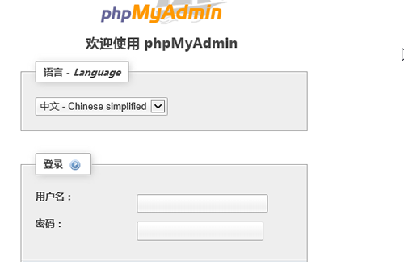

## 1.1  今日目标

1. 掌握数据库的作用；
2. 能够通俗的解释什么是关系型数据库；
3. 能够至少说出三种关系型数据库；
4. 掌握MySQL客户端登录和登出MySQL服务器；
5. 理解数据库具体数据的存储逻辑；
6. 掌握创建、查看和删除数据库；
7. 了解MySQL数据库创建与删除指令对应的文件效果
8. 掌握数据表的增删改查操作；
9. 掌握数据的增删改查操作；


## 1.2  数据库介绍

#### 1.2.1  作用

 


数据库是用来存放数据的仓库

  

数据库中存放的是表，表中存放的是数据。


#### 1.2.2  数据库的发展史

萌芽阶段：文件系统

最初始的数据库是用磁盘来存储数据的。文件就是最早的数据库。

第一代数据库：层次模型

 

优点：这是导航结构

优点：结构清晰，分类查询方便

缺点：有可能造成数据无效


 第一代数据库：网状模型

 


网状模型解决了层次模型的数据不一致的问题，但没有解决导航问题。导航结构在查询中有时候效率低下，比如查询整个公司的四月的营业额。


 第二阶段：关系模型

 

特点：

1、每个表都是独立的

2、通过关系字段将两个表连接起来

3、关系：两个表的公共字段

4、关系型数据库中多表联合查询效率低下。


多学一招：为了解决关系型数据库多表查询效率的问题，项目中使用了NoSQL(非关系型数据库，Redis、mongodb等等)，在数据库中按照键值对来存储，它是关系型数据库的补充。


#### 1.2.3  SQL

Structured Query Language（结构化查询语言），是用来操作关系型数据库的一门语言。这是一个关系型数据库的通用操作语言，也成为标准SQL，也叫SQL-92。

脚下留心：数据库的生产厂商为了占有市场份额，都会在标准SQL的基础上扩展一些自己的东西以吸引用户。


#### 1.2.4  常用的关系型数据库

| 关系型数据库 | 开发公司         | 使用语言 |
| ------------ | ---------------- | -------- |
| access       | 微软公司         | SQL      |
| SQL Server   | 微软公司         | T-SQL    |
| Oracle       | 甲骨文公司       | PL/SQL   |
| MySQL        | 被甲骨文公司收购 | MySQL    |

思考：已知标准SQL可以在所有的关系型数据库上运行，在Oracle上编写的PL/SQL能否在MySQL上运行？

答：不可以，只能运行标准SQL


## 1.3  连接服务器

数据库是CS模式的软件，所以要连接数据库必须要有客户端软件。

MySQL数据库默认端口号是3306

#### 1.3.1  window界面连接服务器

1、Navicat

2、MySQL-Front


#### 1.3.2  通过web窗体连接

 

主要有浏览器就可以访问数据库


#### 1.3.3  命令行连接

```
host		-h	主机
port		-P	端口号   （大写）
user		-u	用户名
password	-p	密码     （小写）
```

例题

```mysql
-- 连接数据库
F:\wamp\PHPTutorial\MySQL\bin>mysql -h127.0.0.1 -P3306 -uroot -proot  -- 明文

-- 如果连接本地数据库 -h可以省略 如果服务器端口是3306，-P端口号也可以省略
F:\wamp\PHPTutorial\MySQL\bin>mysql -uroot -proot	-- 明文

-- 密文
F:\wamp\PHPTutorial\MySQL\bin>mysql -uroot -p  
Enter password: ****
```

 

#### 1.3.4  退出登录

```mysql
mysql> exit		-- 方法一
mysql> quit		-- 方法二
mysql> \q		-- 方法三
```


## 1.4  数据库基本概念

#### 1.4.1  数据库、表相关

1. 数据库：数据库中存放的是表，一个数据库中可以存放多个表

2. 表：表是用来存放数据的。

3. 关系：两个表的公共字段
4.  行：也称记录，也称实体

5. 列：也称字段，也称属性


脚下留心：就表结构而言，表分为行和列；就表数据而言，表分为记录和字段；就面向对象而言，一个记录就是一个实体，一个字段就是一个属性。

#### 1.4.2  数据相关

1、数据冗余：相同的数据存储在不同的地方

```
冗余只能减少，不能杜绝。
减少冗余的方法是分表
```

  


 2、数据完整性：正确性+准确性=数据完整性

 

```
正确性：数据类型正确
准确性：数据范围要准确
```

思考：学生的年龄是整型，输入1000岁，正确性和准确性如何？

答：正确的，但不准确。失去了数据完整性。


#### 1.4.3  数据库执行过程

 


## 1.5  数据库的操作

#### 1.5.1  创建数据库

语法：

```
create database [if not exists] 数据名 [选项]
```

例题

```mysql
-- 创建数据库
mysql> create database stu;
Query OK, 1 row affected (0.06 sec)

-- 创建数据库时，如果数据库已经存在就要报错
mysql> create database stu;
# ERROR 1007 (HY000): Can't create database 'stu'; database exists

-- 在创建数据库时候，判断数据库是否存在，不存在就创建
mysql> create database if not exists stu;
Query OK, 1 row affected, 1 warning (0.00 sec)

-- 特殊字符、关键字做数据库名，使用反引号将数据库名括起来
mysql> create database `create`;
Query OK, 1 row affected (0.04 sec)

mysql> create database `%$`;
Query OK, 1 row affected (0.05 sec)

-- 创建数据库时指定存储的字符编码
mysql> create database emp charset=gbk;
Query OK, 1 row affected (0.00 sec)
# 如果不指定编码，数据库默认使用安装数据库时指定的编码
```


MySQL数据库的目录

```
数据库保存的路径在安装MySQL的时候就配置好。
也可以在my.ini配置文件中更改数据库的保存地址。(datadir="F:/wamp/PHPTutorial/MySQL/data/")
一个数据库就对应一个文件夹，在文件夹中有一个db.opt文件。在此文件中设置数据库的字符集和校对集
```

 ****

小结：

1、如果创建的数据库已存在，就会报错。

```
解决方法：创建数据库的时候判断一下数据库是否存在，如果不存在再创建
```

2、如果数据库名是关键字和特殊字符要报错。

```
解决：在特殊字符、关键字行加上反引号
```

3、创建数据库的时候可以指定字符编码

```
脚下留心：创建数据库如果不指定字符编码，默认和MySQL服务器的字符编码是一致的。
```


#### 1.5.2  显示所有数据库

语法：

```
show databases
```

例题

```mysql
mysql> show databases;
+--------------------+
| Database           |
+--------------------+
| information_schema |
| mysql              |
| performance_schema |
| test               |
+--------------------+
4 rows in set (0.00 sec)
```

注意：数据库安装后，只带上面四个数据库


#### 1.5.3   删除数据库

语法：

```
drop database [if exists] 数据库名
```

例题

```mysql
mysql> drop database `create`;
Query OK, 0 rows affected (0.00 sec)

mysql> drop database `%$`;
Query OK, 0 rows affected (0.00 sec)
-- 判断数据库是否存在，如果存在就删除
mysql> drop database if exists stu;
Query OK, 0 rows affected (0.00 sec)
```

小结：
1、如果删除的数据库不存在，会报错

```
解决：删除之前判断一下，如果存在就删除
```


#### 1.5.4 显示创建数据库的语句

语法：

```
show create database 数据库名
```

例题：

```mysql
mysql> show create database emp;
+----------+-------------------------------------------------------------+
| Database | Create Database                                             |
+----------+-------------------------------------------------------------+
| emp      | CREATE DATABASE `emp` /*!40100 DEFAULT CHARACTER SET gbk */ |
+----------+-------------------------------------------------------------+
1 row in set (0.00 sec)
```


#### 1.5.5  修改数据库

只能修改数据库选项，数据库的选项只有字符编码

语法：

```
alter database 数据库名 charset=字符编码
```

例题：

```mysql
mysql> alter database emp charset=utf8;
Query OK, 1 row affected (0.00 sec)
```

小结：

1、修改数据库只能修改数据库的字符编码

2、在MySQL中utf字符编码之间没有横杆    utf8


#### 1.5.6  选择数据库

语法：

```
use 数据库名
```

例题

```mysql
mysql> use emp;
Database changed
```


## 1.6  表的操作

```mysql
mysql> create database data;
Query OK, 1 row affected (0.00 sec)

mysql> use data;
Database changed
```


#### 1.6.1  创建表

语法：

```
create table [if not exists] `表名`(
    `字段名` 数据类型 [null|not null] [default] [auto_increment] [primary key] [comment],
    `字段名 数据类型 …
)[engine=存储引擎] [charset=字符编码]

null|not null     是否为空
default:          默认值
auto_increment    自动增长,默认从1开始，每次递增1
primary key       主键，主键的值不能重复，不能为空,每个表必须只能有一个主键
comment:          备注
engine            引擎决定了数据的存储和查找   myisam、innodb

脚下留心：表名和字段名如果用了关键字，要用反引号引起来。
```

例题：

```mysql
 -- 设置客户端和服务器通讯的编码
mysql> set names gbk;  
Query OK, 0 rows affected (0.00 sec)

-- 创建简单的表
mysql> create table stu1(
    -> id int auto_increment primary key,
    -> name varchar(20) not null
    -> )engine=innodb charset=gbk;
Query OK, 0 rows affected (0.11 sec)

-- 创建复杂的表
mysql> create table stu2(
    -> id int auto_increment primary key comment '主键',
    -> name varchar(20) not null comment '姓名',
    -> `add` varchar(50) not null default '地址不详' comment '地址',
    -> score int comment '成绩,可以为空'
    -> )engine=myisam;
Query OK, 0 rows affected (0.06 sec)
```

小结：

1、如果不指定引擎，默认是innodb

2、如果不指定字符编码，默认和数据库编码一致

3、varchar(20) 表示长度是20个字符


数据表的文件

```
一个数据库对应一个文件夹
一个表对应一个或多个文件
引擎是myisam，一个表对应三个文件
	.frm	：存储的是表结构
	.myd	:存储的是表数据
	.myi	:存储的表数据的索引
引擎是innodb,一个表对应一个表结构文件，innodb的都有表的数据都保存在ibdata1文件中，如果数据量很大，会自动的创建ibdata2，ibdata3...
```

innodb和myisam的区别

| 引擎   |                                                              |
| ------ | ------------------------------------------------------------ |
| myisam | 1、查询速度快<br />2、容易产生碎片<br />3、不能约束数据      |
| innodb | 1、以前没有myisam查询速度快，现在已经提速了<br />2、不产生碎片<br />3、可以约束数据 |

脚下留心：推荐使用innodb。


#### 1.6.2  显示所有表

语法

```
show tables;
```

例题：

```mysql
mysql> show tables;
Empty set (0.00 sec)
```


#### 1.6.3   显示创建表的语句

语法

```
show create table;	 -- 结果横着排列
show create table \G  -- 将结果竖着排列
```

例题

 


#### 1.6.4  查看表结构

语法

```
desc[ribe] 表名
```

例题

```mysql
-- 方法一
mysql> describe stu2;
+-------+-------------+------+-----+----------+----------------+
| Field | Type        | Null | Key | Default  | Extra          |
+-------+-------------+------+-----+----------+----------------+
| id    | int(11)     | NO   | PRI | NULL     | auto_increment |
| name  | varchar(20) | NO   |     | NULL     |                |
| add   | varchar(50) | NO   |     | 地址不详        |                |
| score | int(11)     | YES  |     | NULL     |                |
+-------+-------------+------+-----+----------+----------------+
4 rows in set (0.05 sec)

-- 方法二
mysql> desc stu2;
+-------+-------------+------+-----+----------+----------------+
| Field | Type        | Null | Key | Default  | Extra          |
+-------+-------------+------+-----+----------+----------------+
| id    | int(11)     | NO   | PRI | NULL     | auto_increment |
| name  | varchar(20) | NO   |     | NULL     |                |
| add   | varchar(50) | NO   |     | 地址不详        |                |
| score | int(11)     | YES  |     | NULL     |                |
+-------+-------------+------+-----+----------+----------------+
4 rows in set (0.00 sec)
```


#### 1.6.5  复制表

**语法一：**create table 新表 select 字段 from 旧表

特点：不能复制父表的键，能够复制父表的数据

 


**语法二：**create table 新表 like 旧表

特点：只能复制表结构，不能复制表数据

 

小结：

*表示所有字段


#### 1.6.6  删除表

语法：

```
drop table [if exists] 表1，表2,… 
```

例题：

```mysql
-- 删除表
mysql> drop table stu4;
Query OK, 0 rows affected (0.06 sec)

-- 如果表存在就删除
mysql> drop table if exists stu4;
Query OK, 0 rows affected, 1 warning (0.00 sec)

-- 一次删除多个表
mysql> drop table stu2,stu3;
Query OK, 0 rows affected (0.03 sec)
```


#### 1.6.7  修改表

```
语法：alter table 表名 
```

创建初始表

```mysql
mysql> create table stu(
    -> id int,
    -> name varchar(20)
    -> );
Query OK, 0 rows affected (0.00 sec)
```


1、添加字段：alter table 表名add [column] 字段名 数据类型 [位置] 

```mysql
mysql> alter table stu add `add` varchar(20);	-- 默认添加字段放在最后
Query OK, 0 rows affected (0.05 sec)

mysql> alter table stu add sex char(1) after name;  -- 在name之后添加sex字段
Query OK, 0 rows affected (0.00 sec)
Records: 0  Duplicates: 0  Warnings: 0

mysql> alter table stu add age int first;  -- age放在最前面
Query OK, 0 rows affected (0.00 sec)
Records: 0  Duplicates: 0  Warnings: 0

mysql> desc stu;
+-------+-------------+------+-----+---------+-------+
| Field | Type        | Null | Key | Default | Extra |
+-------+-------------+------+-----+---------+-------+
| age   | int(11)     | YES  |     | NULL    |       |
| id    | int(11)     | YES  |     | NULL    |       |
| name  | varchar(20) | YES  |     | NULL    |       |
| sex   | char(1)     | YES  |     | NULL    |       |
| add   | varchar(20) | YES  |     | NULL    |       |
+-------+-------------+------+-----+---------+-------+
5 rows in set (0.00 sec)
```


2、删除字段：alter table 表 drop [column] 字段名   

```mysql
mysql> alter table stu drop age;   -- 删除age字段
Query OK, 0 rows affected (0.00 sec)
Records: 0  Duplicates: 0  Warnings: 0
```


3、修改字段(改名)：alter table 表 change [column] 原字段名 新字段名 数据类型 …    

```mysql
-- 将name字段更改为stuname varchar(10)
mysql> alter table stu change name stuname varchar(10);
Query OK, 0 rows affected (0.02 sec)
Records: 0  Duplicates: 0  Warnings: 0

mysql> desc stu;
+---------+-------------+------+-----+---------+-------+
| Field   | Type        | Null | Key | Default | Extra |
+---------+-------------+------+-----+---------+-------+
| id      | int(11)     | YES  |     | NULL    |       |
| stuname | varchar(10) | YES  |     | NULL    |       |
| sex     | char(1)     | YES  |     | NULL    |       |
| add     | varchar(20) | YES  |     | NULL    |       |
+---------+-------------+------+-----+---------+-------+
4 rows in set (0.00 sec)
```


4、修改字段（不改名）:alter table 表 modify 字段名 字段属性…   

```mysql
-- 将sex数据类型更改为varchar(20)
mysql> alter table stu  modify sex varchar(20);
Query OK, 0 rows affected (0.00 sec)
Records: 0  Duplicates: 0  Warnings: 0

-- 将add字段更改为varchar(20) 默认值是‘地址不详’
mysql> alter table stu modify `add` varchar(20) default '地址不详';
Query OK, 0 rows affected (0.00 sec)
Records: 0  Duplicates: 0  Warnings: 0
```


5、修改引擎：alter table 表名 engine=引擎名   

```mysql
mysql> alter table stu engine=myisam;
Query OK, 0 rows affected (0.01 sec)
Records: 0  Duplicates: 0  Warnings: 0
```


6、修改表名:alter table 表名 rename to 新表名    

```mysql
-- 将stu表名改成student
mysql> alter table stu rename to student;
Query OK, 0 rows affected (0.00 sec)
```


7、将表移动到其他数据库

```mysql
-- 将当前数据库中的student表移动到php74数据库中改名为stu
mysql> alter table student rename to php74.stu;
Query OK, 0 rows affected (0.00 sec)
```


## 1.7  数据操作

#### 1.7.1  插入数据

语法：insert into 表名 (字段名, 字段名,…) values (值1, 值1,…)

1、插入所有字段

```mysql
-- 插入所有字段
mysql> insert into stu (id,stuname,sex,`add`) values (1,'tom','男','北京');
Query OK, 1 row affected (0.00 sec)

-- 插入部分字段
mysql> insert into stu(id,stuname) values (2,'berry');

-- 插入的字段和表的字段可以顺序不一致。但是插入字段名和插入的值一定要一一对应
mysql> insert into stu(sex,`add`,id,stuname) values ('女','上海',3,'ketty');
Query OK, 1 row affected (0.00 sec)

-- 插入字段名可以省略
mysql> insert into stu values(4,'rose','女','重庆');
Query OK, 1 row affected (0.00 sec)
```

小结：

```
1、插入字段名的顺序和数据表中字段名的顺序可以不一致
2、插入值的个数、顺序必须和插入字段名的个数、顺序要一致。
3、如果插入的值的顺序和个数与表字段的顺序个数一致，插入字段可以省略。
```


2、插入默认值和空值

```mysql
mysql> insert into stu values (5,'jake',null,default);
Query OK, 1 row affected (0.05 sec)
```

小结：

```
default关键字用来插入默认值，null用来插入空值.
```


3、插入多条数据

```mysql
mysql> insert into stu values (6,'李白','男','四川'),(7,'杜甫','男','湖北');
Query OK, 2 rows affected (0.00 sec)
Records: 2  Duplicates: 0  Warnings: 0
```


#### 1.7.2  更新数据

语法：update 表名 set 字段=值 [where 条件] 

```mysql
-- 将berry性别改为女
mysql> update stu set sex='女' where stuname='berry';
Query OK, 1 row affected (0.06 sec)

-- 将编号是1号的学生性别改成女，地址改为上海。
mysql> update stu set sex='女',`add`='上海' where id=1;
Query OK, 1 row affected (0.00 sec)
```


#### 1.7.3  删除数据

语法：delete from 表名 [where 条件] 

```mysql
-- 删除1号学生
mysql> delete from stu where id=1;

-- 删除名字是berry的学生
mysql> delete from stu where stuname='berry';
Query OK, 1 row affected (0.00 sec)

-- 删除所有数据
mysql> delete from stu;
Query OK, 5 rows affected (0.00 sec)
```


多学一招：delete from 表和truncate table 表区别？

```
1、delete from 表：遍历表记录，一条一条的删除
2、truncate table：将原表销毁，再创建一个同结构的新表。就清空表而言，这种方法效率高。
```


#### 1.7.4  查询数据

语法：

```
select 列名 from 表名
```

例题

```mysql
-- 查询id字段的值
mysql> select id from stu;

-- 查询id,stuname字段的值
mysql> select id,stuname from stu;、

-- 查询所有字段的值
mysql> select * from stu;
```


#### 1.7.5  数据传输时使用字符集

发现：在插入数据的时候，如果有中文会报错（或者中文无法插入）

 

分析：

1、查看客户端发送的编码

 


2、查看服务器接受，返回的编码

 


更改接受客户端指令的编码

```mysql
mysql> set character_set_client=gbk;
Query OK, 0 rows affected (0.05 sec)
```

 

原因：返回编码是utf8，客户端是gbk;

测试：成功

 


可以通过set names一次性设置

 


小结：

1、设置什么编码取决于客户端的编码

2、通过set names 设置编码


## 1.8  补充知识

每次执行指令要进入相应的目录中，麻烦，可以通过环境变量简化操作。

#### 1.8.1  环境变量配置

我的电脑右键——属性——高级

 

将mysql指令目录地址添加到环境变量的Path值中

 


这时候就可以在任意目录下使用mysql指令

 


原理：

1、输入指令后，首先在当前目录下查找，如果当前目录下找不到，就到环境变量的Path中查找

2、Path中有很多目录，从前往后查找


#### 1.8.2  校对集

1、概念：在某种字符集下，字符之间的比较关系，比如a和B的大小关系，如果区分大小写a>B，如果不区分大小写则a<B。比如赵钱孙李大小关系，不同的标准关系不一样

2、校对集依赖与字符集，不同的字符集的的比较规则不一样，如果字符集更改，校对集也重新定义。

3、不同的校对集对同一字符序列比较的结果是不一致的。

4、 可以在定义字符集的同时定义校对集、 语法：

```
 collate = 校对集
```

例题：

定义两个表，相同字符集不同校对集

```mysql
mysql> create table stu1(
    -> name char(1)
    -> )charset=utf8 collate=utf8_general_ci;
Query OK, 0 rows affected (0.05 sec)

mysql> create table stu2(
    -> name char(1)
    -> )charset=utf8 collate=utf8_bin;
Query OK, 0 rows affected (0.05 sec)

mysql> insert into stu1 values ('a'),('B');
Query OK, 2 rows affected (0.00 sec)
Records: 2  Duplicates: 0  Warnings: 0

mysql> insert into stu2 values ('a'),('B');
Query OK, 2 rows affected (0.00 sec)
Records: 2  Duplicates: 0  Warnings: 0
```

测试：两个表的数据都是有小到大排序

```mysql
mysql> select * from stu1 order by name;   -- 不区分大小写
+------+
| name |
+------+
| a    |
| B    |
+------+
2 rows in set (0.08 sec)

mysql> select * from stu2 order by name;   -- 区分大小写
+------+
| name |
+------+
| B    |
| a    |
+------+
2 rows in set (0.00 sec)

```


小结校对集规则：

_bin：按二进制编码比较，区别大小写

_ci：不区分大小写