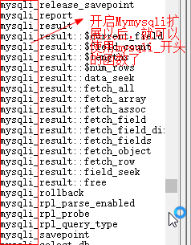
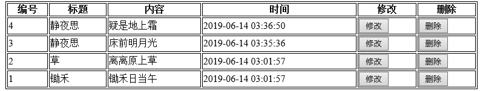
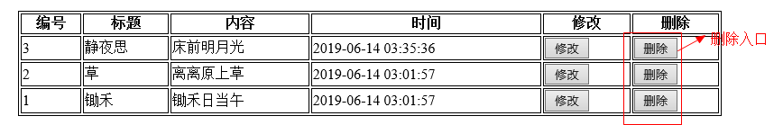
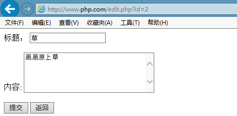

## 1.1  今日目标

1. 理解数据备份与还原的重要性；
2. 掌握mysqldump.exe备份方式；
3. 掌握SQL备份后的还原方式；
4. 掌握Mysqli操作MySQL服务器的过程；
5. 掌握PHP利用Mysqli实现数据表的增删改查操作
6. 掌握PHP操作数据库的封装含义及意义
7. 能够实现新增新闻入库；
8. 能够实现更新新闻信息
9. 能够实现删除新闻信息
10. 能够实现显示新闻列表


## 1.2   连接数据库

 


通过PHP做MySQL的客户端


#### 1.2.1  开启mysqli扩展

在php.ini中开启mysqli扩展

```
extension=php_mysqli.dll
```

开启扩展后重启服务器，就可以使用mysqli_函数了，

 


#### 1.2.2  连接数据库

**创建news数据库**

```mysql
-- 创建表
drop table if exists news;
create table news(
       id int unsigned auto_increment primary key comment '主键',
       title varchar(20) not null comment '标题',
       content text not null comment '内容',
       createtime int not null comment '添加时间'
)engine=innodb charset=utf8 comment '新闻表';

-- 插入测试数据
insert into news values (null,'锄禾','锄禾日当午',unix_timestamp());
insert into news values (null,'草','离离原上草',unix_timestamp());
```

思考：时间字段可以用datetime类型，也可以使用int类型。一般用int，因为datetime占用8个字节，int占用4个字节。


**连接数据库**

```php
mysqli_connect(主机IP，用户名，密码，数据库名，端口号) //如果端口号是3306可以省略
mysqli_connect_error()：获取连接数据库的错误信息
mysqli_connect_errno()：获取连接数据库的错误编码
mysqli_set_charset(连接对象,字符编码)    
```

代码如下：

```php
<?php
//连接数据库，连接成功返回连接对象
$link=@mysqli_connect('localhost','root','root','data','3306');
//var_dump($link);			//object(mysqli)
if(mysqli_connect_error()){
	echo '错误号：'.mysqli_connect_errno(),'<br>';	//显示错误编码
	echo '错误信息：'.mysqli_connect_error();		//显示错误信息
	exit;
}
//设置字符编码
mysqli_set_charset($link,'utf8');	
```

脚下留心：与数据库相关用utf8，与页面显示相关用utf-8


## 1.3  操作数据

#### 1.3.1  数据操作语句

通过mysqli_query()执行SQL语句

增、删、改语句执行成功返回true，失败返回false

```php
<?php
//1、连接数据库
$link=mysqli_connect('localhost','root','root','data');
//2、设置支付编码
mysqli_set_charset($link,'utf8');
//3、执行SQL语句

//3.1  执行insert语句
/*
$rs=mysqli_query($link,"insert into news values (null,'静夜思','床前明月光',unix_timestamp())");
if($rs)
	echo '自动增长的编号是：'.mysqli_insert_id($link);
*/

//3.2  执行update语句
/*
$rs=mysqli_query($link,"update news set content='疑是地上霜' where id=4");
if($rs)
	echo '受影响的记录数是：'.mysqli_affected_rows($link);
else{
	echo '错误码：'.mysqli_errno($link),'<br>';
	echo '错误信息：'.mysqli_error($link);	
}
*/

//3.3  执行delete语句
mysqli_query($link,"delete from news where id=5");

```

用到的函数

```php
mysqli_query()：执行SQL语句
mysqli_insert_id()：获取插入记录自动增长的ID
mysqli_affected_rows()：获取受影响的记录数
mysqli_error()：获取执行SQL语句的错误信息
mysqli_errno()：获取执行SQL语句的错误码
```


#### 1.3.2  数据查询语句

数据查询用select、desc、show，成功会返回结果集，失败返回false

```php
<?php
//1、连接数据库
$link=@mysqli_connect('localhost','root','root','data') or die('错误信息：'.mysqli_connect_error());
//2、设置字符编码
mysqli_query($link,'set names utf8');
//3、执行查询语句
$rs=mysqli_query($link,'select * from news');
//var_dump($rs);	//object(mysqli_result)
//4、获取对象中的数据
//4.1  将对象中的一条数据匹配成索引数组,指针下移一条
//$rows=mysqli_fetch_row($rs);

//4.2  将对象中的一条数据匹配成关联数组,指针下移一条
//$rows=mysqli_fetch_assoc($rs);

//4.3  将对象中的一条数据匹配成索引，关联数组,指针下移一条
//$rows=mysqli_fetch_array($rs);

//4.4  总列数、总行数
//echo '总行数'.mysqli_num_rows($rs),'<br>';
//echo '总列数'.mysqli_num_fields($rs),'<br>';

//4.5  获取所有数据
//$list=mysqli_fetch_all($rs);		//默认是索引数组
//$list=mysqli_fetch_all($rs,MYSQLI_NUM);		//匹配成索引数组
//$list=mysqli_fetch_all($rs,MYSQLI_ASSOC);		//匹配成关联数组
$list=mysqli_fetch_all($rs,MYSQLI_BOTH);		//匹配成关联、索引数组

echo '<pre>';
print_r($list);

//5、销毁结果集
mysqli_free_result($rs);

//6、关闭连接
mysqli_close($link);

```

使用的函数

```php
mysqli_fetch_assoc()：将一条数组匹配关联数组
mysqli_fetch_row()：将一条记录匹配成索引数组
mysqli_fetch_array()：将一条记录匹配成既有关联数组又有索引数组
mysqli_fetch_all()：匹配所有记录
mysqli_num_rows()：总行数
mysqli_num_fields()：总记录数
mysqli_free_result()：销毁结果集
mysqli_close()：关闭连接
```


## 1.4  新闻模块

#### 1.4.1  包含文件

由于所有的操作都要连接数据库，将连接数据库的代码存放到包含文件中

步骤

1、在站点下创建inc文件夹

2、在inc下创建conn.php文件，用来连接数据库，代码就是上面连接数据库的代码

代码实现

```mysql
<?php
//连接数据库
$link=@mysqli_connect('localhost','root','root','data') or die('错误：'.mysqli_connect_error());
mysqli_set_charset($link,'utf8');
```


#### 1.4.2  显示新闻

步骤：

1、连接数据库

2、获取数据

3、遍历循环数据

代码

```php+HTML
<style type="text/css">
	table{
		width:780px;
		border:solid 1px #000;
		margin:auto;
	}
	th,td{
		border:solid 1px #000;
	}
</style>
<body>
<?php
//1、连接数据库
require './inc/conn.php';
//2、获取数据
$rs=mysqli_query($link,'select * from news order by id desc');	//返回结果集对象
$list=mysqli_fetch_all($rs,MYSQLI_ASSOC);		//将结果匹配成关联数组
?>
<table>
	<tr>
		<th>编号</th> <th>标题</th> <th>内容</th> <th>时间</th> <th>修改</th> <th>删除</th>
        <!--3、循环显示数据-->
		<?php foreach($list as $rows):?>
		<tr>
			<td><?php echo $rows['id']?></td>
			<td><?php echo $rows['title']?></td>
			<td><?php echo $rows['content']?></td>
			<td><?php echo date('Y-m-d H:i:s',$rows['createtime'])?></td>
			<td><input type="button" value="修改" onclick=""></td>
			<td><input type="button" value="删除" onclick=""></td>
		</tr>
		<?php endforeach;?>
	</tr>
</table>
</body>
```

运行结果 

  


#### 1.4.3  添加新闻

步骤：

1、创建表单

2、连接数据库

3、将新闻数据写入到数据库中

入口(list.php）

```html
<a href="./add.php">添加新闻</a>
```

代码实现

```php+HTML
<body>
<?php
if(!empty($_POST)) {
	//2、连接数据库
	require './inc/conn.php';
    //3、插入数据
	$time=time();	//获取时间戳
	$sql="insert into news values (null,'{$_POST['title']}','{$_POST['content']}',$time)";  //拼接SQL语句
	
	if(mysqli_query($link,$sql))	//执行SQL语句
		header('location:./list.php');	//插入成功就跳转到list.php页面
	else{
		echo 'SQL语句插入失败<br>';
		echo '错误码：'.mysqli_errno($link),'<br>';
		echo '错误信息：'.mysqli_error($link);
	}
}
?>
<!--1、创建表单-->
<form method="post" action="">
	标题： <input type="text" name="title"> <br /> <br />
	内容:  <textarea name="content" rows="5" cols="30"></textarea> <br /> <br />
	<input type="submit" name="button" value="提交">
</form>
</body>
```

运行结果

  


#### 1.4.4  删除新闻

步骤：

1、在list.php页面点击删除按钮，跳转到del.php页面，传递删除的id

2、在del.php页面连接数据库

3、通过id删除数据

4、删除成功后，跳转到list.php


入口（list.php）

```php+HTML
<input type="button" value="删除" onclick="if(confirm('确定要删除吗'))location.href='./del.php?id=<?php echo $rows['id']?>'">
```

del.php

```php
<?php
//1、连接数据库
require './inc/conn.php';
//2、拼接SQL语句
$sql="delete from news where id={$_GET['id']}";
//3、执行SQL语句
if(mysqli_query($link,$sql))
	header('location:./list.php');
else{
	echo '删除失败';
}
```

小结：

1、一个页面是否写HTML架构，取决于是否有显示功能。

2、如果一个页面只是做业务逻辑，没有显示功能，就不需要写HTML架构，比如del.php页面

 


#### 1.4.5  修改新闻

入口（list.php）

```php+HTML
<input type="button" value="修改" onclick="location.href='edit.php?id=<?php echo $rows['id']?>'">
```


edit.php页面

步骤

第一步：显示修改界面

​	1、连接数据库

​	2、获取修改的数据

​	3、将数据显示到表单中

第二步：执行修改逻辑

​	1、获取新数据

​	2、拼接修改的SQL语句，执行修改逻辑

代码如下

```php+HTML
<?php
//连接数据库
require './inc/conn.php';
//1、获取修改的数据库
$sql="select * from news where id={$_GET['id']}";	//拼接SQL语句
$rs=mysqli_query($link,$sql);	//获取修改的数据
$rows=mysqli_fetch_assoc($rs);	//将修改的数据匹配成一维关联数组
//2、执行修改的逻辑
if(!empty($_POST)) {
	$id=$_GET['id'];		//获取修改的id
	$title=$_POST['title'];	//修改的标题
	$content=$_POST['content'];	//修改的内容
	$sql="update news set title='$title',content='$content' where id=$id"; //拼接SQL语句
	if(mysqli_query($link,$sql))
		header('location:list.php');   //修改成功跳转到list.php页面
	else
		echo '错误：'.mysqli_error($link);
	exit;
}
?>
<!doctype html>
<html>
<head>
<meta charset="utf-8">
<title>无标题文档</title>
</head>

<body>
<form method="post" action="">
	标题： <input type="text" name="title" value='<?php echo $rows['title']?>'> <br /> <br />
	内容:  <textarea name="content" rows="5" cols="30"><?php echo $rows['content']?></textarea> <br /> <br />
	<input type="submit" name="button" value="提交">
	<input type="button" value="返回" onclick="location.href='list.php'">
</form>
</body>
</html>
```

运行结果

 


## 1.5  数据备份与还原

数据库中的数据需要定期备份，数据量小的可以一周备份一次，数据量的可以一天备份一次。

#### 1.5.1  数据备份

利用mysqldump工具，语法：

```
mysqldump 数据库连接 数据库 > SQL文件备份地址
```

例题：

```mysql
-- 将data数据库中所有的表导出到data.sql中
F:\wamp\PHPTutorial\MySQL\bin>mysqldump -uroot -proot data>c:\data.sql

-- 将data数据库中的stuinfo、stumarks表
F:\wamp\PHPTutorial\MySQL\bin>mysqldump -uroot -proot data stuinfo stumarks>c:\data.sql

-- 导出data数据库，导出的语句中带有创建数据库的语法
F:\wamp\PHPTutorial\MySQL\bin>mysqldump -uroot -proot -B data>c:\data1.sql
```

#### 1.5.2  数据还原

方法一：MySQL的source指令（需要登录MySQL才能使用）

```mysql
mysql> source c:/data.sql;
注意：地址分隔符用斜线，不能用反斜线
```

方法二：通过mysql指令数据还原（不需要登录MySQL）

语法：

```
mysql 连接数据库 导入的数据库名 < 导入的SQL文件
```

例题：

```mysql
F:\wamp\PHPTutorial\MySQL\bin>mysql -uroot -proot data1 < c:\data.sql
```


## 1.6  作业：

1、通过循环的方式获取表中的所有记录

2、通过异步实现增、删、改

**异步添加**

add.html

```php+HTML
<body>
<script src='./js/jquery-3.3.1.min.js'></script>
<script>
$(document).ready(function() {
	$(':button:first').click(function(){
		var title=$('#title').val();
		var content=$('#content').val();
		$.post('./add.php',{'title':title,'content':content},function(data){
			if(data){
				alert('添加成功');
				location.href='list.php';
			}else{
				alert('添加失败');
			}
		})
	})
});
</script>
<!--1、创建表单-->
<form method="post" action="">
	标题： <input type="text" id="title"> <br /> <br />
	内容:  <textarea id="content" rows="5" cols="30"></textarea> <br /> <br />
	<input type="button" name="button" value="提交">
</form>
</body>
```

add.php

```php
<?php
require './inc/conn.php';
$title=$_POST['title'];
$content=$_POST['content'];
$time=time();
$sql="insert into news values (null,'$title','$content',$time)";
echo mysqli_query($link,$sql)?1:0;
```


**异步删除**

list.php

```html
-- button按钮
<td><input type="button" value="删除" op='del' newsid=<?php echo $rows['id']?>></td>

<script src='./js/jquery-3.3.1.min.js'></script>
<script>
$(document).ready(function() {
	$(':button').click(function(){
		var tr=$(this).parents('tr');	//按钮所在的行

		if($(this).attr('op')=='del'){
			var id=$(this).attr('newsid');	//获取新闻的id
			$.post('./del.php',{'id':id},function(data){
				
				if(data==1)
					tr.remove();
				else
					alert('删除失败');
			})
		}
	})
});
</script>
```

del.php

```php
<?php
//1、连接数据库
require './inc/conn.php';
//2、拼接SQL语句
$sql="delete from news where id={$_POST['id']}";
//3、执行SQL语句
echo mysqli_query($link,$sql)?1:0;
```


