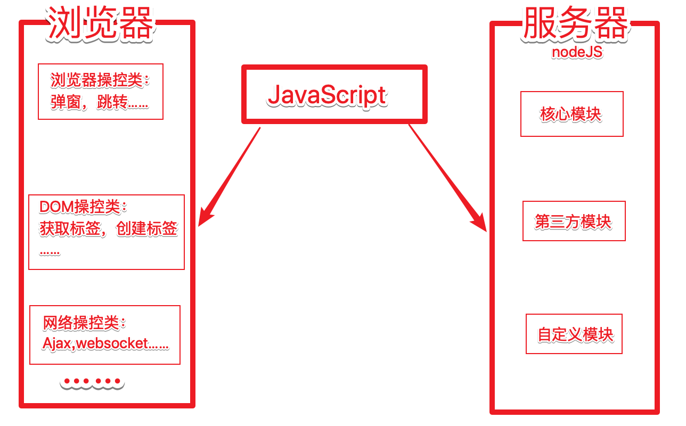
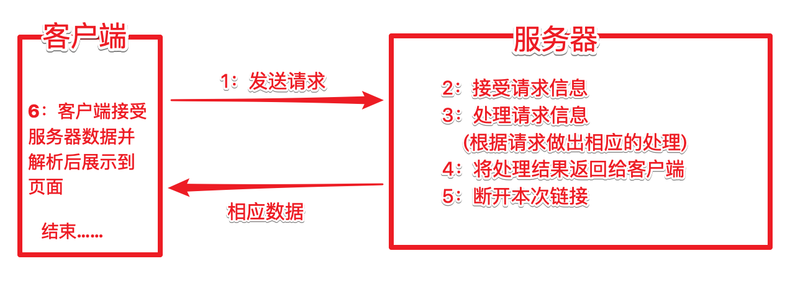
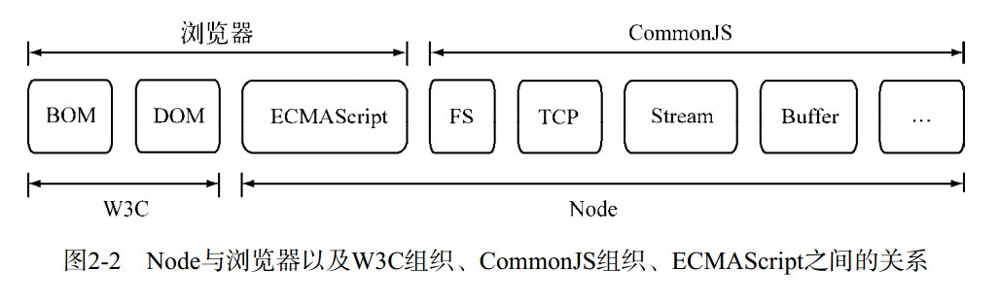

---

## 第0章 Node介绍

### 0.0 回顾 JavaScript 

+ **历史及发展 **

  1995年 网景公司的布兰登开发；

  1997年7月，ECMA组织发布ECMAScript 1.0版;

  2007年10月发布3.1版本后不久，ECMAScript 3.1改名为 ECMAScript 5。

  2008年，为Chrome浏览器而开发的V8编译器诞生

  2011年6月，ECMAscript 5.1版发布，现在使用最为广泛的版本;

  2015年6月，ECMAScript 6正式发布，并且更名为“ECMAScript 2015”;

+ **如何学习JavaScript**

  JavaScript 的核心语法部分相当精简，也就是语言本身，只包括两个部分:

  + 基本的语法构造(比如操作符、控制结构、语句)

  + 标准库(就是一系列具有各种功能的对象比如Array、Date、Math等)。


  想要实现其他复杂的操作和效果，都要依靠 **宿主环境** 提供API，目前，已经嵌入 JavaScript 的宿主环境有多种，最常见的环境就是 **浏览器** 和 **操作系统** ;

* **回顾 JavaScript 语法特性**
  * 变量、数据类型、流程控制
  * 函数(基本声明参数，作用域，回调函数)、面向对象(原型，构造函数，this的指向，new的过程)


### 0.1 Node是什么

`Node`  是一个基于` Chrome V8` 引擎的` JavaScript ` 运行环境。  

`Node`  不是一种独立的语言、`Node`不是 `JavaScript ` 框架，

`Node`是一个**除了浏览器之外的、可以让` JavaScript ` 运行的环境**

Node.js 是一个让 JavaScript 运行在服务端的开发平台，是使用 事件驱动， 异步非阻塞I/O，单线程，跨平台的 JS 运行环境；

### 0.2. 为什么要学习 Node

- 打开服务器的黑盒子
- 企业需求
- 大前端必备技能
- 为了更好的学习前端框架

### 0.3. Node 能做什么

[知乎 - Node.js能做什么，该做什么？](https://www.zhihu.com/question/20796866)

- Web 服务器(重点)
- 命令行工具
- 网络爬虫:是一种按照一定的规则，自动地抓取网站信息的程序
- 桌面应用程序开发

### 0.4. 一些资源

1. 文档

   [Node.js 官方文档](https://nodejs.org/en/docs/)
   [Node.js 中文文档（非官方）](http://nodejs.cn/)

2. 书籍

   [深入浅出 Node.js](https://read.douban.com/ebook/12053349/)
   [Node.js 权威指南](https://book.douban.com/subject/25892704/)
   [Node.js 实战](https://book.douban.com/subject/25870705/)
   [Node.js实战（第2季）](https://book.douban.com/subject/26642320/)

3. github资源

   [Node.js 包教不包会](https://github.com/alsotang/node-lessons)
   [ECMAScript 6 入门](http://es6.ruanyifeng.com/)
   [七天学会 NodeJS](https://github.com/nqdeng/7-days-nodejs) 

4. 社区

   **[Node.js 中文社区](https://cnodejs.org/)** 

### 0.5. Node 发展历史

[聊聊 Node.js 的历史](https://gitbook.cn/books/58e796fd09012f0a48761eae/index.html)
[来自朴灵大大的 -- Node.js 简史](https://cnodejs.org/topic/555d3d54e684c4c8088a0d78)


## 第1章 NodeJS起步

### 1.1 下载安装 

+ 下载 https://nodejs.org/zh-cn/download/

- 历史版本：https://nodejs.org/en/download/releases/


windows下安装过程：


对于已经装过的，重新安装就会升级

安装成功后，打开命令行，输入 

node --version 或者 node -v  (显示node的版本号)


表示安装成功


其他平台的安装方式：

https://nodejs.org/zh-cn/download/package-manager/


### 1.2 REPL环境


node中的REPL环境类似于浏览器中的 Console控制台 ，可以做一些代码测试。

按ctrl + 两次c 退出REPL环境

但是, 我们写代码肯定不是在控制台中写,而是写在一个单独的.js文件中.


### 1.3 node运行js代码


### 1.4 Node 中的模块

**浏览器(客户端)中的JS   与 Node中的JS**

​	


## 第2章 核心模块的使用

### 2.1.1 FS模块

node核心模块之一，用于操作文件；

中文手册 : http://nodejs.cn/api/fs.html

+ 文件读写 

```js
// 引入模块
var fs = require('fs');
// console.log(typeof fs); //object 

// 向文件中写入内容
fs.writeFile('./2.1.txt','itcast',function(cb,cb2){
    // 回调函数 (写入成功后执行的函数)
    console.log(cb);
    console.log(cb2);
})

// 从文件中读取内容
fs.readFile('./2.1.txt','utf8',function(e,d){
    // 回调函数 (读取成功后执行的函数)
    console.log(e);
    console.log(d);
});
```


+ 追加内容

```js
// 引入模块
var fs = require('fs');

// 向文件中追加内容
fs.readFile('./2.1.txt','utf8',function(e,d){
    d+='2344';
    fs.writeFile('./2.1.txt',d,function(e){
        if(e){
            console.log('写入失败')
        }else{
            console.log('写入成功')
        }
    })
});
```


课堂作业：尝试操作json数据，时间15分钟

```js
var str = [
    {id:1,names:'路飞',sex:'男',img:''},
    {id:2,names:'乌索普',sex:'男',img:''},
    {id:3,names:'娜美',sex:'女',img:''}
]
```

要求1：将数据转为字符串存入文件 hzw.json

要求2：向 hzw.json 文件中添加一条数据 `{id:'4',names:'罗宾'，sex:'女',img:''}` ;

要求3：删除 hzw.json 文件中 id 值为2的数据

要求4：将 hzw.json 文件中id为3的数据中的names改为 ‘女帝’；


### 2.1.2 http协议理论

参见http部分课件


### 2.2 HTTP模块

node核心模块之一，用于搭建HTTP服务器；

中文手册 http://nodejs.cn/api/http.html





#### 2.2.1 开启服务器

```js
// 1. 导入http模块
var http = require('http');

// 2. 使用http这个模块中的createServer()创建一个服务器实例对象
var server = http.createServer();

// 3. 绑定端口号,启动web服务器
server.listen(8000, function() {
    console.log(' 请访问http://localhost:8000');
});

// 4. 为这个服务器实例对象注册 request 请求处理函数
// 请求处理函数function(形参1,形参2){}
// 形参1:request请求对象 获取到当前请求的路径,方法等本次请求的所有信息
// 形参2:response响应对象 发送响应数据
server.on('request', function(request, response) {
    console.log('服务端收到客户端的请求啦!!!');
    // 向客户端页面返回字符串
    response.write("hello node");
    // 结束响应
    response.end();
});
```


因为我们的服务器接受请求处理并响应数据时，并没有指定响应数据的类型，所以出现了乱码；

而在http中，我们可以通过服务器的响应头指定数据类型，在 [http.ServerResponse 类](http://nodejs.cn/api/http.html#http_class_http_serverresponse) 中为我们提供了setHeader 方法：


#### 2.2.2 响应 HTML 页面


但是，我们不能一直将html代码写到服务器的方法中，而是需要建一个xx.html的文件，将html文件中的内容返回给客户端；

2.2.2 .html :

```html
<!DOCTYPE html>
<html lang="en">
<head>
    <meta charset="UTF-8">
    <title>Document</title>
</head>
<body>
    <h1>你好，我是西岭老湿</h1>
    <h2>另外，我还很帅……</h2>
</body>
</html>
```

nodejs代码

```js
var http = require('http');
// 1:引入文件操作模块
var fs = require('fs');
var server = http.createServer();
server.on('request', function(request, response) {
    // 2：读取html文件中的内容
    fs.readFile('./2.2.2.html','utf8',function(error,html_data){
        // 设置响应头
        response.setHeader('Content-Type', 'text/html;charset=utf-8');
        // 将html中的内容响应回客户端，结束响应
        response.end(html_data);
    })
});
```


#### 2.2.3 响应图片

```html
<!DOCTYPE html>
<html lang="en">
<head>
    <meta charset="UTF-8">
    <title>Document</title>
</head>
<body>
    <h1>你好，我是西岭老湿</h1>
    <h2>另外，我还很帅……</h2>
    
</body>
</html>
```


```js
server.on('request', function(request, response) {
    // url 属性返回请求的URL字符串
    var urls = request.url;
    if( urls =='/'){
        fs.readFile('./2.2.2.html','utf8',function(error,html_data){
            // 设置响应头
            response.setHeader('Content-Type', 'text/html;charset=utf-8');
            // 将html中的内容响应回客户端，结束响应
            response.end(html_data);
        })
    }else if(urls.indexOf('jpg')>=0){ // 判断请求图片
        fs.readFile('./img/03.jpg',function(error,html_data){
            response.end(html_data);
        })
    }
}
```


#### 2.2.4 响应其他静态资源

```html
<head>
    <meta charset="UTF-8">
    <title>Document</title>
    <link rel="stylesheet" href="./public/h.css">
</head>
<body>
    <h1>你好，我是西岭老湿</h1>
    <h2>另外，我还很帅……</h2>
    
</body>
<script src="./public/h.js"></script>
</html>
```


```js
server.on('request', function(request, response) {
    // url 属性返回请求的URL字符串
    var urls = request.url;
    if( urls =='/'){
        fs.readFile('./2.2.2.html','utf8',function(error,html_data){
            // 设置响应头
            response.setHeader('Content-Type', 'text/html;charset=utf-8');
            // 将html中的内容响应回客户端，结束响应
            response.end(html_data);
        })
    }else{
        fs.readFile('.'+urls,function(error,html_data){
            response.end(html_data);
        })
    }
});
```


### 2.3 服务器遍历文件及文件夹-案例


模仿Apache服务器，遍历文件及文件，显示时间及大小；

右键另存为，下载页面当作静态页面模板使用；

使用node载入静态页面：


使用ajax技术在页面中发送请求到后台，apache.html

```html
<script>
    var xhr = new XMLHttpRequest();
    xhr.onreadystatechange=function(){
      if(this.readyState == 4){
        console.log(this.responseText);
      }
    }
    xhr.open('get','/file_list');
    xhr.send();
</script>
```


node：

```js
server.on('request', function(request, response) {
    // url 属性返回请求的URL字符串
    var urls = request.url;
    if( urls =='/'){
        fs.readFile('./apache.html','utf8',function(error,html_data){
            // 设置响应头
            response.setHeader('Content-Type', 'text/html;charset=utf-8');
            // 将html中的内容响应回客户端，结束响应
            response.end(html_data);
        })
    }else if(urls == '/file_list'){
        fs.readdir('./','utf8',function(err,files){
            response.end(JSON.stringify(files));
        });
    }else{
        fs.readFile('.'+urls,function(error,html_data){
            response.end(html_data);
        })
    }
});
```

apache.html --> ajax

```js
xhr.onreadystatechange=function(){
    if(this.readyState == 4){
        var data = JSON.parse(this.responseText);
        var htmls = '';
        for(var i = 0;i<data.length;i++){
            htmls+='<tr><td valign="top">';
            htmls+= '</td>';
            htmls+='<td><a href="http://localhost/%e7%ac%94%e8%ae%b0-01.pdf">';
            htmls+= data[i]+'</a> </td>';
            htmls+= '<td align="right">2018-04-26 10:31 </td>';
            htmls+= '<td align="right">3.2M</td><td>&nbsp;</td></tr>';
        }
        var tb = document.getElementsByTagName('tbody')[0];
        tb.innerHTML+=htmls;
    }
}
```

### 2.4 动态展示文件的其他属性

获取文件的其他属性：

```js
var fs = require('fs');
fs.readdir('./','utf8',function(err,files){
    fs.stat(files[0],function(er,st){
        console.log(st.mtime);
        console.log(st.size);
        console.log(st.isFile());
    })
});
```


修改node代码

```js
server.on('request', function (request, response) {
    // url 属性返回请求的URL字符串
    var urls = request.url;
    if (urls == '/') {
        fs.readFile('./apache.html', 'utf8', function (error, html_data) {
            // 设置响应头
            response.setHeader('Content-Type', 'text/html;charset=utf-8');
            // 将html中的内容响应回客户端，结束响应
            response.end(html_data);
        })
    } else if (urls == '/file_list') {
        fs.readdir('./', 'utf8', function (err, files) {
            // response.end(JSON.stringify(files));
            var file_obj = [];
            //  判断条件：声明一个变量，这个变量用来记录两个数据的中数据的长度
            var count = 0;
            for (var i = 0; i < files.length; i++) {
                file_obj[i] = {};
                // 利用自调用匿名函数，保留i的变量值
                (function (i) {
                    fs.stat(files[i], function (er, st) {
                        count ++;
                        file_obj[i].name = files[i];
                        if(st.isFile()){
                            file_obj[i].type = 'file';
                        }else{
                            file_obj[i].type = 'dir';
                        }
                        file_obj[i].mtime = st.mtime;
                        file_obj[i].size = st.size;
                        // 当读取的文件个数与所有文件个数相等时
                        if(count == files.length){
                            response.end(JSON.stringify(file_obj));
                        }
                    })
                    // console.log(file_obj);
                })(i);

                // console.log(files[i]);
            }
        });
    } else {
        fs.readFile('.' + urls, function (error, html_data) {
            response.end(html_data);
        })
    }
});
```

修改 ajax代码

``` js
var xhr = new XMLHttpRequest();
xhr.onreadystatechange=function(){
    if(this.readyState == 4){
        var data = JSON.parse(this.responseText);
        var htmls = '';
        for(var i = 0;i<data.length;i++){
            htmls+='<tr><td valign="top">';
            if(data[i].type == 'file'){
                htmls+= '</td>';
            }else{
                htmls+= '</td>';
            }
            htmls+='<td><a href="">';
            htmls+= data[i].name+'</a> </td>';
            htmls+= '<td align="right">'+ data[i].mtime +'</td>';
            htmls+= '<td align="right">'+ data[i].size +'</td><td>&nbsp;</td></tr>';
        }
        var tb = document.getElementsByTagName('tbody')[0];
        tb.innerHTML+=htmls;
    }
}
xhr.open('get','/file_list');
xhr.send();
```


循环后 i 丢失的问题：


```js

// var arr = ['a', 'b', 'c'];
// for (var i = 0; i < arr.length; i++) {
//     // 模拟延迟
//     setTimeout(function () {
//         console.log(arr[i]);
//     }, 1000);
// }

/*
 * *******************************************
 * 上面的代码 全部输出 undefined
 * *******************************************
 */ 

var arr = ['a','b','c'];
for(var i = 0; i < arr.length; i ++) {
    (function(i){
        // 模拟延迟
        setTimeout(function() {
            console.log(arr[i]);
        }, 1000);
   })(i);
}
```


解决方案2: 直接使用count 记录

```js
var fs = require('fs');

fs.readdir('./', 'utf8', function (err, files) {
    // console.log(files);
    var count = 0;
    var arr = []
    for (var i = 0; i < files.length; i++) {
        fs.stat(files[i], 'utf8', function (err, stats) {
            // 在回调中声明对象
            var obj = {};
            // console.log(i);
            obj.size = stats.size
            obj.mtime = stats.mtime
            // 不在使用i变量,因为循环结束i 就会消失
            // 但是count 不会
            obj.name = files[count];
            // 将对象的数据存入数组
            arr.push(obj);
            // console.log(arr);
            // 自增count 下次使用
            count++;
            // console.log(obj);
            if (files.length == count) {
                console.log(arr);
            }
        })
    }
})
```


## 第3章 包管理器npm

### 3.1 使用moment

使用第三方包格式化时间


### 3.2 npm 命令的使用

上面的代码，我们使用npm安装了moment来进行格式化时间的处理，这就是使用第三方模块；


而我们使用的npm就是node中自带的包(模块)管理工具；

借助NPM可以帮助我们快速安装和管理依赖包，使Node与第三方模块之间形成了一个良好的生态系统；


我们也可以直接输入npm，查看帮助引导：


```shell
PS C:\xamp\htdocs\ceshi\09> npm

Usage: npm <command>

where <command> is one of:
    access, adduser, audit, bin, bugs, c, cache, ci, cit,
    completion, config, create, ddp, dedupe, deprecate,
    dist-tag, docs, doctor, edit, explore, get, help,
    help-search, hook, i, init, install, install-test, it, link,
    list, ln, login, logout, ls, outdated, owner, pack, ping,
    prefix, profile, prune, publish, rb, rebuild, repo, restart,
    root, run, run-script, s, se, search, set, shrinkwrap, star,
    stars, start, stop, t, team, test, token, tst, un,
    uninstall, unpublish, unstar, up, update, v, version, view,
    whoami

npm <command> -h  quick help on <command>
npm -l            display full usage info
npm help <term>   search for help on <term>
npm help npm      involved overview

Specify configs in the ini-formatted file:
    C:\Users\Administrator\.npmrc
or on the command line via: npm <command> --key value
Config info can be viewed via: npm help config

npm@6.4.1 C:\Program Files\nodejs\node_modules\npm
```

### 3.3 使用npm初始化项目

一个项目，不可能只是使用一个第三方包，而包越多，管理起来就越麻烦，

而 npm init 给我们提供了项目初始化的功能，也解决了多个包的管理问题：


```
"name": "usenpm", // 项目名
"version": "1.0.0", // 版本号
"description": "这是我们第一次使用npm",  // 描述信息
"main": "index.js", // 入口文件
"scripts": { // npm 设置的一些指令
    "test": "echo \"Error: no test specified\" && exit 1"
},
"keywords": [ // 关键字
    "第一次"
],
"author": "itheima6期", // 作者
"license": "ISC" // 当前项目的协议
```


### 3.4 解决 npm 被墙问题

npm 存储包文件的服务器在国外，有时候会被墙，速度很慢，所以我们需要解决这个问题。

http://npm.taobao.org/  淘宝的开发团队把 npm 在国内做了一个备份。

安装淘宝的 cnpm：

```shell
# 在任意目录执行都可以
# --global 表示安装到全局，而非当前目录
# --global 不能省略，否则不管用
npm install --global cnpm
```

接下来你安装包的时候把之前的 `npm` 替换成 `cnpm`。

举个例子：

```shell
# 这里还是走国外的 npm 服务器，速度比较慢
npm install jquery

# 使用 cnpm 就会通过淘宝的服务器来下载 jquery
cnpm install jquery
```

如果不想安装 `cnpm` 又想使用淘宝的服务器来下载：

```shell
npm install jquery --registry=https://registry.npm.taobao.org
```

但是每一次手动这样加参数很麻烦，所我们可以把这个选项加入配置文件中：

```shell
# 配置到淘宝服务器
npm config set registry https://registry.npm.taobao.org

# 查看 npm 配置信息
npm config list
```

只要经过了上面命令的配置，则你以后所有的 `npm install` 都会默认通过淘宝的服务器来下载。


### 3.5 package.json 与 package-lock.json 文件

如果后期开发过程中，需要项目迁移，我们只需要将package.json文件迁移即可，在新项目下执行

`npm install ` ，所有第三方包会自动安装；


package.json的作用就是用来记录当前项目及包的使用情况；`不能在package.json中添加注释`

package-lock.json  保存第三方包的版本和下载路径等详细信息；

当我们使用npm管理包时，package.json 及package-lock.json 的内容都会自动更新


### 3.6 服务端页面渲染

之前的案例中，我们时通过前端浏览器发送ajax请求获取服务器数据的，前端获取数据后进行遍历展示；


缺点就是发送多次请求、不利于搜索引擎查找；我们修改为后端渲染数据；

art-template：  [https://www.npmjs.com/package/art-template](https://www.npmjs.com/package/art-template)


```js
var art = require('art-template');
art.defaults.root = './';
var html = art('./art-test.html',{data:[{name:123,age:345},{a:678,b:987}]});
console.log(html);
```


```html
<body>
    <h1>nihoa</h1>
    <h2>{{data[0].name}}</h2>
</body>
```


1：重新创建目录，并初始化项目： `npm init `

2：将之前写好的后台文件 http.js 和 前台模板页面 apache.html 复制到新项目目录中；

3：安装时间处理模块： `npm   install   moment`

4：安装模板引擎模块:    ` npm  install   art-template `

5： 修改 后台文件 http.js 和 前台模板页面 apache.html  文件

 http.js  ：


apache.html  ： 


那么我们在项目中应该使用 客户端渲染还是服务端渲染：

答：两者都用，根据数据的不同作用而定；


## 第4章 Node模块化及CommonJS规范

通过前面几个章节的学习, 我们基本掌握了NodeJS编程的基础知识, 但是我们也直观的发现了一个问题,和我们之前学习浏览器编程时JS, 差异还是很大的; 都是JavaScript编程, 为何有这种差异? 前面写过的防Apache服务器的案例中, 使用过内置fs模块, 使用过 moment 模块, 而这些模块都不是我们写的, 都是直接拿过来使用, 那么我们能不能自己写一个模块, 应该怎么写, 有哪些规矩, 如果我们自己写了一个模块, 能不能提供给其他编程人员直接使用, 应该怎么用? 


> Electron  跨平台的桌面应用框架: [https://electronjs.org/](https://electronjs.org/)


### 4.1 CommonJS规范的由来

JS 的表现的表现能力取决于宿主环境提供的API, 在web1.0 时代, W3C 组织提供了浏览器的规范支持, 在web2.0 时代, 随着HTML5的发展, 更多的标准API 出现在了浏览器中, 但是, 在后端 JS 中标准的制定纹丝不动 ; 


由 Mozilla 工程师Kevin Dangoor于2009年1月提出名为 **ServerJS** 的规范; 2009年8月，更名为*CommonJS，*以显示 API 的更广泛适用性。

> What I’m describing here is not a technical problem. It’s a matter of people getting together and making a decision to step forward and start building up something bigger and cooler together.      
>
> 我在这里描述的不是一个技术问题。这是一个人们聚在一起，决定向前一步，开始一起建立更大更酷的东西的问题。                                    
>
> --Kevin Dangoor 



### 4.2 CommonJS 的模块规范

CommonJS对模块的定义十分简单，主要分为：

1、模块引用：

使用 `require()` 方法引入一个模块API ； 

2、模块定义：

在模块中使用 exports 对象导出当前模块数据或方法；

在模块中还存在一个module对象，它代表模块自身，module对象有一个exports 属性，用于数据导出；

 其实exports 对象就是module.exports 的引用;   `exports === module.exports`

3、模块标识：

其实就是模块的文件名，必须符合小驼峰法命名规则，使用`require()` 引入时使用 `. 或 ..` 开头的相对路

径或`/` 绝对路径，引入时可以不写文件后缀名；


**重点注意** ： 模块中的方法和变量的作用域仅在模块内部，每个模块具有独立的空间，互不干扰；

CommonJS 构建的模块机制中的引入与导出是我们完全不用考虑变量污染或者替换的问题，相比与`命名空间`的机制，是有巨大差距的；


### 4.3 Node对CommonJS的实现 (Node模块化)


以上代码就是**自定义模块**的基本规则  这是**重点**


### 4.4 模块加载的顺序和规则 

在 CommonJS 规范中，使用 `require()` 加载(引入) 模块时，模块标识必须使用相对路径或绝对路径指明模块位置，但是在node的实现中，我们可以不指明模块路径；如： `require('fs')、require('moment')` ;

如果没有指明路径，那就是加载核心模块或第三方模块，指明加载路径一般就是加载自定义模块；

不管加载什么模块，都是优先从缓存中加载：

>  Node 加载模块时，如果这个模块已经被加载过了，则会直接缓存起来，将来再次引用时不会再次加加载这个模块（即：如果一个模块被加载两次，则模块中的代码只会被执行一次）


而核心模块和第三方模块的的加载顺序就是：

> 先加载核心模块，核心模块的内容都是在安装node时已经编译好的可执行的二进制代码，加载执行的速度，仅次于缓存加载，如果核心模块中没有，则加载第三方模块

第三方模块的加载规则：

> - 先在当前文件的模块所属目录去找 node_modules目录
> - 如果找到，则去该目录中找 模块名的目录  如 : moment 
> - 如果找到 moment 目录， 则找该目录中的 package.json文件
> - 如果找到 package.json 文件，则找该文件中的 main属性
> - 如果找到main 属性，则拿到该属性对应的文件
> - 如果找到 moment 目录之后，
>   - 没有package.json
>   - 或者有 package.json 没有 main 属性
>   - 或者有 main 属性，但是指向的路径不存在 
>   - 则 node 会默认去看一下 moment 目录中有没有 index.js --> index.json--> index.node 文件
> - 如果找不到index 或者 找不到 moment 或者找不到 node_modules 
> - 则进入上一级目录找 node_moudles 查找（规则同上）
> - 如果上一级还找不到，继续向上，一直到当前文件所属磁盘的根目录
> - 如果到磁盘概目录还没有找到，直接报错


### 4.5 模块化封装案例

思路：

1：服务器功能  -->  apache 

2：监听请求  -->  路由 

3：根据请求处理业务 -->  Controller

4：获取数据（处理数据） -->  model 

5：显示数据  --> view 

>  客户端渲染方式的案例重构


修改 http.js --- 服务器模块

```js
var http = require('http');
var router = require('./router');
var server = http.createServer();

router(server);

server.listen(8000,function(){
    console.log('欢迎来到node世界')
})
```


添加自定义模块  router.js  -- 路由模块 

```js
var controller = require('./controller');

module.exports = function(server){
    server.on('request',function(req,res){
        var urls = req.url;
        if(urls == '/'){
            // 需要获取html文件中的内容
            // 响应给客户端
            // 业务层模块的调用
            controller.index(function(data){
                // 利用回调函数获取数据
                res.end(data);
            });
        }else if(urls == '/getnames'){
             // 业务层模块的调用 
            // 将请求对象及响应对象传入业务层方法，在业务层做http响应处理
            controller.getNames(req,res);
        }else{
            // 响应静态资源
            require('fs').readFile('.'+urls,function(err,data){
                res.end(data);
            })
        }
    })
}
```


contrllor.js --- 业务模块

```js
var fs = require('fs');
var moment = require('moment');
module.exports = {
    index: function (callback) {
        // 返回静态页面
        fs.readFile('./index.html', 'utf8', function (err, data) {
            callback(data);
        })
        // console.log('index');
    },

    getNames: function (req, res) {
        // console.log('getnamesssss');
        fs.readdir('./', 'utf8', function (err, data) {
            var filearr = [];
            var cont = 0;
            for (var i = 0; i < data.length; i++) {
                // 2：
                (function (i) {
                    // 3：
                    fs.stat(data[i], function (err, stats) {
                        cont++;
                        // 获取文件名
                        // 问题：文件名为 undefined  
                        // 原因：在循环结束之后，函数才会被调用，而此时i已经被修改为最后的值
                        // 解决：在每次循环中形成一个独立的作用域保留i的值，
                        // 当异步函数调用时，获取到的是独立作用域中的i 
                        filearr[i] = {};
                        filearr[i].name = data[i];
                        // 获取文件的其他属性
                        filearr[i].type = stats.isFile();
                        filearr[i].size = stats.size;

                        // filearr[i].mtime = stats.mtime;
                        filearr[i].mtime = moment(stats.mtime).format("YYYY-MM-DD hh:mm:ss");
                        // 异步函数调用次数与文件数相等时，服务器作出响应并断开
                        if (cont == data.length) {
                            res.end(JSON.stringify(filearr));
                        }
                    })
                })(i);
            }
        })
    }
}
```


> 本文档大量参考相关书籍、文档、博客、手册等资源，最终解释权归 吴明仕 所有；
>
>
>
> 参考资源相关列表:
>
> [https://nodejs.org/zh-cn/](https://nodejs.org/zh-cn/)   node.js官网 
>
> [http://nodejs.cn/](http://nodejs.cn/)  node.js中文网 
>
> 《深入浅出Node.js》  朴灵著 ，人民邮电出版社
>
> https://en.wikipedia.org/wiki/CommonJS  维基百科 
>
> [《ECMAScript 6 入门》(第三版)](http://es6.ruanyifeng.com/)  阮一峰著 ，电子工业出版社
>
> 《你不知道的JavaScript》(上、中、下卷)   [美] Kyle Simpson 著 ，人民邮电出版社
>
> http://www.expressjs.com.cn/   express中文网
>
>


