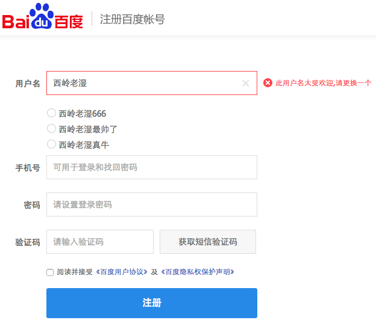
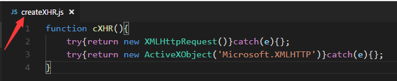
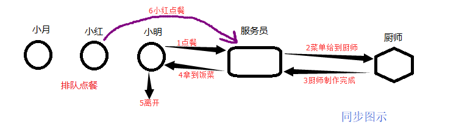
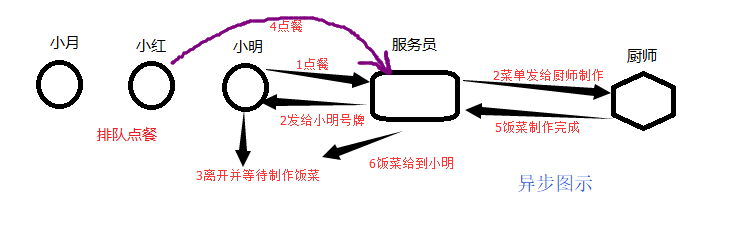
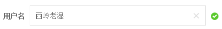
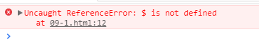
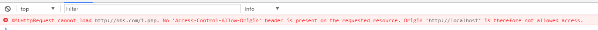

# Ajax 技术

> 作者：西岭老湿 

----

## 第1章 认识Ajax 

### 1.1 初识 ajax 

我们平常上网，不管是注册账号，还是浏览网页，其本质就是通过客户端向服务器发送请求，服务器接到请求后返回处理后的数据给客户端；
在我们之前学习代码中，向服务器提交数据典型的应用是就是 form 表单，其中的 action 就是我们提交数据的服务器端地址；

完成一个 form 表单；
当我们点击提交按钮时，页面就会跳转到服务器页面；

但是，我本不想让页面跳转，数据也能被发送到服务器端，同时，还可以接受服务器返回的数据；


当我注册一个网站的账号时，填写完用户名并没有点击提交，但是，用户名如果有重复，文本框的傍边便会提示我更换用户名；



类似的功能还有 验证短信的发送、百度搜索的关键字推举、无刷新的分页等等……

想要完成这些类似的功能实现，我们今天所要学习的ajax技术，就是核心技术；

ajax 也是技术名词的缩写：
Asynchronous `[ə'sɪŋkrənəs; eɪ-]` ：异步的；
JavaScript ：JavaScript语言
And ：和、与
XML ：数据传输格式

1998年微软公司（Microsoft）的Outlook Web Access第一次使用了ajax技术，允许客户端脚本发送HTTP请求，并随后集成在IE4.0中应用（XMLHTTP），到2005年，谷歌（Google）把Ajax成功应用于自家的多款Web系统中（Gmail邮箱、Google Map、Google 搜索建议），

从此Ajax被越来越多的人所接受…

**客户端通过HTTP向服务器发送请求**


### 1.2 快速入门

```html
<body>
    <form action="1-1-1.php" method="get">
        <input type="text" name="names" value=""><br>
        <input type="button" value="提交">
    </form>
</body>
<script>
    //获取DOM对象
    var inp = document.getElementsByTagName('input');
    //绑定点击事件
    inp[1].onclick = function(){
        //获取文本值
        var v = inp[0].value;
        //获取ajax对象
        var xhr = new XMLHttpRequest();
        //监听状态变化
        xhr.onreadystatechange = function(){
            //判断状态值
            if(xhr.readyState == 4){
                //获取服务器返回信息
                alert(xhr.responseText);
            }
        }
        //打开链接
        xhr.open('get','/test');
        //发送连接
        xhr.send();
    }
</script>
```

http.js

```php
var fs = require('fs');
// 服务器模块
var http = require('http');
var server = http.createServer();

server.listen(8080,function(){
    console.log('服务器启动成功,请访问：http://127.0.0.1:8080')
})

server.on('request',function(req,res){
    var method = req.method;
    var urls = require('url').parse(req.url);
    if(method == 'GET'){
        if(urls.pathname.indexOf('.html')>=0){
            fs.readFile('.'+urls.pathname,function(err,data){
                res.end(data);
            })
        }else if(urls.pathname == '/test'){
            res.end('123')
        }
        // console.log(urls.pathname);
    }else if(method == 'POST'){
        
    }else{
        res.end('err_method')
    }
})
```


## 第2章 Ajax对象 

### 2.1 获取对象

通过上一节我们发现，想要使用 ajax 的一系列功能，我们就必须先得到 ajax 对象

基于 W3C标准 浏览器：

```js 
var xhr = new XMLHttpRequest();
```

基于IE内核的浏览器:

```js 
var xhr = new ActiveXObject('Microsoft.XMLHTTP');
```


```html
<script>
    var btu = document.getElementById('btu');
    btu.onclick = function(){
        //基于 W3C标准 浏览器
        var xhr = new XMLHttpRequest();
        alert(xhr);

        //基于IE内核的浏览器， W3C标准浏览器中报错
        var xhr = new ActiveXObject('Microsoft.XMLHTTP');
        alert(xhr);
    }
</script>
```


浏览器标准不一样，得到的对象也不一样，我们也不知道客户使用什么样的浏览器，因此，我们需要解决兼容性问题；

修改上述代码并测试，**具有兼容性**：

```html
<script>
var btu = document.getElementById('btu');
btu.onclick = function(){
	try{
		var xhr =  new XMLHttpRequest()
	}catch(e){};

	try{
		var xhr = new ActiveXObject('Microsoft.XMLHTTP')
	}catch(e){};

	alert(xhr);
}
</script>
```

再次对代码进行修改 **兼容代码封装进函数调用**

```html
<script>
    var btu = document.getElementById('btu');
    btu.onclick = function(){
        //封装进函数供其他程序调用
        function cXHR(){
            try{return new XMLHttpRequest()}catch(e){};
            try{return new ActiveXObject('Microsoft.XMLHTTP')}catch(e){};
        }
        alert(cXHR());
    }
</script>
```

将函数写入单独的文件，共其他地方引入调用

**创建createXHR.js** 
将函数复制到文件 createXHR.js 内并保存, **如图：**



**使用：**

```html
//文件引入
<script src="createXHR.js"></script>
<script>
    var btu = document.getElementById('btu');
    btu.onclick = function(){
		//函数调用
        alert(cXHR());
    }
</script>
```

顺便封装一个方法：
使用id属性获取DOM对象，方便后面使用

```js
function gid(id){
    return document.getElementById(id);
}
```

### 2.2 ajax对象的属性、方法 *

火狐开发者文档：
https://developer.mozilla.org/zh-CN/docs/Web/API/XMLHttpRequest 

#### 2.2.1 属性

- **readyState： Ajax状态码 * **
	0：表示对象已建立，但未初始化，只是 new 成功获取了对象，但是未调用open方法
	1：表示对象已初始化，但未发送，调用了open方法，但是未调用send方法
	2：已调用send方法进行请求
	3：正在接收数据（接收到一部分），客户端已经接收到了一部分返回的数据
	**4：接收完成，客户端已经接收到了所有数据 * **

- status ：http响应状态码
	200代表成功获取服务器端数据
	404未找到页面等等……

- statusText ：http响应状态文本

- **responseText：如果服务器端返回字符串，使用responseText进行接收**

- responseXML ：如果服务器端返回XML数据，使用responseXML进行接收

- **onreadystatechange：当 readyState 状态码发生改变时所触发的回调函数**

#### 2.2.2 方法

- **open(method,url,[aycs])：初始化Ajax对象 (打开)**
  method:http请求方式，get/post
  url:请求的服务器地址
  aycs:同步与异步 


- **setRequestHeader(header,value)：设置请求头信息**
  header ：请求头名称
  value ：请求头的值


- xhr.getAllResponseHeaders() 获取全部响应头信息

- xhr.getResponseHeader('key') 获取指定头信息


- **send([content]) ：发送Ajax请求**
  content ：	如果是get请求时，此参数为null;

  如果是post请求时，此参数就是要传递的数据

  

  **注意: 所有相关的事件绑定必须在调用send()方法之前进行.**

  


#### 2.2.3 同步与异步

例如，小明去餐馆排队点餐，前台服务员将小明的菜单告诉厨师进行制作，此时小明后面排队的人就一直等着，
直到厨师制作完成，把饭菜送到小明手里后离开，后面的人才能继续点餐；这就是同步处理

但是，如果前台服务员将小明的菜单告诉厨师后，服务员发给小明一个好牌去旁边等待，后面的人继续点餐，
厨师将小明的饭菜做好后，随时呼唤小明就餐；这就是异步处理

服务器的不同做法，就代表着 Ajax 的同步或异步处理；
小明就是客户端；
厨师就是后台服务器；

图示：






前台代码：

```html
<script src="createXHR.js"></script>
    <script>
        function t1(){
            var xhr = cXHR();
            xhr.onreadystatechange = function(){
                if(this.readyState == 4){
                    alert(this.responseText);
                }
            }
            //false同步
            //true 异步
            xhr.open('get','/test',false); 
            xhr.send(null);
        }
        function t2(){
            alert('t2');
        }
        t1();
        t2();
    </script>
```

## 第3章 判断用户名是否可用--案例

 百度注册效果

**用户名被占用：**


**用户名没有没占用：**



前台代码

```html
<body>
    <input type="text" value="" id="names">
    <span id="tip"></span>
</body>
<script>
    var inp = document.getElementById('names');
    inp.onblur = function () {
        var xhr = new XMLHttpRequest();
        xhr.onreadystatechange = function () {
            if (xhr.readyState == 4) {
                // alert(xhr.responseText);
                if (xhr.responseText == 1) {
                    var h = '<font color="red">用户名已经被占用</font>';
                    document.getElementById('tip').innerHTML = h;
                } else {
                    var h = '<font color="green">用户名可用</font>';
                    document.getElementById('tip').innerHTML = h;
                }
            }
        }
        xhr.open('get', '/baidu?names=' + inp.value);
        xhr.send();
    }
</script>
```


http.js

```php
else if(urls.pathname == '/test'){
    res.end('123')
}else if(urls.pathname == '/baidu'){
    if(urls.query.names == 'admin'){
        res.end('1')
    }else{
        res.end('0')
    }
}
```


## 第4章 Ajax发送POST请求

### 4.1 post请求

复制第3章案例代码，将 get 请求修改为 post 请求；

```js
//请求地址
var url = 'baidu';
//open参数为post
xhr.open('post',url);
//设置请求头 *** 
xhr.setRequestHeader('Content-type','application/x-www-form-urlencoded');
//设置post请求参数值
xhr.send('names='+inp.value);

```


## 第5章 Ajax框架的封装

如果一个页面中有十几个地方用到Ajax，那么我们需要写十几次open()、十几次send()、十几次获取xhr对象；
代码重复相当多，而凡是有代码重复的地方，就有封装的可能；

创建新文件： ajax.js 

### 5.1 餐前甜点

之前我们为了方便使用，封装过使用指定 id 获取DOM对象及获取xhr对象；
我们对之前的代码进行一次修改，使其更加优雅；

**定义一个自调用匿名函数**

```js
(function(){
	//code……
})();
```

为什么 定义一个自调用匿名函数？
在实际项目开发中，如果一个项目同时引入了多个javascript框架，可能会产生命名的冲突问题，
如果使用自调用匿名函数来封装javascript框架，所有变量处于封闭状态，就可以避免这个问题。

**封装一个$函数，用于获取指定id的dom对象**

```js
(function(){
	//封装$函数，获取指定 id 的DOM对象并返回给调用者
    var $ = function(id){
        return document.getElementById(id);
    }
})();
```

我们在前台代码中引入并使用ajax.js 

```html
<body>
   <div id="d">div</div>
</body>
<script src="ajax.js"></script>
<script>
    alert($('d'));
</script>
```



报错原因： 函数 $ 为局部变量；

**让 $ 局部变量全局化**

```js
(function(){
    //封装$函数，获取指定 id 的DOM对象并返回给调用者
    var $ = function(id){
        return document.getElementById(id);
    }
    //将局部变量 $ 复制给顶层window对象，使其成为全局变量
    window.$ = $;
})();
```

### 5.2 封装get方法

ajax代码我们都会写，问题是：
如何把代码放进匿名函数中并且外部可以调用？

```js
(function(){
    //封装$函数，获取指定 id 的DOM对象并返回给调用者
    var $ = function(id){
        return document.getElementById(id);
    }
    //将局部变量 $ 复制给顶层window对象，使其成为全局变量
    window.$ = $;

    //声明gets方法
    var gets = function(url){
        var xhr = new XMLHttpRequest();
        xhr.onreadystatechange = function(){
            if(xhr.readyState == 4){
                alert(xhr.responseText);
            }
        }
        xhr.open('get',url);
        xhr.send();
    }
    //将局部变量 gets 复制给顶层window对象，使其成为全局变量
    window.ajax_get = gets;
})();
```

这样写并没有语法错误，也可以正常调用，但是，随着功能的不断增加，
我们的window对象也会被赋予各种各样的值，最终还是会导致混乱；

**在JavaScript中一切都是对象**

$ 也可以被当作对象，我们就可以将ajax函数赋值给 $ ；

```js
(function(){
    //封装$函数，获取指定 id 的DOM对象并返回给调用者
    var $ = function(id){
        return document.getElementById(id);
    }

    //声明ajax函数，并复制给$;
    $.get = function(url){
        var xhr = new XMLHttpRequest();
        xhr.onreadystatechange = function(){
            if(xhr.readyState == 4){
                alert(xhr.responseText);
            }
        }
        xhr.open('get',url);
        xhr.send();
    }
    window.$ = $;
})();
```

前台调用

```html
<script>
    $.get('/test');
</script>
```


### 5.3 获取Ajax的返回值

前台调用：

```html
<script>
    var cb = function(msg){
        $('d').innerHTML = msg;
    }
    $.get('/test',cb);
</script>

```

修改 ajax.js

```js
$.get = function(url,callback){
    var xhr = $.init(); //调用init,获取ajax对象
    xhr.onreadystatechange = function(){
        if(xhr.readyState == 4){
            callback(xhr.responseText);
        }
    }
    xhr.open('get',url);
    xhr.send();
}
```

前台调用修改：

```html
<script>
    // var cb = function(msg){
    //     $('d').innerHTML = msg;
    // }
    $.get('09-1.php',function(msg){
        $('d').innerHTML = msg;
    });
</script>
```


**封装 POST 方法到 ajax.js**


## 第6章 跨域问题的解决方案

### 6.0 什么是跨域

启动两个端口的服务器：


访问8000端口的服务器获取页面，页面中使用 ajax 向9000端口的服务器发送请求；





**同源策略，也叫跨域禁止策略；**
阻止从一个域上加载的脚本，获取或操作另一个域上的资源；

但是，公司内部系统的数据交互就无法进行：
公司OA系统 ：http://oa.itcast.cn 
公司ERP系统 ：http://erp.itcast.cn 
公司ESM系统 ：http://esm.itcast.cn 


### 6.1 认识jsonp

而Web页面上调用js文件时则不受是否跨域的影响

（不仅如此，我们还发现凡是拥有"src"这个属性的标签都拥有跨域的能力，比如script、img、iframe）；
src 的能力就是把远程的数据资源加载到本地(图片、JS代码等);

前台代码：

```html
<body>
    <input type="button" value="点击" id="btu">
</body>
<script>
    //提前写好函数，调用函数需要传参
    function cb(msg){
        alert(msg);
    }
</script>
<!--src加载进来的代码就是一个JS的函数调用,cb函数调用  -->
<script src="http://127.0.0.1:9000/kuayu"></script>
```

http9000.js   代码：

```php
if(urls.pathname == '/'){
    res.end('index');
}else if(urls.pathname == '/kuayu'){
    res.end('cb("123")');
}
```

**修改前后台代码，增加灵活性；**

前台代码：

```html
<script>
    //提前写好函数，调用函数需要传参
    function cb(msg) {
        alert(msg);
    }
</script>
<!--src加载进来的代码就是一个JS的函数调用,cb函数调用  -->
<!--地址get传参，告知后台函数调用名称 -->
<script src="http://127.0.0.1:9000/kuayu?callback=cb"></script>
```

http9000.js   代码：

```php
if(urls.pathname == '/'){
    res.end('index');
}else if(urls.pathname == '/kuayu'){
    // console.log(urls.query);
    res.end(urls.query.callback+'("123")');
}
```


### 6.2 如何使用JSONP

```html
<body>
   <input type="button" id="btu" value="点击">
</body>
<script src="ajax.js"> </script>
<script>
    //提前写好函数，调用函数需要传参
    function callback(msg){
        console.log(msg);
    }
    //动态添加script标签及src属性
    $('btu').onclick = function(){
        var sc = document.createElement('script');
        sc.src = "http://bbs.com/2.php?cb=callback";
        document.getElementsByTagName('head')[0].appendChild(sc);
    }
</script>
```

就是在远程服务器上设法动态的把数据装进js格式的文本代码段中，供客户端调用和进一步处理；
在前台通过动态添加script标签及src属性，表面看上去与ajax极为相似，但是，这和ajax并没有任何关系；
为了便于使用及交流，逐渐形成了一种 **非正式传输协议**，人们把它称作 **JSONP** ；

该协议的一个要点就是允许用户传递一个callback参数给服务端，
然后服务端返回数据时会将这个callback参数作为函数名来包裹住JSON数据，
这样客户端就可以随意定制自己的函数来自动处理返回数据了。


### 6.3 跨域资源共享（ CORS）机制

官方手册：

https://developer.mozilla.org/zh-CN/docs/Web/HTTP/Access_control_CORS


详情教程：

https://zhuanlan.zhihu.com/p/53996160


## 第7章 jQ中的Ajax  

### 7.1 认识jQ中ajax的封装

jQ 对于ajax的封装有两层实现；
$.ajax 为底层封装实现；
基于 `$.ajax` ，分别实现了`$.get` 与`$.post` 的高层封装实现；

### 7.2 ajax 的底层实现

基本语法：
**$.ajax(obj)**

对象的参数设置及含义：

**async：** 	     	布尔类型，代表是否异步，true代表异步，false同步，默认为true
**cache：**      	是否缓存，布尔类型，true代表缓存，false代表不缓存，默认为true
**complete：**    	当Ajax状态码（readyState）为4的时候所触发的回调函数
**contentType：** 	发送信息至服务器时内容编码类型；(默认: "application/x-www-form-urlencoded") 
**data：** 			要求是一个字符串格式，Ajax发送时所传递的数据
**dataType：** 		期待的返回值类型，可以是text，xml，json，默认为text类型
**success：** 		当Ajax状态码为4且响应状态码为200时所触发的回调函数
**type：** 			Ajax发送网络请求的方式，(默认: "GET")；
**url：** 			请求的url地址

案例代码：

http.js : 

```js
var fs = require('fs');
// 服务器模块
var http = require('http');
var server = http.createServer();

server.listen(8080,function(){
    console.log('服务器启动成功,请访问：http://127.0.0.1:8080')
})

server.on('request',function(req,res){
    var method = req.method;
    var urls = require('url').parse(req.url);
    if(method == 'GET'){
        if(urls.pathname == '/'){
            res.end('index');
        }else if(urls.pathname == '/jq_ajax_get'){
            res.end('123')
        }else{
            fs.readFile('.'+urls.pathname,function(err,data){
                res.end(data);
            })
        }
        // console.log(urls.pathname);
    }else if(method == 'POST'){
        
    }else{
        res.end('err_method')
    }
})
```


**GET 请求**

```html
<body>
    <input type="button" value="点击" id="btu">
</body>
<script>
    $('#btu').click(function(){
        //get请求
        $.ajax({
            url:'/jq_ajax_get',
            success:function(data){
                alert(data);
            }
        });
    });
</script>
```

**POST 请求**

```html
<body>
    <input type="button" value="点击" id="btu">
</body>
<script>
    $('#btu').click(function () {
        $.ajax({
            url: '/jq_ajax_post',
            type: 'post',
            data: 'id=1111',
            success: function (data) {
                alert(data);
            },
            // async:false,
        });
        // alert(22); //检验同步异步
    });
</script>
```


http.js

```js
else if(method == 'POST'){
    if(urls.pathname == '/jq_ajax_post'){
        res.end('post_back')
    }
}
```


### 7.3 ajax 的高层实现

#### 7.3.1 GET 应用

基本语法：
**$.get(url, [data], [callback], [type])**

url:待载入页面的URL地址
data:待发送 Key/value 参数。
callback:载入成功时回调函数。
type:返回内容格式，xml, html, script, json, text, _default。

案例代码：

```html
<body>
    <input type="button" value="点击" id="btu">
</body>
<script>
    $('#btu').click(function(){
        $.get('/jq_ajax_get',function(data){
            alert(data);
        },'json');
    });
</script>
```


#### 7.3.2 POST 应用

**$.post(url, [data], [callback], [type])**
url:发送请求地址。
data:待发送 Key/value 参数。
callback:发送成功时回调函数。
type:返回内容格式，xml, html, script, json, text, _default。

案例代码：

```html
<body>
    <input type="button" value="点击" id="btu">
</body>
<script>
    $('#btu').click(function () {
        $.post('/jq_ajax_post',
            { id: '11' },
            function (data) {
                alert(data);
            });
    });
</script>
```


## 第8章 前端渲染-海贼王项目


### 8.1 Ajax技术展示首页

index.html

```html
<body>
    <header>
        <div class="page-header container">
            <h1>海贼王
                <small>角色管理器</small>
            </h1>
        </div>
    </header>
    <div class="container hero-list">
        <a class="btn btn-success pull-right" href="/add">添加英雄</a>
        <table class="table table-hover">
            <thead>
                <th>编号</th>
                <th>名称</th>
                <th>能力</th>
                <th>团体</th>
                <th>头像</th>
                <th>操作</th>
            </thead>
            <tbody id="tbody">
                <!-- 数据展示区域 -->
            </tbody>
        </table>
    </div>
</body>

<!-- 服务器读取本页面返回 -->
<!-- 返回给浏览器后，浏览器再解析代码，发送ajax请求获取数据 -->
<script>
    var xhr = new XMLHttpRequest();
    xhr.onreadystatechange = function () {
        if (xhr.readyState == 4) {
            // ajax 获取数据后，解析数据并循环遍历到页面中
            var backdata = JSON.parse(xhr.responseText);
            // console.log(backdata);
            var htmls = '';
            for (let i = 0; i < backdata.length; i++) {
                htmls += `<tr>
                    <td>${backdata[i].id}</td>
                    <td>${backdata[i].name}</td>
                    <td>${backdata[i].nengli}</td>
                    <td>${backdata[i].jituan}</td>
                    <td></td>
                    <td>
                        <a href="/getone?id=${backdata[i].id}">查看</a>
                        <a href="/edituser?id=${backdata[i].id}">修改</a>
                        <a href="/deluser?id=${backdata[i].id}">删除</a>
                    </td>
                </tr>`
            }
            // DOM 操作 修改页面展示的内容
            document.getElementById('tbody').innerHTML = htmls;
        }
    }

    xhr.open('get', '/getall');
    xhr.send();

</script>

```

router.js

```js
server.on('request',function(req,res){
            // res.end('23')
            var urls = url.parse(req.url,true);
            // 首页只返回空页面
            if(urls.pathname == '/'){
                controller.index(res);
                // 接收页面发送的ajax请求
            }else if(urls.pathname == '/getall'){
                controller.getAll(req,res);
            }
```


controller.js

```js
    // 返回静态页面
    index: function (res) {
        // 后端不关系页面与数据整合的问题
        fs.readFile('./index.html', function (err, html_data) {
            res.end(html_data);
        })
    },

    // 返回json数据，前段处理
    getAll:function(req,res){
        // 后端不关系页面与数据整合的问题
        fs.readFile('./db.json','utf8',function(err,json_data){
            res.setHeader('Content-Type','text/plain;charset=utf-8')
            res.end(json_data);
        })
    },
```


### 8.2 Ajax删除数据

思路：

1：删除a链接的href请求，使用事件绑定触发Ajax的HTTP请求；

2：服务器接收请求并获取请求参数，进行数据删除

3：服务器将处理数据的结果响应会ajax

4：Ajax判断处理结果，并在浏览器做DOM操作；


```js
<script>
    // 为了配合删除 将ajax获取全部数据的功能封装到getDataAll函数中
    function getDataAll() {
        var xhr = new XMLHttpRequest();
        xhr.onreadystatechange = function () {
            if (xhr.readyState == 4) {
                // ajax 获取数据后，解析数据并循环遍历到页面中
                var backdata = JSON.parse(xhr.responseText);
                // console.log(backdata);
                var htmls = '';
                for (let i = 0; i < backdata.length; i++) {
                    htmls += `<tr>
                    <td>${backdata[i].id}</td>
                    <td>${backdata[i].name}</td>
                    <td>${backdata[i].nengli}</td>
                    <td>${backdata[i].jituan}</td>
                    <td></td>
                    <td>
                        <a href="/getone?id=${backdata[i].id}">查看</a>
                        <a href="/edituser?id=${backdata[i].id}">修改</a>
                        <a href="" kk="123" user_id="${backdata[i].id}">删除</a>
                    </td>
                </tr>`
                }
                // DOM 操作 修改页面展示的内容
                document.getElementById('tbody').innerHTML = htmls;
            }
        }

        xhr.open('get', '/getall', false);
        xhr.send();
    }

    
    // 页面加载完成后调用函数获取数据
    window.onload = function(){
        getDataAll();
    }


    document.getElementById('tbody').onclick = function (ev) {
        // 获取节点对象的自定义属性值
        // console.log(ev.target.getAttribute('kk'));
        // console.log(ev.target.getAttribute('user_id'));

        // console.log(ev.target);
        // return false;
        // 阻止浏览器的默认行为
        ev.preventDefault();

        var xhr = new XMLHttpRequest();
        xhr.onreadystatechange = function () {
            if (xhr.readyState == 4) {
                if (xhr.responseText == 1) {
                    alert('删除成功')
                    // 删除成功后调用函数重新获取全部数据
                    getDataAll();
                }
            }
        }
        xhr.open('delete', 'http://127.0.0.1:9000/del?id=' + ev.target.getAttribute('user_id'));
        xhr.send();
    }

</script>
```


router.js

```js
if(req.method == "DELETE"){
                // 处理ajax的删除
                controller.ajaxDel(req,res,urls.query.id)
            }
```


controller.js

```js

    ajaxDel:function(req,res,id){
        fs.readFile('./db.json', 'utf8', function (err, json_str) {
            var json_arr = JSON.parse(json_str);
            var arr = [];
            for (let i = 0; i < json_arr.length; i++) {
                if (json_arr[i].id != id) {
                    arr.push(json_arr[i])
                }
            }
            fs.writeFile('./db.json', JSON.stringify(arr), function (err) {
                // res.setHeader('Content-type', 'text/html;charset=utf-8');
                if (!err) {
                    res.end('1');
                } else {
                    res.end('0');
                }
            })
        })
    },
```


### 8.3 Ajax 添加数据

add.html

```html
<script>
    document.getElementById('btn').onclick = function(){
         // 发送ajax请求
        // 请求方式是post 
        // 要将请求的数据放入send方法中(http只支持字符串数据传输) name=123&age=99
        // 服务器需要接受post请求(直接使用formidable就可以了)
        // 服务器接收数据后，写入json文件，然后返回1或0 
        // ajax 接受1或0后判断并跳转到首页展示数据

        var xhr = new XMLHttpRequest();
        xhr.onreadystatechange = function(){
            if(xhr.readyState == 4){
                if(xhr.responseText==1){
                    alert('添加成功')
                    location.href = '/'
                }else{
                    alert('添加失败')
                }
            }
        }
        // 获取表单
        var inp = document.getElementsByTagName('input');
        // 拼接为字符串
        var inp_str = 'name='+inp[0].value+'&nengli='+inp[1].value+'&jituan='+inp[2].value
        // 将字符串进行URL编码
        var user_data = encodeURI(inp_str);
        // console.log(user_data);
        xhr.open('post','http://127.0.0.1:9000/ajax_add')
        // 请求头必须在open之后设置
        xhr.setRequestHeader('Content-type','application/x-www-form-urlencoded')
        xhr.send(user_data);
    }

</script>
```


controller.js

```js
ajax_add(req, res) {
        //////原生处理POST请求//////
        // var pd = ''
        // req.on('data',(data)=>{
        //     pd+=data;
        // })
        // req.on('end',()=>{
        //     // console.log(pd);
        //     var d = require('querystring').parse(pd);
        //     console.log(d);
        //     res.end('')
        // })

        //////借助formidable处理POST请求数据/////
        var fd = require('formidable');
        var form = new fd.IncomingForm();
        form.parse(req, function (err, filds, files) {
            // console.log(filds);
            // console.log(files);
            fs.readFile('./db.json', 'utf8', function (err, json_str) {
                var json_arr = JSON.parse(json_str);
                // 添加id值
                filds.id = json_arr[json_arr.length-1].id +1 ;
                json_arr.push(filds);
                console.log(json_arr);
                fs.writeFile('./db.json', JSON.stringify(json_arr), function (err) {
                    if (!err) {
                        res.end('1');
                    } else {
                        res.end('0');
                    }
                })
            })
        })

    },
```


### 8.4 Ajax 文件上传

想要使用Ajax完成文件上传，首先我们要学会，Ajax作为客户端如何将文件读入并解析为二进制数据；
HTML5为我们提供了 **FormData 对象**：
通过FormData对象可以组装一组用 XMLHttpRequest发送请求的键/值对。它可以更灵活方便的发送表单数据，因为可以独立于表单使用。
如果你把表单的编码类型设置为multipart/form-data，则通过FormData传输的数据格式和表单通过submit() 方法传输的数据格式相同;

FormData 手册
https://developer.mozilla.org/zh-CN/docs/Web/API/FormData/Using_FormData_Objects


add.html

```html
<body>
    <form action="/" id="fm" method="post" enctype="multipart/form-data">
        <table>
            <tr>
                <td>姓名</td>
                <td><input name="name" type="text" ></td>
            </tr>
            <tr>
                <td>能力</td>
                <td><input name="nengli" type="text" ></td>
            </tr>
            <tr>
                <td>集团</td>
                <td><input name="jituan" type="text" ></td>
            </tr>
            <tr>
                <td>上传图片</td>
                <td><input name="img" type="file" ></td>
            </tr>
            <tr>
                <td></td>
                <td><input type="button" value="确认修改" id="btn"></td>
            </tr>
        </table>
    </form>
</body>
<script>
    document.getElementById('btn').onclick = function(){
         // 发送ajax请求
        // 请求方式是post 
        // 要将请求的数据放入send方法中(http只支持字符串数据传输) name=123&age=99
        // 服务器需要接受post请求(直接使用formidable就可以了)
        // 服务器接收数据后，写入json文件，然后返回1或0 
        // ajax 接受1或0后判断并跳转到首页展示数据

        var xhr = new XMLHttpRequest();
        xhr.onreadystatechange = function(){
            if(xhr.readyState == 4){
                if(xhr.responseText==1){
                    alert('添加成功')
                    location.href = '/'
                }else{
                    alert('添加失败')
                }
            }
        }
        
        // console.log(user_data);
        xhr.open('post','http://127.0.0.1:9000/ajax_add')
        // 对整个Form表单打包
        var fd = new FormData(document.getElementById('fm'))
        xhr.send(fd);
    }

</script>
```


controller.js

```js
 ajax_add(req, res) {
        //////////实现表单文件上传//////////////////
        var fd = require('formidable');
        var form = new fd.IncomingForm();
        form.parse(req, function (err, filds, files) {
            // console.log(filds);
            // console.log(files);
            fs.rename(files.img.path, './img/' + files.img.name, function (err) {
                fs.readFile('./db.json', 'utf8', function (err, json_str) {
                    var json_arr = JSON.parse(json_str);
                    // 添加id值
                    filds.id = json_arr[json_arr.length - 1].id + 1;
                    // 添加图片地址
                    filds.img = '/img/' + files.img.name;
                    json_arr.push(filds);
                    console.log(json_arr);

                    fs.writeFile('./db.json', JSON.stringify(json_arr), function (err) {
                        res.setHeader('Content-type', 'text/html;charset=utf-8');
                        if (!err) {
                            res.end('1');
                        } else {
                            res.end('0');
                        }
                    })
                })
            })

            // res.end('145')
        })

    },
```


